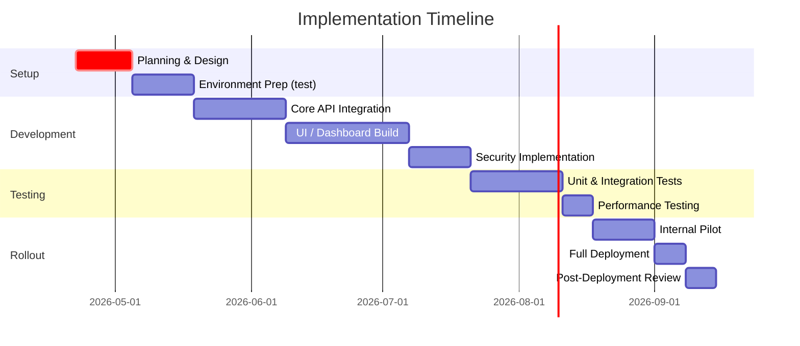

# Executive Summary

This report analyzes how to enrich a **read-only** Identity Operations console with Ping Identity APIs for SSO/MFA troubleshooting, dashboards and user analytics. We inventory Ping products (PingOne, PingFederate, PingAccess, PingDirectory, PingID/PingOne MFA, PingIntelligence/Protect) and identify the key read‑only API endpoints. For each operational feature (auth logs, MFA status, session info, user 360, etc.) we map to specific endpoints (with HTTP methods, URLs, scopes and response fields). We propose in-memory data models (JSON schemas) and UI metrics (tables, charts) that can be computed on-the-fly from API calls (no persistent DB). Security guidance covers OAuth2 scopes (least privilege), secret management, PII masking, and audit-logging. We outline SDKs, sample code patterns, webhook/streaming options, and error‐handling (pagination, rate-limit). Finally, we recommend a phased implementation plan with mermaid timeline and architecture flowchart diagrams.

Key recommendations include: use PingOne AIC’s **Monitoring Logs API** for event/audit data【50†L780-L787】; use PingFederate’s **Token Introspection** and **Session Management** APIs for live SSO session info【6†L2-L11】【18†L1299-L1304】; use PingDirectory SCIM APIs for user profile and group lookups【40†L122-L126】; use PingOne MFA APIs to enumerate enrolled devices and generate reports【48†L1884-L1890】; and use PingOne Protect (AI risk) API to score user logins on demand【46†L26-L34】. All API calls require OAuth2 (PingOne: client_credentials, PingFederate: client or cert) with minimal scopes, and should handle pagination and 429 rate-limit responses with retry/backoff. In-memory caches should have TTLs (e.g. 5–15 min) to avoid repeated calls. 

Security posture: enforce least-privilege roles and scopes on API clients, protect secrets (e.g. via Vault or environment vars), log tool usage to a SIEM, and design the UI so that PII (usernames, IPs) is masked or only shown to authorized roles. The app itself should be fronted by corporate SSO (PingOne, etc.) and use RBAC for internal access. 

The recommended implementation steps span API design, UI/dashboards, security review, testing, and a canary rollout (see **Timeline** below). Reference architecture (mermaid diagram) shows a stateless API layer bridging the front-end to Ping services and a SIEM/log exporter.

# 1. Ping Identity Products & API Inventory 

| **Product**        | **Primary APIs**                                                                             | **Use Cases**                                            |
|--------------------|----------------------------------------------------------------------------------------------|----------------------------------------------------------|
| **PingOne (AIC)**  | - Monitoring Logs API (`GET /monitoring/logs` or `/tail`)【50†L780-L787】【50†L798-L806】<br>- PingOne IAM: identities, apps (REST CRUD)【45†L50-L59】<br>- PingOne MFA: devices, logs, reporting (e.g. `GET /users/{id}/devices`)【13†L2141-L2149】, `POST /reports/…`【48†L1884-L1890】<br>- PingOne Protect (Intelligence): risk evaluations (`POST /riskEvaluations`)【46†L26-L34】 | Logs and events (auth, audit) per tenant/environment; user directory in cloud; MFA device status and logs; risk scores for fraud detection. |
| **PingFederate**   | - OAuth2 / OIDC: introspection (`POST /as/introspect.oauth2`)【6†L0-L6】, userinfo, etc.<br>- Session Management API (`GET /pf-ws/rest/sessionMgmt/users/{user}`)【18†L1299-L1304】.<br>- Admin (PF-WS) API: no OAuth support; uses basic auth or certs. | Token introspection to validate/inspect tokens; query/revoke user SSO sessions【18†L1299-L1304】. |
| **PingAccess**     | - Administrative API (`/pa-admin-api/v1/...`) with OAuth tokens from PF【36†L135-L143】 (uses PF client).<br>- No direct log API (logs to files/Splunk). | View gateway configuration or metrics; OAuth tokens from PF can call PingAccess endpoints if needed【36†L135-L143】. |
| **PingDirectory**  | - SCIM 2.0 REST API (`/scim/v2/Users`, `/Groups`, etc.)【40†L122-L126】.<br>- LDIF/LDAP (not applicable to a purely REST front-end). | Query user profiles, attributes and group memberships for “user 360” view. |
| **PingID (MFA)**   | - If on-prem PingID is used: PingID APIs (push OTP) or use PingID admin portal. (Often replaced by PingOne MFA). | Check MFA enrollment (if legacy), device logs. (Prefer PingOne MFA instead.) |
| **PingIntelligence / Protect** | - PingOne Protect Risk API (`POST /riskEvaluations`, `GET /riskPredictors` etc.)【46†L26-L34】. No direct log API (risk decisions can be retrieved). | Provide real-time risk scores for login attempts. PingIntelligence for APIs (API security) is out of scope for user ID management. |

*We prioritize PingOne AIC (cloud IAM) APIs for logs, MFA, risk, as well as PingFederate (on-prem) for sessions and introspection. PingAccess and PingID are secondary or legacy in this context.* 

# 2. Endpoints for Key Features

Below we map each desired feature to specific Ping API calls. For brevity we show one endpoint per feature; in practice multiple APIs may be combined. (Full lists in next sections.)

## 2.1 SSO Troubleshooting Console

- **Authentication Logs**: Retrieve login events from PingOne:  
  `GET https://<tenant-env>/monitoring/logs?source=am-authentication&beginTime=...&endTime=...` with headers `x-api-key`/`x-api-secret`【50†L780-L787】. This returns log entries (payload JSON with timestamp, source, etc.)【50†L798-L806】. Use pagination (pagedResultsCookie) or `/tail` for live feed【50†L788-L795】.  
- **PingFederate Token Introspection**:  
  `POST https://<pf-domain>/as/introspect.oauth2` (form data: `token`, `token_type_hint`) with Basic or Bearer auth. Returns JSON: `{active, client_id, scope, exp, username...}`【6†L0-L6】. Shows if a token is valid and contains user info.  
- **PingFederate Active Sessions**:  
  `GET https://<pf-domain>/pf-ws/rest/sessionMgmt/users/{user_key}` with OAuth client auth. Returns all active sessions for the user: includes fields like `sri`, `status`, `lastActivityTime`, array of `authnSessions` (with `id`, `creationTime`, timeouts, authn source, context IP and user-agent)【18†L1299-L1304】. 
- **PingAccess Logs**: PingAccess does not expose request logs via API. Instead, export logs via a SIEM (e.g., Splunk). The PingAccess admin API (requires PF OAuth token) can return configuration/status but not request logs.  
- **Token Status Dashboard**: Aggregate results from introspection/sessions to show active sessions per user. E.g. chart of sessions per application, or table of token details. 

## 2.2 MFA Diagnostics

- **MFA Enrollment & Devices**:  
  `GET https://api.pingone.com/v1/environments/{envID}/users/{userID}/devices` returns all MFA devices (mobile, SMS, OATH, FIDO) for a user. Each device has `type`, `status`, etc.【13†L2050-L2058】.  
- **MFA Device Logs**:  
  For native (mobile) devices, we can **request** device logs by `PUT /environments/{envID}/users/{userID}/devices/{deviceID}/logs` with body `{"status":"PENDING"}`【13†L2097-L2105】. The user’s device will upload logs (on request) within 24h. After the device sends logs, you can retrieve them via `GET /.../logs` (same URL) to read the log contents.  
- **MFA Reports**:  
  PingOne MFA API provides reporting endpoints【48†L1884-L1890】: e.g. `POST /reports/smsDevices` returns all users with SMS devices, `POST /reports/mfaEnabledDevices` generates a CSV file of all users with any MFA. Poll results via `GET /reports/{id}/result`. Use these to compute, e.g., percent of users with MFA. (See Table below.)  

## 2.3 Leadership Dashboards / Analytics

- **Overall Usage Metrics**:  
  Use PingOne Logs API with filters (source like `am-authentication`) to compute totals: e.g. total logins, failures, success rate over time. Graph trends.  
- **MFA Adoption**:  
  Use MFA Reports (above) to calculate MFA enablement: e.g.  
  ```text
  MFA_enablement = (count of users with at least one enrolled MFA device) / (total active users) * 100%
  ```  
  Data from GET `/devices` for each user (or aggregate from report).  
- **Geolocation and Risk Stats**:  
  If log payloads include IP/country, aggregate logins by region. Also, call `POST /risk-evaluations` for each login attempt (or periodically) to score risk; show histogram of risk levels.  
- **System Health**:  
  Ping products do not expose real-time health via these APIs. Recommend separate monitoring (e.g. PingAccess node status via `GET /pa-admin-api/v1/health` with OAuth, PingFederate system checks, etc.). At least check for API response delays.  

## 2.4 User “360” Profile

- **User Attributes & Groups**:  
  PingDirectory SCIM: `GET /scim/v2/Users?filter=userName eq "{username}"` or `GET /scim/v2/Users/{id}`【40†L122-L126】. Returns full profile (email, name, attributes). Similarly, `GET /scim/v2/Groups?members eq "{userID}"` to list groups.  
- **Active Sessions**:  
  Use PingFederate Session API for that user【18†L1299-L1304】.  
- **Enrolled Devices**:  
  Use PingOne MFA API `GET /environments/{env}/users/{user}/devices`【13†L2050-L2058】.  
- **Auth History**:  
  Query PingOne logs for entries with that user (filter on `payload` if JSON contains username or use transactionId chaining)【50†L925-L933】.  
- **MFA Status & Settings**:  
  From MFA device list and PingOne MFA settings API: `GET /environments/{env}/mfa/settings` returns global MFA config, and `GET /environments/{env}/users/{user}/devices`.  
- **Visualization**: Present combined data in UI: user card with ID/name/email, list of devices, group list, recent login events.  

## 2.5 Compliance / Audit View

- **Audit Log Retrieval**:  
  All admin actions and system events in PingOne are logged. Use same `/monitoring/logs` endpoint to retrieve admin audit events (source parameter like `audit` or `idm-admin-audit`). For PingFederate, its audit log can be exported to SIEM and polled; PingFederate has no REST audit endpoint.  
- **Data Model**: Maintain in-memory buffer of recent audit events. Schema example (JSON):  
  ```json
  {
    "timestamp": "...",
    "actor": "admin@example.com",
    "action": "UpdatePolicy",
    "target": "RiskPolicySet",
    "result": "SUCCESS",
    "ipAddress": "1.2.3.4"
  }
  ```  
- **UI**: Table of audit events; filters by time, admin user, action type. Summaries (counts per admin, per action).  

## 2.6 Geo / Risk Monitoring

- **Geo**: The log payload for authentication often includes IP/Geo. Use log entries (`monitoring/logs`) and extract `payload.ipAddress` or similar. Compute chart of logins by country.  
- **Risk**: For each login (or on-demand), call PingOne Protect: `POST /risk-evaluations` with context (user ID, IP, device info)【46†L26-L34】. The JSON response contains a risk score or decision (e.g. “ALLOW” or “DENY”) with details. Use this to highlight anomalous logins.  

## 2.7 Troubleshooting Toolkit

- Provide quick lookups: given a user or token, call introspect, session list, device list, etc. E.g., allow entering a `transactionId` to fetch specific logs via `/monitoring/logs?transactionId={id}`【50†L925-L933】. Show flow of that authentication.

# 3. Endpoint Reference Tables

Below are tables mapping key endpoints to their usage, required scopes, and sample fields. (Scopes are examples; actual scopes depend on your Ping role setup.)

### Authentication & Session Endpoints

| **Feature**         | **Endpoint (Method)**                               | **Description**                          | **Auth/Scope**                     | **Key Response Fields**                                     |
|---------------------|-----------------------------------------------------|------------------------------------------|------------------------------------|-------------------------------------------------------------|
| PingOne Logs (AIC)  | `GET /monitoring/logs?source={src}&...`【50†L780-L787】 | Retrieve log events (last 24h or specify time range) | HTTP headers `x-api-key`/`x-api-secret` (API key auth)【50†L780-L787】. Scope: e.g. `logs.read`. | JSON `result[]`: each entry has `payload` (event JSON or text), `timestamp`, `type`, `source`【50†L798-L806】 |
| PingOne Logs (tail) | `GET /monitoring/logs/tail?source={src}`            | Tail new log entries since last call    | as above                            | Same as above; use `pagedResultsCookie` to continue.         |
| PF Introspect       | `POST /as/introspect.oauth2`【6†L0-L6】             | Validate/access details of an access token | Client auth (Basic or Bearer). Scopes: none (token itself must be valid). | `active`, `client_id`, `scope`, `exp`, user info (`username`, custom claims)【6†L0-L6】. |
| PF Session Query    | `GET /pf-ws/rest/sessionMgmt/users/{user_key}`【18†L1299-L1304】 | List all live sessions for user_key (unique ID) | OAuth client (client_credentials with *SessionMgmt* scope). Requires PingFed client config【18†L1271-L1276】. | JSON object: `status`, `lastActivityTime`, `authnSessions[]` (with each `id`, `creationTime`, `idleTimeout`, `authnSource`, etc.), `contextData` (IP, user-agent)【18†L1299-L1304】. |

### MFA Endpoints

| **Feature**       | **Endpoint (Method)**                                             | **Description**                               | **Auth/Scope**                       | **Key Fields**                                              |
|-------------------|-------------------------------------------------------------------|-----------------------------------------------|--------------------------------------|-------------------------------------------------------------|
| List Devices      | `GET /environments/{env}/users/{user}/devices`【13†L2050-L2058】    | List all MFA devices for a user               | Bearer token from PingOne (client_credentials). Scope: `mfa.devices.read`. | JSON array of devices: each has `id`, `type` (e.g. `MOBILE`/`SMS`), `status` (ACTIVE/PENDING)【13†L2050-L2058】. |
| Request Device Logs| `PUT /.../devices/{deviceID}/logs`【13†L2099-L2107】            | Ask device to upload logs (for native devices) | Bearer token. Scope: `mfa.devices.write`.        | Sends back JSON with `status: PENDING`; system updates when logs received. |
| Get Device Logs   | `GET /.../devices/{deviceID}/logs`                               | Retrieve logs sent by device (after PENDING) | Bearer token. Scope: `mfa.devices.read`.        | Raw log text or JSON payload of device events.             |
| Report SMS Devices| `POST /environments/{env}/reports/smsDevices`【48†L1884-L1890】   | Generate report of all SMS MFA devices (immediate JSON response) | Bearer token. Scope: `mfa.reports.read`. | Returns `reportResults`: array of `{userID, userName, deviceID, ...}` entries. |
| Report MFA-enabled| `POST /environments/{env}/reports/mfa-enabled`【48†L1884-L1890】 | Generate report of all users with any MFA device (CSV file) | Bearer token. Scope: `mfa.reports.read`. | Returns job ID; poll `GET /reports/{id}/result`: response includes URL for CSV or inline rows. |
| Report Results    | `GET /environments/{env}/reports/{reportID}/result`             | Fetch results of report (JSON or CSV)        | Bearer token. Scope: `mfa.reports.read`. | Job `status`, and either `entries` array or file download. |

### SCIM (Directory) Endpoints

| **Feature**        | **Endpoint (Method)**                              | **Description**                       | **Auth/Scope**                  | **Key Fields**                                         |
|--------------------|----------------------------------------------------|---------------------------------------|---------------------------------|--------------------------------------------------------|
| Search Users       | `GET /scim/v2/Users?filter=userName eq "{name}"`【40†L122-L126】 | Find user by username (or other filter) | OAuth token from PingFederate (client_credentials) with SCIM scope. | `Resources[]`: each resource is a user with attributes (`id`, `userName`, `name`, `emails`, etc.). |
| Get User by ID     | `GET /scim/v2/Users/{id}`【40†L122-L126】           | Retrieve single user entry             | as above                        | User JSON with `userName`, `emails`, `memberships`, etc. |
| Search Groups      | `GET /scim/v2/Groups?filter=members eq "{userDN}"` | List groups containing user           | as above                        | `Resources[]` with each group’s `displayName`, `members` array. |
| Get Group by ID    | `GET /scim/v2/Groups/{id}`                         | Get group details                     | as above                        | Group JSON with `displayName`, `members`.              |

*Note:* To use SCIM, configure PingFederate as OAuth provider for PingDirectory (see PingDirectory SCIM guide). Scopes like `scim.read` may be required. The SCIM API respects ACIs so only allowed attributes are returned.

### Risk API (PingOne Protect)

| **Feature**      | **Endpoint (Method)**                                    | **Description**                               | **Auth/Scope**             | **Key Fields**                                 |
|------------------|----------------------------------------------------------|-----------------------------------------------|----------------------------|-----------------------------------------------|
| Compute Risk     | `POST /environments/{env}/risk-evaluations`【46†L26-L34】 | Evaluate risk for a user login context         | Bearer token (PingOne Protect client). Scope: `risk.evaluate`. | Response JSON: `decision` (ALLOW/DENY/CHALLENGE), `score` (0–1), `policyId`, `metadata` (details). |

### Additional Endpoints

- **PingAccess Admin**: `GET /pa-admin-api/v1/health` or other admin calls. Auth via PF OAuth token with scope configured【36†L135-L143】. (No logs API.)  
- **PingID (Legacy)**: If still used, PingID REST API can query user status, but it’s deprecated in favor of PingOne MFA.  
- **Webhook/Streaming**: PingOne supports pushing events to external SIEM. (Docs: *“Monitoring activity with Splunk”*【35†L937-L945】, webhook connectors【10†L899-L907】.) Alternatively, you **poll** `/monitoring/logs` in a loop or tail.  

# 4. Data Models and In-Memory Objects

Since the app is read-only, define JSON schemas to hold aggregated data temporarily (cache with TTL). Example models:

```json
// Model for a user’s 360 profile:
{
  "userId": "1234-abcd",
  "userName": "alice@example.com",
  "displayName": "Alice Smith",
  "emails": ["alice@example.com"],
  "phoneNumbers": ["+1-555-1234"],
  "groups": ["Engineering", "VPN Users"],
  "mfaDevices": [
    {"id":"dev1","type":"TOTP","status":"ACTIVE"},
    {"id":"dev2","type":"MOBILE_PUSH","status":"PENDING"}
  ],
  "sessions": [
    {
      "id": "abcd1234",
      "creationTime": "2023-04-20T10:00:00Z",
      "idleTimeout": "2023-04-20T10:30:00Z",
      "lastActivityTime": "2023-04-20T10:15:00Z",
      "ipAddress": "1.2.3.4",
      "userAgent": "Mozilla/5.0",
      "authnSource": "HtmlFormAdapter"
    }
  ],
  "lastLogin": "2023-04-20T10:15:00Z",
  "status": "ACTIVE"
}
```

```json
// Model for aggregated metrics (cached):
{
  "totalLogins": 1245,
  "successRate": 0.987,
  "failedLogins": {
    "invalid_password": 5,
    "account_locked": 3
  },
  "mfaEnabledPercent": 76.5,
  "activeSessions": 53,
  "topRiskScores": [0.95, 0.87, 0.72]
}
```

- **Retention**: Cache these objects in memory for short TTL (e.g. 5–15 minutes). Recompute via APIs after expiration or if user refreshes view.
- **Pagination**: For endpoints returning many items (logs, sessions), implement loops. E.g., for logs:
  ```python
  cursor = None
  while True:
      params = {"source": "am-authentication", "beginTime": T1, "endTime": T2}
      if cursor: params['_pagedResultsCookie'] = cursor
      resp = requests.get(..., headers=headers, params=params).json()
      process(resp['result'])
      cursor = resp.get('pagedResultsCookie')
      if not cursor: break
  ```
- **Backoff**: On HTTP 429 or timeout, retry with exponential backoff.

# 5. Sample API Calls and Snippets

**PingOne Logs (Python)**:  
```python
import requests, time
API_KEY = os.environ["PINGONE_API_KEY"]
API_SECRET = os.environ["PINGONE_API_SECRET"]
TENANT_FQDN = "api.pingone.com"  # or region
headers = {"x-api-key": API_KEY, "x-api-secret": API_SECRET}
params = {"source": "am-authentication", "beginTime": "2026-04-21T00:00:00Z"}
url = f"https://{TENANT_FQDN}/monitoring/logs"
resp = requests.get(url, headers=headers, params=params)
logs = resp.json().get("result", [])
for entry in logs:
    print(entry["timestamp"], entry["payload"][:100])
```

**PingFederate Introspect (cURL)**:  
```bash
curl -X POST "https://pf.example.com/as/introspect.oauth2" \
  -u "pf-client:secret" \
  -d "token=eyJhbGci..." -d "token_type_hint=access_token"
```
Response (JSON):
```json
{
  "active": true,
  "client_id": "pf-client",
  "exp": 1713648000,
  "scope": "openid profile email",
  "username": "alice@example.com"
}
```

**PingFederate Session API (Node.js)**:  
```js
const axios = require('axios');
const pfClientToken = 'Bearer ' + token; // obtained via client_credentials OAuth
const userKey = encodeURIComponent('alice@example.com');
axios.get(`https://pf.example.com/pf-ws/rest/sessionMgmt/users/${userKey}`, {
  headers: { Authorization: pfClientToken }
}).then(res => {
  console.log("Active sessions:", res.data.authnSessions);
});
```

**PingOne MFA Device List (Python)**:  
```python
env_id = "env-1234"
user_id = "user-5678"
url = f"https://api.pingone.com/v1/environments/{env_id}/users/{user_id}/devices"
resp = requests.get(url, headers={"Authorization": f"Bearer {token}"})
devices = resp.json()["_embedded"]["devices"]
print("MFA devices:", [d["type"] for d in devices])
```

**PingOne Create Risk Evaluation (Python)**:  
```python
url = f"https://api.pingone.com/v1/environments/{env_id}/riskEvaluations"
payload = {"user": {"identifier": user_id}, "ipAddress": "1.2.3.4"}
resp = requests.post(url, json=payload, headers={"Authorization": f"Bearer {token}"})
risk_result = resp.json()
print("Risk decision:", risk_result["decision"], "score:", risk_result["score"])
```

*All secrets (client IDs, API keys) must come from secured config (env vars or Vault). Do **not** hard-code credentials in code. Use TLS (HTTPS) and rotate tokens regularly.*

# 6. UI Metrics and Dashboards

**Suggested Visualizations:**  

- **Auth Events Table:** Columns: Timestamp, User, Application, Result (Success/Failure), IP, Auth Method. This shows recent login attempts for ops teams.  
- **Login Success Rate Chart:** Line chart of successful vs. failed logins over time (e.g. last 24h, 7d).  
- **MFA Enablement Gauge:** Pie or donut showing % users with MFA enabled vs total (computed via `/reports/mfa-enabled`).  
- **Top Failure Reasons:** Bar chart of most common auth failure codes from logs (e.g., invalid password, OTP timeout).  
- **Active Sessions:** Numeric summary of current sessions (PingFed Session API) and list of sessions (user, start time).  
- **Risk Level Distribution:** Histogram of user logins by risk score (PingOne Protect).  
- **User 360 Panel:** Upon selecting a user, show a card with basic info, groups, devices, sessions, recent logins, and MFA status. Possibly a mini-timeline of that user’s authentication events.  

Data for charts should be computed in-memory from API results (filter/aggregate on JSON payloads). For example, to get success rate, count `payload.success==true` vs `false` in auth logs. Use chart libraries (Chart.js, D3, etc.) with the data arrays.

# 7. Troubleshooting Workflows

- **Single User Troubleshoot:** Operator searches user → fetch user profile (SCIM), fetch active sessions (PingFed), fetch devices (PingOne), fetch recent logs (PingOne monitoring) → display collated info.  
- **Token Issue:** Paste token in UI → call introspect or PingFed `/introspect` → show validity, scopes, expiry, associated user.  
- **Failed Login Spike:** Show chart of login attempts; on spike click, filter logs for that interval to identify cause (e.g. correct vs wrong password, MFA challenges).  
- **MFA Enrollment Check:** Select user → show if they have any devices; if none, prompt enrollment. Admin console could be opened from here.  
- **Risk Alert:** Show user with high-risk login → view the risk evaluation details, compare with policy.  

Each workflow is powered by API calls above and visual analysis.

# 8. Available SDKs & Sample Repositories

- **PingOne SDKs:** For user flows (OIDC login), Ping provides [JS/Java/Swift/etc. SDKs](31) (e.g. `@ping-identity/p14c-js`) and sample apps【32†L263-L272】. But for administrative APIs, no official JS/Python, so use standard HTTP libraries.  
- **PingOne AIC Go SDK:** (PingOne AIC API) [Go client](31) exists for PingOne AIC (https://github.com/pingidentity/ PingOne-AIC-Go). Example usage for identity operations.  
- **PingFederate SDK:** PingFederate has a [Go SDK](31) for its administrative REST API. Could use it for session API calls.  
- **PingDirectory SCIM:** No official SDK; use any SCIM client or HTTP.  
- **Python/Node:** Use `requests` (Python) or `axios` (Node) for generic calls. See snippets above.  
- **Rate-Limit Handling:** Use `Retry-After` header or known QPS limits. Eg. PingOne docs recommend throttling to avoid 429【50†L788-L795】. Implement exponential backoff.  
- **Secrets:** Use environment variables or a secrets vault. E.g. in Kubernetes, use a Secret for the PingOne API key and mount as env var.

# 9. Webhooks & Event Streaming

- **PingOne Webhooks:** PingOne DaVinci (Flow) can push events to webhooks【10†L899-L907】, but the Monitoring Logs API is simplest for pulling events.  
- **Log Streaming:** PingOne AIC supports streaming logs to external SIEM (e.g. Splunk)【10†L899-L907】. For near-real-time UI updates, you could tail the `/monitoring/logs/tail` endpoint【50†L844-L853】 continuously or use PingOne’s webhook connector to send events to your backend.  
- **PingAccess:** Can integrate with SIEM via syslog, but no direct webhook.  
- **Alternative Polling:** If no push, schedule periodic polls (e.g. every minute) to update dashboards.  

# 10. Security Considerations

- **Least Privilege:** Grant the API client only necessary scopes. For example, a “viewer” role in PingOne with only `monitoring.read` and `mfa.read` scopes for this app. Map app roles to PingOne admin roles.  
- **RBAC:** Integrate the console with corporate SSO; only allow Cyber/Identity team users. Internally, separate roles (e.g. “auditor” vs. “admin”) to control what data is visible (e.g. hide PII from auditors).  
- **PII Masking:** Redact sensitive fields in logs (last 4 of account numbers, mask emails if needed). Use PingOne’s log filtering (configure policies to exclude PII) or mask in UI.  
- **Token Management:** Use short-lived client credentials if possible. Rotate secrets regularly. Store no tokens in UI.  
- **Audit Logging:** Log every UI action (searches, views, exports) to your SIEM. Include userID of admin, timestamp. Also log all API errors.  
- **Network Security:** Call Ping APIs only over HTTPS. If self-hosted console, keep it inside corporate VPN or use a secure cloud account.  
- **Zero-Trust:** The console itself should require multi-factor login. Consider network isolation (access only from Cyber team’s subnet).  

# 11. Testing Plan

- **Unit Tests:** Mock API clients; verify JSON parsing and data aggregation logic.  
- **Integration Tests:** Against a PingOne **test environment** and a PingFederate **test instance**. Use known test data to validate endpoints return expected fields.  
- **Security Tests:** Ensure no secret leakage (lint config), check CORS if front-end, pen-test UI for XSS (even though read-only), and ensure TLS. Use static code analysis tools.  
- **Performance:** Simulate heavy log polling (e.g. many users, many events). Ensure UI still responsive. Monitor API rate-limits.  
- **Edge Cases:** Token expiry, unreachable APIs. The app should handle 401 (re-auth) and 503/429 (retry) gracefully.  

# 12. Rollout Strategy & Timeline

We recommend a phased rollout:

1. **Proof of Concept (2–3 wks):** Build core API layer calling PingOne logs and PingFederate introspect. Simple web UI to display a few metrics. Test in dev Ping environments.
2. **Feature Build (4–6 wks):** Add remaining features (MFA, user 360, dashboards). Implement caching and pagination. Internal code review and security review (address compliance requirements).
3. **Pilot Release (2 wks):** Deploy to a subset of Cyber team with limited data. Feature-flag new dashboard. Collect feedback.
4. **Expanded Test (2 wks):** Roll out to full Cyber team. Conduct training, update docs.
5. **Production Launch (1 wk):** Enable for leadership (read-only view), monitor usage.  
6. **Iteration & Hardening (ongoing):** Based on user feedback, add enhancements (e.g. new charts, filtering). Continuously review logs and performance.

Below is a high-level timeline diagram (mermaid gantt style):



# 13. Architecture Diagram (Mermaid)

```mermaid
flowchart LR
    UI[Web Frontend (React/Angular)] -->|API calls| APIGW[Stateless API Layer]
    APIGW --> PingOne[PingOne AIC APIs]
    APIGW --> PingFed[PingFederate APIs]
    APIGW --> PingDir[PingDirectory (SCIM API)]
    APIGW --> SIEM[SIEM/Log System]
    PingOne -->|Logs/Events| SIEM
    PingFed -->|Audit Logs| SIEM
    UI -.-> AD[Corporate SSO (PingOne or AD)]
    AD --> UI
    SIEM --> APIGW[Pull logs via API (optional)] 
```

*Figure: Data flow – User queries come through the UI to an API backend, which calls PingOne (logs, MFA, risk), PingFederate (token/session), PingDirectory (user info). Key events are also sent to a SIEM (and can be polled by the app). The UI itself is protected by corporate SSO and only reads data.*  

(For slide export: This mermaid diagram can be rendered to SVG/PNG. Ensure legible fonts and adjust sizes as needed.)

# 14. Conclusion and Next Steps

By leveraging Ping Identity’s rich API surfaces, the cyber team’s read-only console can provide deep visibility into SSO/MFA operations without building custom infrastructure. The strategy is to **pull** from Ping’s logging, session, and MFA endpoints, aggregate in-memory, and visualize in dashboards. Key next steps:

- **Prototype** the log retrieval and introspection flows to verify API access and data formats.
- **Design** the UI mockups (tables, charts) aligned with user needs.
- **Define** OAuth2 roles/scopes in PingOne and PingFederate for the app.
- **Implement** caching strategies (e.g. Redis or local memory) with expiration.
- **Plan** secure storage for secrets (use secrets manager, not in code).
- **Coordinate** with Ping Identity support for any advanced features (e.g. enabling SCIM, API rate-limit increases).
- **Review** IGA policies (audit logs retention, least privilege, data masking requirements).

With these integrations, the operations team can diagnose incidents faster, track security metrics, and demonstrate compliance (MFA coverage, audit trails) – all within a user-friendly console.

