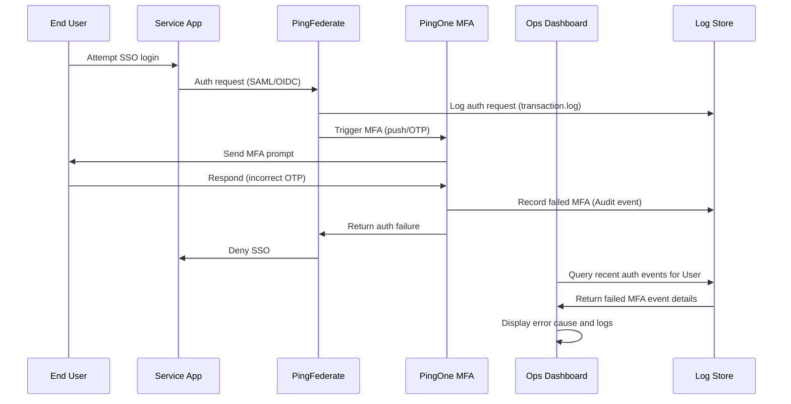
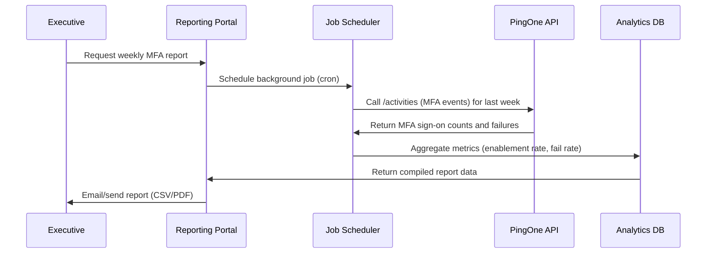

# Executive Summary  
Enhancing an identity team’s operations with Ping Identity APIs involves tapping into PingOne and Ping product-suite endpoints to surface SSO/MFA events, user/device status, and usage metrics. Key data sources include PingOne Platform APIs (for user/MFA config and audit events)【10†L27-L34】【43†L2074-L2082】, PingFederate’s REST APIs and logs【53†L1255-L1263】【53†L1339-L1347】, PingAccess audit logs【26†L591-L600】, PingDirectory audit logs, PingID’s MFA auth/admin APIs【57†L92-L100】【56†L42-L50】, and PingOne Protect risk events. Our integration will use these APIs to build: (1) **Ops tools** (real-time session and auth-trace viewers, search/filter UI, bulk user/device actions, alerting on failures) and (2) **Leadership reporting** (dashboards and scheduled reports showing metrics like MFA enablement rate, adoption trends, failure rates, top error causes). We recommend a backend that periodically ingests API-driven logs into a datastore (to overcome limited retention) and exposes them via a responsive UI. Security measures include strict API scopes and encryption for PII. Below is a detailed analysis of the APIs, endpoints, workflows, data model, and implementation considerations.  

## Ping Identity API Inventory  

| Product          | API/Feature                 | Endpoints / Data                         | Notes/Citations                                                                                 |
|------------------|-----------------------------|------------------------------------------|-----------------------------------------------------------------------------------------------|
| **PingOne (Platform)**  | User & MFA Management       | `/environments/{envID}/users` (CRUD, enableMFA)【43†L2074-L2082】; `/environments/{envID}/users/{userID}/mfaEnabled` (GET/PUT)【43†L2074-L2082】. | Enables MFA per-user; `mfaEnabled` Boolean toggles MFA. Also device mgmt (`/devices` sub-collection). |
|                  | Audit/Events (Logging)     | `/environments/{envID}/activities` (GET)【10†L27-L34】; `/monitoring/logs` (REST log entries)【31†L778-L787】. | `/activities` returns user and admin events (logins, config changes) with filters (date, user, action)【10†L27-L34】. `/monitoring/logs` (PingOne Advanced) streams raw log entries by source (e.g. `am-authentication`)【31†L778-L787】. |
|                  | PingOne MFA (Verify)       | User/device operations: e.g. `PUT /users/{id}/devices/{deviceId}/logs` (collect device logs)【15†L212-L221】; (List devices via `/devices` endpoint). | Device log API triggers mobile app to upload logs【15†L212-L221】. PingOne MFA dashbds report on usage (UI-driven). |
|                  | Analytics Reporting        | Built-in **Dashboards** (Auth, MFA, Risk)【66†L911-L919】【67†L894-L902】; Audit report UI (Monitoring > Audit). | Provides MFA adoption %, user counts, etc【66†L911-L919】; can export limited-range audit CSV.|
| **PingFederate** | Session Mgmt API           | `/pf-ws/rest/sessionMgmt/sessions/{sri}` (GET info)【53†L1255-L1263】; `/extend`, `/revoke` variants (POST)【53†L1321-L1330】【53†L1363-L1372】. | OAuth client must be allowed for session API. Returns JSON with session(s) for given session ID (pi.sri)【53†L1255-L1263】. |
|                  | Admin APIs & Logs          | Administrative API (REST for config)【22†L19-L27】; Session Revocation API; PF log files (`transaction.log`, `audit.log`, etc.【17†L1230-L1240】). | PF logs (transaction, audit) record each SAML/OIDC login and errors【17†L1230-L1240】. Can push logs to syslog/Splunk. |
| **PingAccess**   | Audit Logs                 | Log files: `pingaccess.log` (runtime), `pingaccess_engine_audit.log` (transactions)【26†L591-L600】; HAR-formatted audit logs (HTTP transaction details). | No public REST API for logs; use file auditing or sideband tools. |
|                  | Admin REST API             | Configuration API (resource/policy CRUD). | Primarily for provisioning, not direct troubleshooting. |
| **PingDirectory**| SCIM/LDAP APIs             | SCIM 1.1/2.0 endpoints (user CRUD); no built-in events API. | Directory user store; writes trigger `audit.log` (LDIF) for changes【28†L1-L4】. Useful as authoritative user source. |
| **PingID (legacy MFA)** | Auth & Admin APIs        | Authentication (Start, Online/Offline, Cancel) – SOAP/REST endpoints; User Mgmt (AddUser, GetUser, etc.)【57†L92-L100】【56†L42-L50】. | PingID APIs are older; PingOne MFA APIs are recommended for new development【55†L33-L36】. Use if PingOne not adopted. |
| **PingIntelligence/Protect** | Risk Events API         | PingOne API or streams (under Protect). | Risk policies produce events (high/medium/low risk) shown on dashboards【59†L888-L897】. These may be available via PingOne or forwarded to SIEM. |
| **Audit & Event Hub** | Audit APIs/Webhooks        | PingOne Subscription API (webhooks) and `/activities`【10†L27-L34】; PingFederate audit logs; PingID audit logs; syslog/CEF outputs. | For high-throughput, use event subscriptions or SIEM integration; note `/activities` is low-rate【68†L13-L16】. |

*Table: Ping Identity products and relevant APIs/endpoints for SSO/MFA data (with sample sources). Scopes/permissions must align (e.g. "identity.users.read", "identity.users.mfa.read", "environment.events.read") with PingOne roles. Follow least-privilege for all API credentials.*

## SSO/MFA Troubleshooting Endpoints

- **PingOne (Cloud)** – Use the Audit API to fetch recent auth events. The `/activities` endpoint returns timestamped events such as successful/failed sign-ins, MFA challenges, and admin actions【10†L27-L34】. (Note: `/activities` has a low rate limit【68†L13-L16】; for streaming use subscriptions.) For real-time MFA device status, use the MFA Device Logs API (`PUT /users/{id}/devices/{devId}/logs`) to trigger devices to send logs【15†L212-L221】. User session lookup via PingOne is limited (no direct session API), so rely on federation logs or set “tracking” in SSO templates to correlate events.

- **PingFederate (On-Prem)** – Leverage the Session Management API. Given an OAuth session identifier (pi.sri), call  
  ```
  GET /pf-ws/rest/sessionMgmt/sessions/{sri} HTTP/1.1
  Authorization: Basic <client-creds>
  ```
  This returns JSON with any valid sessions for that SRI (see example【53†L1255-L1263】). You can also POST to `/extend` or `/revoke` endpoints on the same path to extend/revoke all sessions for that SRI【53†L1321-L1330】【53†L1363-L1372】. For general SSO troubleshooting, consult PF log files: `transaction.log` shows each SAML/OIDC exchange, and `audit.log` shows selected transaction details【17†L1230-L1240】.

- **PingAccess** – Audit traffic by enabling HAR logging (writes `pingaccess_engine_audit_har.log`)【27†L580-L588】. Use regex filtering on this JSON-formatted log for specific API calls or errors. The primary logs are `pingaccess.log` and `pingaccess_engine_audit.log`【26†L591-L600】, which detail request/response pairs. There is no public REST API to query access logs.

- **PingID (if used)** – The PingID Authentication API returns rich JSON responses including status codes on each step. For troubleshooting, inspect the response of `AuthenticateOnline`/`AuthenticateOffline` calls (HTTP 200 vs 4xx/5xx with error codes from PingID)【57†L92-L100】. The User Management API allows querying a user’s devices and status (e.g. *GetUserDetails* returns user’s MFA status)【56†L42-L50】.  However, note that PingID is legacy; PingOne MFA APIs should be used if PingID is integrated into PingOne【55†L33-L36】.

- **Audit and Events** – In PingOne, the “Audit” console or `/activities` API can be queried with filters (date, user, source) to find events like failed authentications. E.g., a query might filter `action.type` = `USER_AUTHENTICATION` with `outcome = FAILURE`. Logs older than 14 days must be exported or ingested elsewhere. For broader SIEM integration, use webhooks or syslog from PingFederate/Access.

## MFA Enablement, Status, and Enrollment APIs

- **Enable/Disable MFA per user** – PingOne API:  
  `PUT /environments/{envID}/users/{userID}/mfaEnabled` with body `{"mfaEnabled": true}` enables MFA (and `false` disables). The GET equivalent checks status【43†L2074-L2082】. This drives the `mfaEnabled` attribute on the user.  
- **User’s registered MFA devices** – PingOne: `GET /environments/{envID}/users/{userID}/devices` (or protocol-specific sub-endpoints) lists devices (TOTP, email/SMS, push) for that user.  For PingID, use *GetPairingStatus* in the User Mgmt API to list paired devices【56†L42-L50】.  
- **Enrollment (admin)** – PingOne: have admin UI or SCIM in PingDirectory to add users, then call *Enable MFA* if default off. PingID: use *AddUser* and *StartOfflinePairing*/*GetActivationCode* to enroll devices.  
- **MFA adoption metrics** – PingOne’s Authentication Dashboard calculates “MFA adoption” (percentage of active users with MFA enabled over time)【66†L911-L919】. This metric can also be computed by fetching all users via API and counting `mfaEnabled=true`.  

## Reporting & Analytics Metrics

Key metrics and data sources include: 

- **MFA Enablement Rate (%):** = (users with `mfaEnabled=true`) / (total active users). Data from PingOne User API or `/activities` listing user creation/changes【10†L27-L34】【43†L2074-L2082】.  
- **MFA Adoption Over Time:** Trends of (MFA-used logins / total logins) per period. Compute from authentication events (PingOne audit logs or PF transaction logs) distinguishing which logins had MFA challenge. The Authentication Dashboard provides a visual of this trend【66†L911-L919】.  
- **SSO Success/Failure Rates:** From auth logs (PingOne activities, PF audit.log or PingAccess engine logs), count successes vs failures per app or user.  
- **MFA Failure Rate:** Number of failed MFA attempts (e.g. wrong OTP, push decline) over total MFA attempts. PingID API error responses (e.g. code 104 for timeout) and PingOne logs can feed this.  
- **Latency:** Average time between login start and completion (e.g. track timestamps from authentication-start to second-factor success). May require custom logging or correlating events via a transaction ID.  
- **Top Error Causes:** Aggregate by error code or message from PingID / PingOne responses. E.g. count occurrences of “DEVICE_NOT_REACHABLE” or OTP expiration.  

These metrics can be surfaced via dashboards (e.g. charts of MFA adoption【66†L911-L919】, heatmaps of login volume by day/hour【66†L931-L940】) and scheduled reports (CSV exports).  

## Operations UI Features & Workflows

- **Real-Time Session/Authentication Viewer:** A dashboard showing current active sessions (from PF Session API) and recent auth events (from PingOne logs). For example, an operator can enter a username to see their active session details (`GET /sessionMgmt/sessions/{sri}`) and recent login attempts (via `/activities?userId=...`).  
- **Search/Filter Logs:** Provide search across stored log/events by user, application, device ID, or error code. E.g. querying PingOne audit via API (filter by `userDisplayName` or `action.type`).  
- **Authentication Replay/Trace:** Given a failed login, display the sequence of steps (primary auth, MFA prompt, error) by stitching together events from logs. For instance: browser request → PingFederate transaction → PingID push → failure. This might use the PingFederate correlation token (PF-PFX) in logs to link steps.  
- **Bulk Actions:** Bulk enable/disable MFA or force re-enrollment for a group of users (via batch API calls to `PUT /users/{id}/mfaEnabled`). Export lists of users/devices in CSV for offline processing.  
- **Alerting:** Set thresholds (e.g. MFA failures > X in 5min) to trigger alerts (email/slack). This uses background jobs polling logs for error spikes.  
- **UI Example (Troubleshooting Sequence):** 



*Diagram: Troubleshooting a failed MFA flow. Logs/events are stored (DB) and queried via the Ops dashboard to diagnose the issue.*

## Leadership Dashboard & Reporting

- **High-Level Dashboards:** Summarize key stats (MFA adoption %, total users, login volume, failure trends). Use charts/“cards” like PingOne’s Auth Dashboard (e.g. MFA adoption evolution【66†L911-L919】, sign-ons chart).  
- **Scheduled Reports:** Ability to schedule and email periodic CSV/PDF reports (e.g. weekly MFA enablement compliance, system health). Backend can use Audit API to fetch last-period data and format it.  
- **Exportable Data:** Enable exporting tables (user lists, device lists, error logs) to CSV or PDF for execs.  
- **Example Workflow (Report Generation):** 



*Diagram: Generating a leadership report on MFA usage. Data is collected via API and aggregated for scheduled delivery.*

## Data Model & Storage

We recommend storing events and user status in a local data store for long-term analysis. For example:  

- **Events Table:** Each record (AuthEvent) with `timestamp`, `userId`, `type` (auth, mfa, etc), `status` (success/fail), `deviceId`, `errorCode`, `ipAddress`. Ingest via API calls or streaming (webhooks).  
- **Users Table:** Mirror of identity data (`userId`, `mfaEnabled`, `enrollmentDate`, etc) updated via SCIM or Polling APIs.  
- **Sessions Table:** Track active sessions if needed (`sessionId`, `userId`, `startTime`, `lastActivity`, `expiry`). Populated from Session API.  
- **Reports Table:** Pre-computed aggregates (daily MFA adoption %, error counts) if needed.  

**Retention:** PingOne retains audit logs only ~90 days【10†L27-L34】, so store data locally to keep historical trends beyond that. Define retention policy per data type (e.g. auth events 1–3 years, PII scrub as required by policy).  

## Security & Privacy Considerations

- **Scopes & Least Privilege:** Assign minimal API scopes to the worker app/service. E.g., allow only “Read Users” and “Read MFA” scopes for querying status, and “Read Events” for audit logs【43†L2074-L2082】. Separate credentials for admin actions (enabling MFA).  
- **Data Protection:** Logs and user data contain PII (usernames, IP addresses). Encrypt data at rest, secure access controls on the integration database. Ensure compliance with privacy policy (e.g. store only hashed user IDs if possible).  
- **Consent & Policy:** Since this is internal ops use, explicit user consent isn’t needed beyond existing terms. However, ensure monitoring activities align with corporate acceptable-use and GDPR (if applicable) by logging usage audit.  
- **Audit:** Log all actions taken by the integration itself (e.g. when an admin triggers a bulk disable MFA). Ideally these logs feed back into PingOne or SIEM for traceability.  

## Implementation Complexity & Prioritization

We classify features by effort (Low/Med/High) and impact:

- **Inventory & Basic Queries:** *Low.* Setting up API clients to call PingOne’s `/activities`, PingFederate’s session API, PingID user API. High value for visibility.  
- **Realtime Session Viewer:** *Medium.* Uses PF session API and live log queries. Valuable for support.  
- **Search/Filter Interface:** *Medium.* Implement UI with filtering on stored events. Relatively straightforward with a good search backend.  
- **Authentication Trace (Replay):** *High.* Correlating multi-step flows requires correlating tokens/IDs; complex but powerful for ops.  
- **Dashboards (MFA adoption, SSO stats):** *Medium.* Use time-series charts; leverage existing calculations like PingOne’s adoption metrics【66†L911-L919】.  
- **Bulk MFA Management:** *Low/Med.* Straightforward API calls; UI for selecting users. Important for onboarding/policy changes.  
- **Alerting Mechanism:** *High.* Requires defining thresholds and infrastructure (email/SMS hook).  
- **Reporting/Export (CSV/PDF):** *Medium.* Use standard libraries; low complexity but valuable for execs.  

Prioritize features that combine high value and lower effort first (e.g. dashboards, basic search, MFA status checks). More complex features (trace replay, alerting) come after foundation is solid.

## API Rate Limits & Error Handling

- **Rate Limits:** PingOne’s Audit `/activities` has a low limit (few requests per minute)【68†L13-L16】. The `/monitoring/logs` endpoint allows ~60 calls/min with up to 1,000 records/page【32†L35-L43】. Handle 429 responses by backing off (sleep/retry).  
- **Retry Strategy:** Implement exponential backoff on transient errors (HTTP 429, 5xx). PingOne advises incremental delays for idempotent calls【68†L13-L16】. For critical data (logs), schedule retries or use Kafka-style log shipping if possible.  
- **Error Logging:** Capture and log API error details (status, timestamp) to aid debugging. Alert if persistent failures occur.  

## Monitoring & Observability of the Integration

- **Self-Monitoring:** Instrument the integration to emit metrics (API call counts, latencies, error rates). Use existing platforms (Prometheus, CloudWatch). Trigger alerts on spikes in errors or API usage.  
- **Audit Access:** Record which admins use the ops UI and which data/actions they invoke. Feed these into your own audit trail.  
- **PingOne/Splunk Integration:** Consider using the *PingOne App for Splunk*【77†L0-L4】 to ingest PingOne events directly into a SIEM or dashboard, for an external view. Alternatively, stream events from PF/PingOne into SIEM via webhook/Syslog.  

## Alternative Data Sources

- **IdP Logs:** Many SSO errors appear only in on-prem logs (PF server.log, admin.log). Configure forwarding to a log aggregator (e.g. Splunk/ELK).  
- **PingAccess/AWS Logs:** Use PingAccess sideband or HAR logs to diagnose API gateway issues.  
- **SIEM/Syslog:** Forward all PingFederate, PingAccess, PingDirectory logs to a central SIEM. This supplement can provide correlation across the entire auth infrastructure.  
- **User Analytics:** If SSO is front-ended by tools like login.gov or third-party IdPs, their logs are additional sources (though less relevant for Ping operations).  

**Sources:** Official Ping Identity documentation (API references and guides) as cited above【10†L27-L34】【15†L212-L221】【43†L2074-L2082】【53†L1255-L1263】【66†L911-L919】【67†L894-L902】. Tables and diagrams are illustrative; API sample snippets are based on PingOne/PingFederate docs.