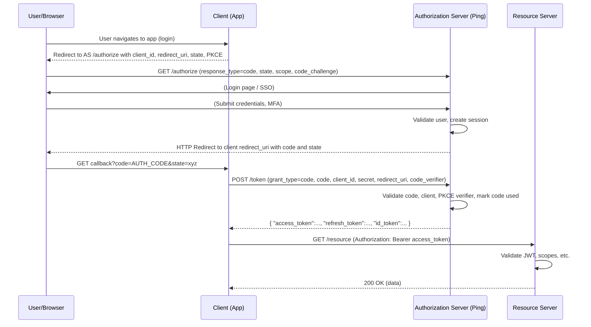
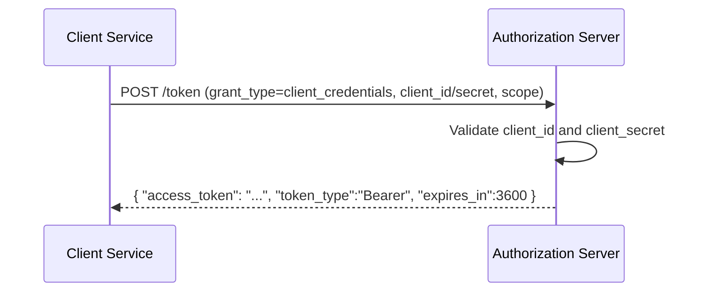
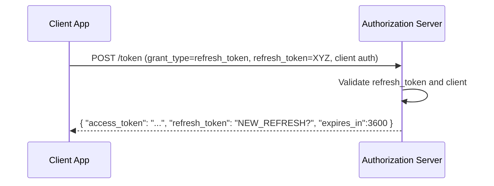
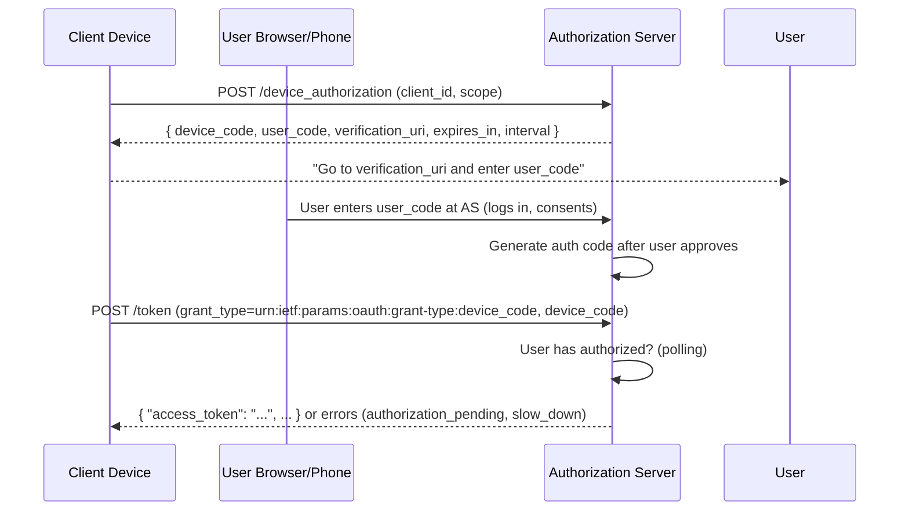
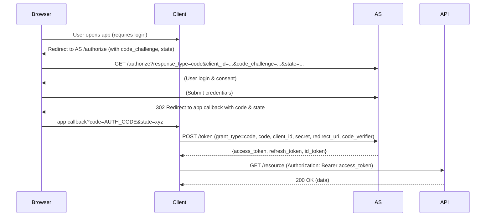
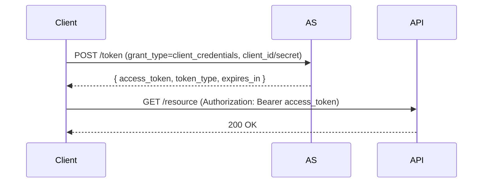
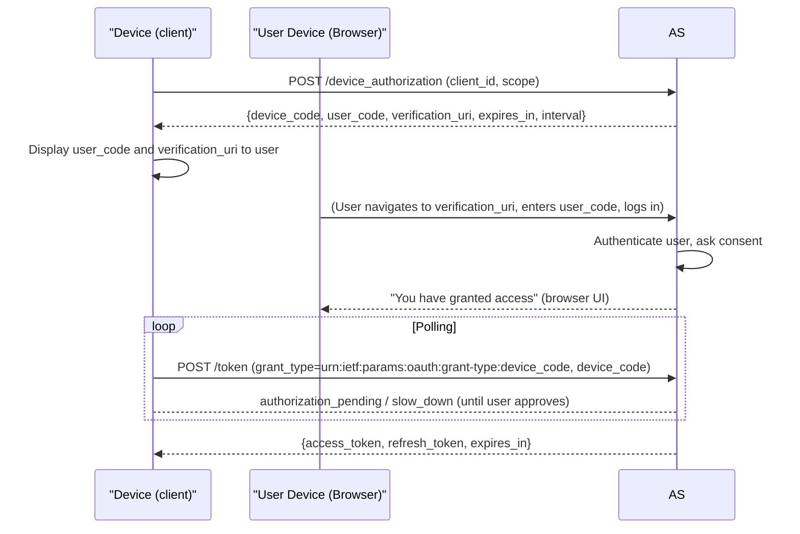

# OAuth2 Grant Types – In-Depth Engineering Guide

**Executive Summary:** This report exhaustively covers OAuth2 grant types (3‑legged and 2‑legged) with a focus on the **Authorization Code** flow internals. We examine each grant (Authorization Code, Client Credentials, Refresh Token, Device Code, and Implicit), explain when to use each, and show sequence diagrams with concrete HTTP examples. For the Authorization Code flow, we detail *every step*: the `/authorize` request, user authentication, code generation and storage, and the back-channel `/token` exchange (including PKCE, state/nonce, one-time code binding, etc). We also cover token creation (JWT vs opaque), claims, signing (JWS), key management (JWKS), refresh-token rotation, introspection, revocation, and common error cases (`invalid_grant`, `redirect_uri_mismatch`, etc). Diagrams (Mermaid) illustrate the flows. **RFC 6749**, **RFC 7636**, **RFC 8628**, **RFC 8693**, OIDC Core, and Ping Identity docs are used as authoritative sources【16†L1400-L1405】【13†L143-L152】.

---

## OAuth2 Roles and Grant Categories

- **Resource Owner:** End-user (with an account on the identity provider)  
- **Client:** Application seeking access (e.g. web app, mobile app, backend service)  
- **Authorization Server (AS):** Issues tokens (e.g. Ping Federate)  
- **Resource Server (API):** Accepts access tokens to serve data

OAuth grants fall into two broad categories:

- **3-Legged (Delegated User Consent) Flows:** involve a user (resource owner) granting an application access. *Examples:* Authorization Code (with PKCE), Implicit (deprecated), Device Code.  
- **2-Legged (Machine-to-Machine) Flows:** no end-user; client uses its own credentials. *Examples:* Client Credentials.

We will cover all major grant types:

- **Authorization Code Grant (3-legged)** – user-facing OAuth code flow (with PKCE for public clients)【16†L1400-L1405】.  
- **Client Credentials Grant (2-legged)** – machine-to-machine authentication.  
- **Refresh Token Grant (extension)** – exchange a refresh token for a new access token.  
- **Device Authorization Grant (3-legged)** – for devices without browsers (RFC 8628).  
- **Implicit Grant (3-legged, deprecated)** – insecure browser-based flow (no code exchange)【13†L183-L191】.  
- **Token Exchange (RFC 8693)** – convert one token to another (delegation scenarios).

Each flow will be illustrated with a sequence diagram and example HTTP requests/responses. 

We also explain **2-legged vs 3-legged** architectures, code/token formats, and security considerations (CSRF, replay attacks, etc).

---

## Table: OAuth2 Grant Types Overview

| Grant Type                  | Typical Use Case                                   | Client Type | User Involved? | Token Issued      | Main Steps                     |
|-----------------------------|----------------------------------------------------|-------------|----------------|-------------------|--------------------------------|
| **Authorization Code**      | Web apps, mobile apps (user login with OAuth)      | Confidential / Public | **Yes**    | Access & optional Refresh; ID token in OIDC | (A) Browser→AS login → code issued → (B) Server→AS token exchange |
| **Authorization Code + PKCE** | Public clients without client_secret (mobile/SPA) | Public      | Yes            | Same as above      | Same as above + code_challenge / code_verifier steps |
| **Client Credentials**      | Service-to-service APIs (no user)                  | Confidential | No             | Access Token only | Client authenticates with ID/secret → token issued |
| **Refresh Token**           | Token renewal (any client)                         | Confidential / Public | No (grant reuse) | New Access Token    | Client sends refresh token to AS → new tokens returned |
| **Device Authorization**    | Smart TVs, IoT devices (no browser)                | Public      | Yes (via second device) | Access Token (after user approves) | (1) Device→AS request codes → (2) User enters code on second device → (3) Device polls AS for token |
| **Implicit (deprecated)**   | Legacy SPAs/browser apps (not recommended)         | Public      | Yes            | Access Token (directly) | (A) Browser→AS login → (B) AS redirects with token in URI fragment |
| **Token Exchange (RFC 8693)** | Token delegation / impersonation scenarios        | Confidential / Public | Yes or No   | Another token       | Client presents token → AS returns different token |

Each grant type has distinct steps and security properties. We diagram them and detail their HTTP messages below.

---

## 2-Legged vs 3-Legged Flows

- **3-Legged Flow** (User-driven): Involves the **Resource Owner (User)**. Example: A user logs into a third-party web app using corporate SSO. Flow:  
  1. User initiates login in Client (often via browser redirect).  
  2. Client redirects user (browser) to AS `/authorize`.  
  3. User authenticates at AS (login form, MFA).  
  4. AS issues **authorization code** (in redirect back to client).  
  5. Client backend exchanges code at AS `/token` for tokens (access, refresh, ID).  
  6. Client uses access token to call APIs.  
  This flow delegates user consent/credentials to AS【16†L1400-L1405】【16†L1447-L1455】.

- **2-Legged Flow** (Machine-to-machine): No user. Example: A backend service calls another internal service. Flow:  
  1. Client sends credentials (`client_id`/`secret` or certificate) to AS `/token`.  
  2. AS validates client and returns an access token.  
  3. Client uses token on Resource Server.  
  This uses the **Client Credentials grant**【7†L209-L214】.

Below, we detail each grant.

---

## Authorization Code Grant (3-Legged) – Step-by-Step

The **Authorization Code Grant** (RFC 6749 Sec 4.1) is the most common secure user login flow【16†L1400-L1405】. It occurs in two phases: a front-channel (browser redirect) and a back-channel (server-to-server).  

### (1) Authorization Request (Front-Channel)

The client initiates by redirecting the user’s browser to the AS’s `/authorize` endpoint, with parameters such as `response_type=code`, `client_id`, `redirect_uri`, `scope`, and a random `state` (to prevent CSRF)【16†L1447-L1455】【16†L1500-L1508】. Example HTTP request:

```http
GET /oauth2/authorize?
    response_type=code
    &client_id=client123
    &redirect_uri=https%3A%2F%2Fapp.example.com%2Fcb
    &scope=openid%20profile%20email%20api.read
    &state=xyzABC123
    &code_challenge=...       # (with PKCE)
    &code_challenge_method=S256
HTTP/1.1
Host: auth-server.example.com
```

- **`response_type=code`** tells the AS we want an authorization code【16†L1484-L1492】.
- **`state`** is a random opaque string chosen by client; AS will return it verbatim to prevent CSRF【16†L1500-L1508】.
- **`code_challenge` & `code_challenge_method`**: If using PKCE (mandatory for public clients), these are included【26†L912-L920】.
- The browser then shows the AS login page (or an existing SSO session).

### (2) User Authentication and Consent

The user logs in at the AS, possibly with MFA, and grants consent for requested scopes. The AS establishes a user session (cookie or session on server).

### (3) Authorization Code Issuance (Front-Channel Redirect)

After successful login, the AS **generates an authorization code** and redirects the user’s browser back to the client’s `redirect_uri`, including the `code` and the original `state`. For example:

```
HTTP/1.1 302 Found
Location: https://app.example.com/cb?code=QWERTY12345&state=xyzABC123
```

Key points about the authorization code:
- It **must expire quickly** (RFC 6749 recommends ≤10 minutes; typically 30–60 seconds)【16†L1542-L1547】.
- It is **single-use**: once exchanged, it cannot be reused.
- It must be bound to the **client_id**, **redirect_uri**, and **user**. The AS should verify these on exchange【13†L143-L152】【16†L1459-L1467】.
- If PKCE is used, the AS stores the `code_challenge` and method with this code【13†L155-L157】.
- Implementation: The code can be a **random opaque string** stored in a server database/cache, or a short JWS token containing these fields【13†L143-L152】. 

**Authorization Code Storage Model (illustrative):**

```yaml
authorization_code: "QWERTY12345"
client_id: "client123"
redirect_uri: "https://app.example.com/cb"
user_id: "user789"
scope: "openid profile email api.read"
expires_at: "2026-04-27T12:53:45Z"
used: false
code_challenge: "nQx9..."
code_challenge_method: "S256"
```

The AS keeps this record (in memory or DB) until it’s exchanged or expires. It ensures one-time use by marking it `used=true` on exchange.

### (4) Token Request (Back-Channel)

The client backend (not the browser) makes a direct HTTPS POST to the AS `/token` endpoint to exchange the code for tokens. This is the **back-channel**, which is more secure (client secret and code_verifier not exposed to browser).

Example request:

```http
POST /oauth2/token HTTP/1.1
Host: auth-server.example.com
Content-Type: application/x-www-form-urlencoded

grant_type=authorization_code
&code=QWERTY12345
&redirect_uri=https%3A%2F%2Fapp.example.com%2Fcb
&client_id=client123
&client_secret=CLIENT_SECRET    # Omit if public client (PKCE)
&code_verifier=dBjftJeZ4CVP** (if PKCE was used)
```

- **`grant_type=authorization_code`**: tells AS which grant we’re using【14†L9-L16】.
- **`code`**: the code received from step (3).
- **`redirect_uri`**: must match the one in the authorization request; AS must verify it【13†L143-L152】.
- **Client authentication**: If the client is confidential, include `client_secret`. For public (mobile/SPA), no secret is sent, but *PKCE* binds the request.
- **`code_verifier`**: if using PKCE, this is the original random string that matches the earlier `code_challenge`【26†L912-L920】.

### (5) Token Response

If the request is valid, the AS validates:

- The **authorization code exists**, is unused, not expired, and matches the `client_id` and `redirect_uri`【13†L143-L152】【16†L1471-L1475】.
- The client secret (if provided) is correct.
- If PKCE was used, compute `hash(code_verifier)` and compare to stored `code_challenge` (e.g. using SHA-256/S256)【20†L73-L82】.
- The `state` matching is already done on redirect; no more state needed here.
- On success, the AS marks the code as used (cannot be reused).

The AS then **issues tokens** (typically a JWT access token, an ID token if OIDC, and a refresh token if allowed). Example JSON response:

```json
HTTP/1.1 200 OK
Content-Type: application/json

{
  "access_token": "eyJhbGciOiJSUzI1NiIs...<JWT>...",
  "token_type": "Bearer",
  "expires_in": 3600,
  "refresh_token": "8xLOxBtZp8",
  "id_token": "eyJhbGciOiJSUzI1NiIs...<JWT>..."
}
```

- **Access Token:** A short-lived token (often JWT) meant for APIs. It contains scopes/permissions and user info as claims.
- **Refresh Token:** A long-lived opaque token for renewing the access token later.
- **ID Token (OIDC only):** A JWT asserting the user’s identity (used by the client to establish a session)【13†L165-L174】.
- The AS signs JWTs with its private key (JWS) and includes an `exp` claim, issuer `iss`, audience `aud` (the client or the API), etc.【16†L1542-L1547】.

### Sequence Diagram



This diagram highlights the **front-channel** (browser) and **back-channel** (server-to-server) steps, code issuance, and token exchange.

### Security Features

- **State Parameter:** Prevents CSRF by binding the flow to the client. The client checks returned `state` matches the original【16†L1500-L1508】.
- **Nonce (OIDC-specific):** A random value the client sends in `/authorize` that the AS includes in the ID Token, to prevent replay of ID tokens. (Not covered deeply in OAuth spec but in OIDC spec.)  
- **One-Time Code:** The code is one-time use and short-lived【16†L1542-L1547】. Any reuse yields `invalid_grant`.  
- **PKCE (Proof Key for Code Exchange):** For public clients (mobile/SPAs), the client generates a high-entropy `code_verifier` (256-bit random) and sends a hashed `code_challenge` in the auth request. The AS stores the challenge【13†L155-L157】. Upon `/token`, the client sends the raw `code_verifier`, which AS hashes and compares. This thwarts intercepted code reuse【18†L734-L742】【20†L39-L47】.  
- **Redirect URI Matching:** AS must verify that the `redirect_uri` in the token request matches exactly the one used in auth request【13†L143-L152】【16†L1469-L1475】.  
- **Client Authentication:** Confidential clients must authenticate at token endpoint (e.g., with `client_secret`)【16†L1464-L1473】, preventing misuse of stolen codes.

### Common Errors and Checks

- `invalid_client`: Client_id/secret wrong.
- `invalid_grant`: Code already used, expired, or mismatched.
- `redirect_uri_mismatch`: Redirect URI differs.
- `invalid_request`: Missing parameters.
- `invalid_scope`: Requested scope not allowed.
- `access_denied`: User denied consent.
- `invalid_request`: State missing or mismatched (CSRF detected).
  
For example, if the code was already exchanged, the AS returns `400 Bad Request` with `error=invalid_grant`. If `redirect_uri` doesn’t match, AS may return `error=invalid_grant` or `error=invalid_request`. In logs, you’d see messages like `"Authorization code <code> not found or expired"` or `"Redirect URI mismatch"`.

### Authorization Code Flow (conclusion)

In summary, the **Authorization Code grant** provides a secure handshake with user involvement【16†L1400-L1405】. The code is a short-lived ticket, and tokens are issued over a secure back-channel. Implementing it correctly requires careful handling of state, PKCE, and code storage【13†L143-L152】【16†L1542-L1547】.

---

## Client Credentials Grant (2-Legged, No User)

The **Client Credentials Grant** (RFC 6749 Sec 4.4) is used for server-to-server authentication【7†L209-L214】. No user logs in; instead, the client (a machine/service) uses its own credentials.

### Flow Diagram



### HTTP Example

```http
POST /oauth2/token HTTP/1.1
Host: auth-server.example.com
Authorization: Basic base64(client_id:client_secret)
Content-Type: application/x-www-form-urlencoded

grant_type=client_credentials
&scope=read:orders write:orders
```

- The client must authenticate (often via HTTP Basic with `client_id:client_secret`).
- No `code` or `redirect_uri` since no user is involved.
- The AS returns an access token (JWT or opaque) with the specified scope.

The access token is typically issued with the **`sub`** claim set to the client itself (or a service account identity), and **`aud`** to the target API. For example:

```json
{
  "iss": "https://idp.example.com",
  "sub": "client-service-abc",
  "aud": "inventory-api",
  "scope": "read:orders write:orders",
  "exp": 1712345678
}
```

Common pitfalls:
- Not securely storing the client secret (in config or env, not in source).
- Not rotating secrets regularly.
- Using overly broad scopes (principle of least privilege).

This grant returns **no refresh token** (since no user to re-authenticate). The client must request a new access token when it expires.

---

## Refresh Token Grant

OAuth2 defines the **Refresh Token** grant to obtain a new access token when the original expires【16†L1542-L1547】. This is an extension, not a full flow with user involvement.

### Flow



The client sends its **refresh token** to `/token`:

```http
POST /oauth2/token HTTP/1.1
Host: auth-server.example.com
Content-Type: application/x-www-form-urlencoded

grant_type=refresh_token
&refresh_token=HjK8Df93W... 
&client_id=client123
&client_secret=secret
```

- The AS validates the refresh token (not expired, not revoked) and client authentication.
- It issues a new access token. Depending on policy, it may issue a new refresh token (rotating the token).
- Common practice (for security) is **refresh token rotation**: when a refresh token is used, it is invalidated and replaced by a new one. This limits replay if a refresh token leaks.

Refresh tokens should be stored securely (not in browser localStorage). They can be long-lived but must be revocable (via a revocation endpoint or blacklist) if needed.

Common errors:
- `invalid_grant`: if the refresh token is expired, revoked, or invalid.
- `invalid_client`: if client auth fails.
- `invalid_scope`: if requested scope outside original. The new token’s scopes must be subset of original.

---

## Device Authorization Grant (Device Code Flow, RFC 8628)

The **Device Code grant** is for devices without a browser or with limited input (smart TVs, IoT)【9†L78-L85】. The device obtains a user code and verification URI, the user authorizes on another device, and then the original device polls for the token.

### Flow Overview



- **Step 1:** Device requests codes:
  ```http
  POST /oauth2/device_authorization
  grant_type=urn:ietf:params:oauth:grant-type:device_code
  &client_id=device_app
  &scope=openid profile
  ```
- **Step 2:** AS responds with `device_code`, `user_code`, `verification_uri`, and how often to poll.
- The device shows `user_code` and `verification_uri` to user (e.g. on-screen instructions).
- **Step 3:** User, on a separate device (phone), browses to `verification_uri`, enters `user_code`, logs in, and approves.
- **Step 4:** Device polls token endpoint:
  ```http
  POST /oauth2/token
  grant_type=urn:ietf:params:oauth:grant-type:device_code
  &device_code=abcde12345
  &client_id=device_app
  ```
- AS returns `authorization_pending` until user finishes. Once authorized, returns tokens.
- **Step 5:** Device receives access (and refresh) token, then can call APIs as usual.

Key citation: The OAuth Device Code flow is defined in RFC 8628【9†L78-L85】. Ping Federate also supports this flow via a device authorization endpoint【24†L1099-L1106】.

Common response codes during polling:
- `authorization_pending`: user hasn’t finished.
- `slow_down`: back off polling interval.
- `expired_token`: `device_code` expired.

---

## Implicit Grant (Deprecated)

The **Implicit Grant** (OAuth 2.0 Section 4.2) is a legacy 3-legged flow where the AS returns an access token (and possibly ID token) directly in the redirect URI fragment. It is **no longer recommended** due to security risks【13†L183-L191】. In this flow:

```mermaid
sequenceDiagram
    participant Browser as User/Browser
    participant Client as Browser App
    participant AS as Authorization Server

    Browser ->> AS: /authorize?response_type=token
    AS ->> Browser: 302 Redirect to redirect_uri#access_token=xyz&state=...
    Browser: (Client app JS reads token from URL fragment)
```

Example redirect (from [13]):

```
HTTP/1.1 302 Found
Location: https://app.example.com/redirect#access_token=abc123&state=xyz&token_type=Bearer&expires_in=3600
```

- **Risks:** Tokens appear in URL fragment, exposing them to browser history, logs, and possible interception.  
- **Current Best Practice:** Use Authorization Code with PKCE instead【13†L199-L207】【13†L211-L214】. Modern OAuth2.1 deprecates the Implicit flow entirely.

We mention it for completeness but strongly advise against it.

---

## Token Exchange (RFC 8693)

The **Token Exchange** grant (RFC 8693) allows a client to swap one token for another (e.g. exchange an access token for one with different scopes or on behalf of a different user). This is an advanced use (not typical in initial setup, more for delegation). For brevity, we note:

- Client calls token endpoint with `grant_type=urn:ietf:params:oauth:grant-type:token-exchange` and provides an `subject_token` and desired parameters (scope, audience, requested_token_type).
- AS validates and issues a new token accordingly (possibly impersonating a service account or other client).

Due to complexity and less common usage, we refer to RFC 8693 rather than detailing it here (focus is on core grants above)【16†L1542-L1547】.

---

## Token Formats and Validation

### JWT vs Opaque Tokens

- **JWT (JSON Web Token):** Self-contained tokens (signed JWS) with payload. Common for access and ID tokens. Contains claims like `iss` (issuer), `sub` (subject/user id), `aud` (audience/API), `exp` (expiry), `scope`, and custom claims【13†L143-L152】【16†L1542-L1547】. For example:

  ```json
  {
    "iss": "https://idp.example.com",
    "sub": "user123",
    "aud": "orders-api",
    "exp": 1712345678,
    "scope": "read:orders write:orders",
    "roles": ["admin","finance"]
  }
  ```

  The signature is verified by resource servers using the IdP’s public key, obtained from its JWKS endpoint (`/.well-known/jwks.json`).

- **Opaque Token:** A random string with no embedded info. Must be validated by introspecting with the AS. E.g., `Yw3l92Kmp...`. Less common in pure OAuth2/OIDC stacks (JWT is more popular), but may be used for refresh tokens (for privacy) or if AS chooses.

### Token Signing and JWKS

AS signs JWTs with a private key (e.g. RS256). It publishes public keys via JWKS (JSON Web Key Set) at `/.well-known/jwks.json`. Resource servers fetch these keys (cache them) to verify JWT signatures.

### Token Introspection

For opaque access tokens or when needed, OAuth defines an **Introspection Endpoint**. A resource server can call AS `/introspect` with a token, and get back active/inactive plus meta info (claims, scopes). This is more common with opaque tokens.

### Refresh Token Rotation and Revocation

- **Rotation:** When a refresh token is used, AS issues a new one and invalidates the old (prevents reuse). This is an extra security measure. For example, if a refresh token leaks, it can’t be reused beyond first use.
- **Revocation:** OAuth defines a revocation endpoint (RFC 7009) where clients or admins can revoke tokens. Ping supports OAuth token revocation endpoints【24†L1201-L1209】.

---

## Security Considerations

- **CSRF (Cross-Site Request Forgery):** Prevented by using the `state` parameter【16†L1500-L1508】.
- **XSS (Cross-Site Scripting):** Especially for SPAs storing tokens in browser; best to use HTTP-only cookies (if same-site) or in-memory storage. In OAuth2 flows, avoid storing tokens in localStorage.
- **Replay Attacks:** 
  - **Authorization code:** One-time use, short TTL【16†L1542-L1547】.
  - **Token Reuse:** Use short-lived access tokens, rotate refresh tokens, and consider token binding (out of scope here).
- **Open Redirects:** AS must strictly validate `redirect_uri` exactly, not allow wildcards, to prevent redirect hijack (RFC 6749 Sec 3.1.2).
- **Token Leakage:** Use HTTPS always. Prefer JWTs with minimal necessary claims (avoid PII in tokens).
- **Client Authentication:** Treat client secrets like passwords. For public clients, skip secrets and rely on PKCE.
- **Scopes and Claims:** Follow least privilege. Use specific scopes, not wildcards like `*`. Include only needed claims.

Many of these are detailed in the OAuth2 Security Best Current Practice (RFC 9255 etc.) and Ping Identity’s security guides.

---

## Common Error Logs (Example)

- `invalid_client`: wrong client_id/secret (seen in AS logs: “Client authentication failed”).
- `invalid_grant`: e.g. “Authorization code has already been used or is invalid”.
- `redirect_uri_mismatch`: “Provided redirect_uri does not match registered value”.
- `authorization_pending`: device flow (user hasn’t approved yet).
- `access_denied`: user clicked “deny” on consent.
- `invalid_scope`: requested scope not allowed for client.

When debugging, check:
- Was the `/authorize` request valid (params, redirect URI registered)?
- Did the AS create an auth code entry and did the `/token` use the exact same redirect URI?
- Was the code exchanged more than once?
- Are the clocks synchronized (code/token expiry)?
- Is PKCE `code_verifier` correct?

---

## Sequence Diagrams for Each Grant

**Authorization Code Flow (with PKCE):**



**Client Credentials Flow:**



**Device Code Flow:**



---

## Additional Details

### PKCE Code Challenge Example

For PKCE, the client generates a random 32-byte value and base64-url-encodes it as `code_verifier`. Example in pseudocode:

```python
import os, base64, hashlib
code_verifier = base64.urlsafe_b64encode(os.urandom(32)).rstrip(b'=')
code_challenge = base64.urlsafe_b64encode(hashlib.sha256(code_verifier).digest()).rstrip(b'=')
```

The client sends `code_challenge=code_challenge` (with `method=S256`) in `/authorize`. Later, it sends `code_verifier` in `/token`. The AS computes SHA256 and compares to stored `code_challenge`【18†L734-L738】【20†L43-L49】.

Ping Identity PKCE docs confirm:
> *code_verifier*: random string sent in token request.  
> *code_challenge*: derived from code_verifier, sent in auth request.  
> *code_challenge_method*: method used (e.g. S256)【26†L912-L920】.

### Code and Token Lifetimes (Typical Defaults)

| Artifact           | Expiry/TTL       | Description                         |
|--------------------|------------------|-------------------------------------|
| **Auth Code**      | ~1–2 minutes (≤10min)【16†L1542-L1547】 | Very short-lived, single-use       |
| **Access Token**   | ~5–60 minutes (configurable) | Short-lived token for APIs        |
| **Refresh Token**  | Days–months (configurable) | Long-lived, stored securely        |
| **ID Token**       | Same as access token | Contains user identity (OIDC)      |
| **Device Code**    | Minutes (from AS response) | Used in device flow (RFC 8628)    |
| **User Code**      | Minutes (display to user) | Shown to user in device flow       |

### Data Storage Example (Auth Code)

A typical server-side table for auth codes might be:

| code (PK)  | client_id | user_id | redirect_uri           | scope          | expires_at         | used | code_challenge | code_challenge_method |
|------------|-----------|---------|------------------------|----------------|--------------------|------|----------------|-----------------------|
| QWERTY1234 | client123 | user789 | https://app/callback   | openid profile | 2026-04-27 12:53:45| false| AbCdEfGhIj...  | S256                  |

On token request, AS finds this row, checks `used==false`, `expires_at>now`, matches `redirect_uri`, then marks `used=true` and issues tokens.

### Token Validation (on Resource Server)

When an API receives a token (JWT), it must validate:
1. Signature (use JWKS from AS to verify JWS)  
2. `iss` (matches expected issuer)  
3. `aud` (matches this API)  
4. `exp` (not expired)  
5. `scope` includes required scopes  
6. (Optional) `nbf`, `iat` if used.

If ANY fail, reject with 401. Common mistakes: forgetting to check audience, not handling expired tokens gracefully, or trusting tokens without signature check.

---

## References

- OAuth 2.0 Specification (RFC 6749) – Grant types and flows【16†L1400-L1405】【16†L1542-L1547】.  
- OAuth 2.0 Security Best Practices (RFC 9207, 9255).  
- Proof Key for Code Exchange (PKCE, RFC 7636) – PKCE mechanics【18†L734-L742】.  
- OAuth 2.0 Device Authorization (RFC 8628) – Device flow.  
- OAuth 2.0 Token Exchange (RFC 8693).  
- OpenID Connect Core Spec – ID Token structure.  
- Ping Identity Documentation – OAuth endpoints and PKCE【26†L912-L920】.  
- OAuth.com “Authorization Response” – Authorization code storage considerations【13†L143-L152】.  

This comprehensive guide should equip an authentication engineer to implement, debug, and secure OAuth2 grant flows in real-world systems. The key is understanding the purpose of each message, strict validation of all parameters, and robust error handling.