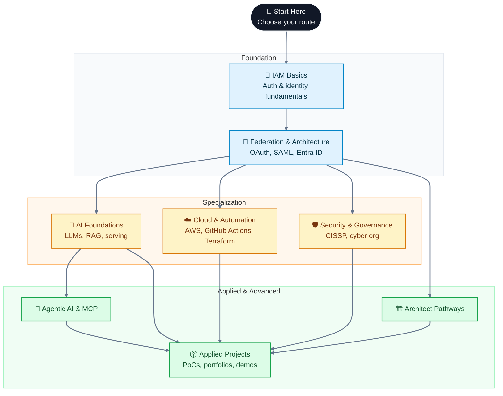

# Learning Resource

This repository is a personal learning library organized by technology domain. It brings together course-style content, study guides, architecture notes, reference material, and applied project work across AI, IAM, cloud, security, DevOps, and related disciplines.

## What this repository contains

This workspace is designed to be browsed as a set of learning paths rather than a single course. Each domain folder contains a mix of:

- structured course or module content in HTML
- markdown guides and notes
- architecture references and playbooks
- project briefs and implementation notes

## Recommended way to use it

1. Start with one of the main domain folders: ai, iam, cloud, security, or devops.
2. Open the main index or primer file inside that folder.
3. Follow the modules in order from the first entry point onward.
4. Use the reference and templates folders for supporting material.

## Repository structure

### Quick-reference catalog

This table is the fastest way to scan what exists in the workspace without opening folders manually.

| Directory | Course or track | Primary entry point | Best for |
|---|---|---|---|
| [ai/](ai/) | AI learning umbrella | [ai/agentic-ai-mcp/AGENTIC_DOC_00_MASTER_INDEX.html](ai/agentic-ai-mcp/AGENTIC_DOC_00_MASTER_INDEX.html) | Overall AI path |
| [ai/00-local-lab-setup/](ai/00-local-lab-setup/) | Local lab setup and AI engineering roadmap | [ai/00-local-lab-setup/ai-engineering-roadmap.html.html](ai/00-local-lab-setup/ai-engineering-roadmap.html.html) | Lab setup and environment |
| [ai/01-llm-frameworks/](ai/01-llm-frameworks/) | LLM frameworks series | [ai/01-llm-frameworks/DOC_01_LLM_FRAMEWORKS_DIAMOND.html](ai/01-llm-frameworks/DOC_01_LLM_FRAMEWORKS_DIAMOND.html) | LLM foundations |
| [ai/02-model-serving/](ai/02-model-serving/) | Model serving | [ai/02-model-serving/DOC_02_MODEL_SERVING_DIAMOND.html](ai/02-model-serving/DOC_02_MODEL_SERVING_DIAMOND.html) | Inference and serving |
| [ai/03-rag-concepts/](ai/03-rag-concepts/) | RAG and vector storage | [ai/03-rag-concepts/DOC_03_RAG_VS_PROMPT_DIAMOND.html](ai/03-rag-concepts/DOC_03_RAG_VS_PROMPT_DIAMOND.html) | RAG concepts |
| [ai/04-frontend-ui/](ai/04-frontend-ui/) | Frontend UI for AI apps | [ai/04-frontend-ui/DOC_04_FRONTEND_UI_DIAMOND.html](ai/04-frontend-ui/DOC_04_FRONTEND_UI_DIAMOND.html) | UI integration |
| [ai/05-capstone/](ai/05-capstone/) | Capstone track | [ai/05-capstone/DOC_05_CAPSTONE_DIAMOND.html](ai/05-capstone/DOC_05_CAPSTONE_DIAMOND.html) | End-to-end project wrap-up |
| [ai/agentic-ai-mcp/](ai/agentic-ai-mcp/) | Agentic AI and MCP | [ai/agentic-ai-mcp/AGENTIC_DOC_00_MASTER_INDEX.html](ai/agentic-ai-mcp/AGENTIC_DOC_00_MASTER_INDEX.html) | Multi-agent systems |
| [ai/ai-stack-atlas/](ai/ai-stack-atlas/) | AI stack atlas playbooks | [ai/ai-stack-atlas/index.html](ai/ai-stack-atlas/index.html) | Architecture overview |
| [ai/ai-coding-tools/claude/](ai/ai-coding-tools/claude/) | Claude coding styles and workflows | [ai/ai-coding-tools/claude/claude-coding-styles-index.html](ai/ai-coding-tools/claude/claude-coding-styles-index.html) | Claude-based engineering |
| [ai/ai-coding-tools/copilot/](ai/ai-coding-tools/copilot/) | GitHub Copilot playbooks | [ai/ai-coding-tools/copilot/copilot-ai-credits-playbook.html](ai/ai-coding-tools/copilot/copilot-ai-credits-playbook.html) | Copilot workflows |
| [ai/ai-coding-tools/gpt/](ai/ai-coding-tools/gpt/) | GPT and COSTAR notes | [ai/ai-coding-tools/gpt/costar_prompt_spec_driven_ai_workspace_setup_vscode_copilot.md](ai/ai-coding-tools/gpt/costar_prompt_spec_driven_ai_workspace_setup_vscode_copilot.md) | Prompt engineering |
| [ai/sdd-playbook/](ai/sdd-playbook/) | Spec-driven development playbook | [ai/sdd-playbook/sdd-playbook-part1.html](ai/sdd-playbook/sdd-playbook-part1.html) | SDD workflows |
| [ai/outskill-ai-generalist/](ai/outskill-ai-generalist/) | Outskill AI generalist | [ai/outskill-ai-generalist/01-pre-reads/](ai/outskill-ai-generalist/01-pre-reads/) | Structured learning path |
| [iam/](iam/) | IAM learning umbrella | [iam/iam-architect-atlas/index.html](iam/iam-architect-atlas/index.html) | Main IAM entry |
| [iam/01-authentication-basics/](iam/01-authentication-basics/) | Authentication fundamentals | [iam/01-authentication-basics/auth_learning_plan.md](iam/01-authentication-basics/auth_learning_plan.md) | Auth basics |
| [iam/02-oauth-oidc/](iam/02-oauth-oidc/) | OAuth 2.0 and OIDC | [iam/02-oauth-oidc/oauth-oidc-complete-guide.md](iam/02-oauth-oidc/oauth-oidc-complete-guide.md) | OAuth and OIDC |
| [iam/03-saml/](iam/03-saml/) | SAML | [iam/03-saml/saml-iam-complete-guide.md](iam/03-saml/saml-iam-complete-guide.md) | SAML foundations |
| [iam/entra-id/](iam/entra-id/) | Microsoft Entra ID and graph-based architecture | [iam/entra-id/EntraID_Doc1_Identity_Architecture.html](iam/entra-id/EntraID_Doc1_Identity_Architecture.html) | Entra ID deep dive |
| [iam/iam-architect-atlas/](iam/iam-architect-atlas/) | IAM Architect Atlas | [iam/iam-architect-atlas/index.html](iam/iam-architect-atlas/index.html) | Core architect path |
| [iam/iam-architect-portal/](iam/iam-architect-portal/) | IAM architect portal | [iam/iam-architect-portal/INDEX.html](iam/iam-architect-portal/INDEX.html) | Shorter portal view |
| [iam/ping-federation/](iam/ping-federation/) | PingFederate and PingDirectory | [iam/ping-federation/pingfederate-pingdirectory-guide.html](iam/ping-federation/pingfederate-pingdirectory-guide.html) | Federation stack |
| [cloud/](cloud/) | Cloud and certification learning | [cloud/aws-certification/aws-certification-guide-2026.html](cloud/aws-certification/aws-certification-guide-2026.html) | Cloud prep |
| [cloud/aws-certification/](cloud/aws-certification/) | AWS certification and security specialty | [cloud/aws-certification/aws-certification-guide-2026.html](cloud/aws-certification/aws-certification-guide-2026.html) | AWS study path |
| [security/](security/) | Security learning umbrella | [security/cissp/cissp_page0_trailer.html](security/cissp/cissp_page0_trailer.html) | Security entry points |
| [security/cissp/](security/cissp/) | CISSP study series | [security/cissp/cissp_page0_trailer.html](security/cissp/cissp_page0_trailer.html) | Exam preparation |
| [security/cyber-org/](security/cyber-org/) | Cyber organization and leadership | [security/cyber-org/roadmap.html](security/cyber-org/roadmap.html) | Security org design |
| [devops/](devops/) | DevOps and automation learning | [devops/github-actions/github-actions-index.html](devops/github-actions/github-actions-index.html) | DevOps entry |
| [devops/github-actions/](devops/github-actions/) | GitHub Actions mastery | [devops/github-actions/github-actions-index.html](devops/github-actions/github-actions-index.html) | CI/CD workflows |
| [devops/ansible/](devops/ansible/) | Ansible for PingFederate migration | [devops/ansible/ansible-pf-migration-part1.html](devops/ansible/ansible-pf-migration-part1.html) | Automation and migration |
| [devops/terraform-pingfederate/](devops/terraform-pingfederate/) | Terraform mastery | [devops/terraform-pingfederate/index.html](devops/terraform-pingfederate/index.html) | Infrastructure as code |
| [projects/](projects/) | Portfolio and proof-of-concept work | [projects/poc-argus/argus-project-brief.html](projects/poc-argus/argus-project-brief.html) | Applied initiatives |
| [projects/poc-argus/](projects/poc-argus/) | Argus project brief and demo assets | [projects/poc-argus/argus-project-brief.html](projects/poc-argus/argus-project-brief.html) | Architecture and positioning |
| [projects/poc-cipher/](projects/poc-cipher/) | CIPHER project materials | [projects/poc-cipher/CIPHER_Design_Document.html](projects/poc-cipher/CIPHER_Design_Document.html) | Design and demo |
| [projects/poc-icp/](projects/poc-icp/) | Identity Context Protocol work | [projects/poc-icp/docs/ICP_Architecture.html](projects/poc-icp/docs/ICP_Architecture.html) | Protocol and architecture |
| [projects/multi-agent-onboarding/](projects/multi-agent-onboarding/) | Multi-agent onboarding materials | [projects/multi-agent-onboarding/IAM_MultiAgent_HLD.md](projects/multi-agent-onboarding/IAM_MultiAgent_HLD.md) | HLD and onboarding |
| [reference/](reference/) | Reference material and links | [reference/link-collections/useful_links.md](reference/link-collections/useful_links.md) | Supporting resources |
| [reference/link-collections/](reference/link-collections/) | Useful links and external references | [reference/link-collections/useful_links.md](reference/link-collections/useful_links.md) | Link library |
| [reference/migration-guides/](reference/migration-guides/) | Migration notes and playbooks | [reference/migration-guides/teamcity-to-github-actions-migration.md](reference/migration-guides/teamcity-to-github-actions-migration.md) | Migration references |
| [reference/prompts-library/](reference/prompts-library/) | Prompt templates and examples | [reference/prompts-library/Promts.md](reference/prompts-library/Promts.md) | Prompt reuse |
| [reference/research-notes/](reference/research-notes/) | Research notes | [reference/research-notes/Identity_Sphere_research.md](reference/research-notes/Identity_Sphere_research.md) | Deep-dive notes |
| [templates/](templates/) | Reusable templates and themes | [templates/html-themes/THEME.html](templates/html-themes/THEME.html) | Reuse and design |
| [archived/](archived/) | Retired or legacy material | [archived/](archived/) | Historical content |

### How to keep this catalog useful

- Add a new row whenever a new learning path, course folder, or major content bundle is introduced.
- Keep the primary entry point column pointing to the best starting file for that path.
- When content is retired, move it to [archived/](archived/) and remove or mark the row as legacy.

## Recommended learning order

If you want a simple progression, this is a practical order to follow:

1. Start with the fundamentals in [iam/01-authentication-basics/](iam/01-authentication-basics/) and [iam/02-oauth-oidc/](iam/02-oauth-oidc/).
2. Move into the more structured architect paths such as [iam/iam-architect-atlas/](iam/iam-architect-atlas/) and [iam/entra-id/](iam/entra-id/).
3. Explore AI foundations through [ai/01-llm-frameworks/](ai/01-llm-frameworks/) and [ai/03-rag-concepts/](ai/03-rag-concepts/).
4. Continue with applied AI systems in [ai/agentic-ai-mcp/](ai/agentic-ai-mcp/) and [ai/ai-stack-atlas/](ai/ai-stack-atlas/).
5. Build cloud and automation fluency with [cloud/aws-certification/](cloud/aws-certification/) and [devops/terraform-pingfederate/](devops/terraform-pingfederate/).
6. Use [security/cissp/](security/cissp/) and [security/cyber-org/](security/cyber-org/) for governance and leadership depth.
7. Finish with project-based work in [projects/](projects/) to turn study into practical application.

## Visual learning map

This diagram gives a more polished quick view of the repository structure and how the main learning paths connect.

## Strong starting points

If you want a good entry path into this workspace, these are excellent places to begin:

- [iam/iam-architect-atlas/index.html](iam/iam-architect-atlas/index.html) — IAM architect learning path
- [ai/agentic-ai-mcp/AGENTIC_DOC_00_MASTER_INDEX.html](ai/agentic-ai-mcp/AGENTIC_DOC_00_MASTER_INDEX.html) — agentic AI and MCP foundation
- [cloud/aws-certification/aws-certification-guide-2026.html](cloud/aws-certification/aws-certification-guide-2026.html) — AWS certification roadmap
- [security/cissp/cissp_page0_trailer.html](security/cissp/cissp_page0_trailer.html) — CISSP study entry point
- [devops/github-actions/github-actions-index.html](devops/github-actions/github-actions-index.html) — GitHub Actions learning path

## Root-level files

- [course_index_option-1.html](course_index_option-1.html) — one earlier course index prototype
- [course_index_option-2.html](course_index_option-2.html) — another earlier course index prototype
- [README.md](README.md) — this overview document

## Suggested browsing pattern

- Open HTML files directly in a browser for richer presentation.
- Open markdown files in VS Code for reading and note-taking.
- For each workspace, look for files named such as index, page0, module-01, or trailer as the natural start point.

## Naming and organization notes

- Main domain folders use short lowercase names such as ai, iam, cloud, security, and devops.
- Series folders are typically kebab-case.
- Module files are usually numbered or named in a way that suggests progression.
- New content should stay grouped by domain and be easy to discover from the main folder entry points.
