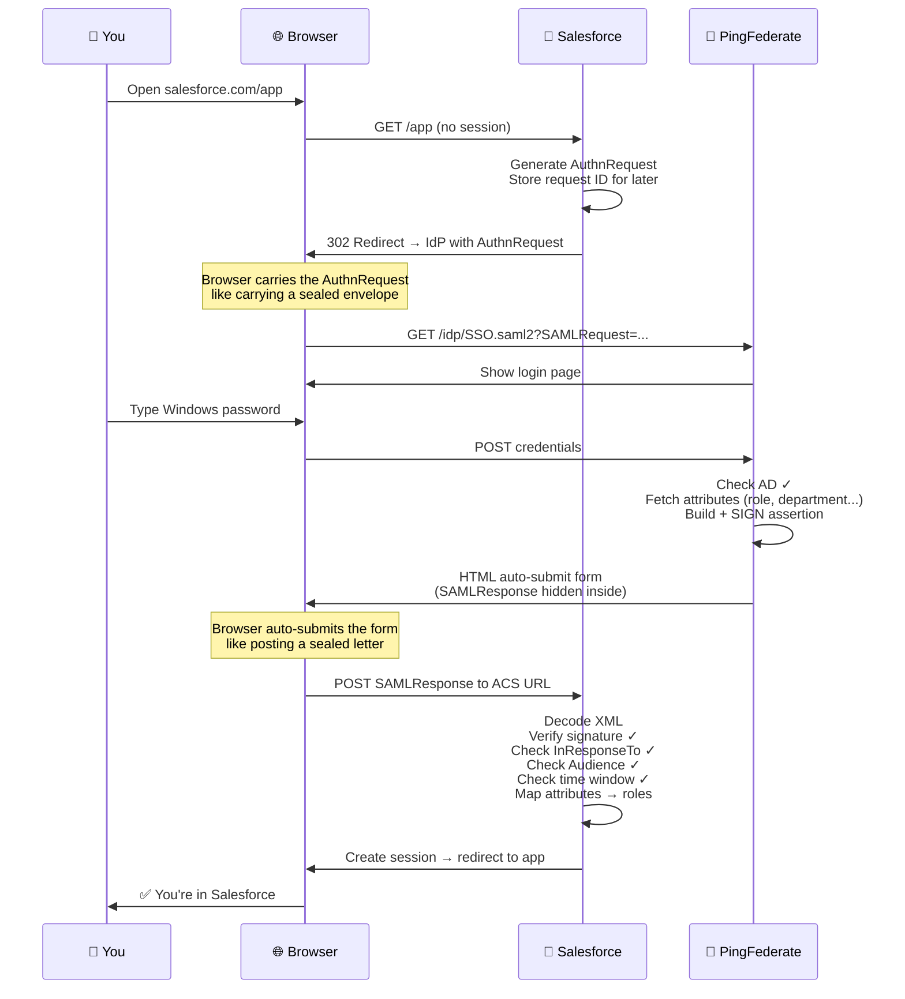
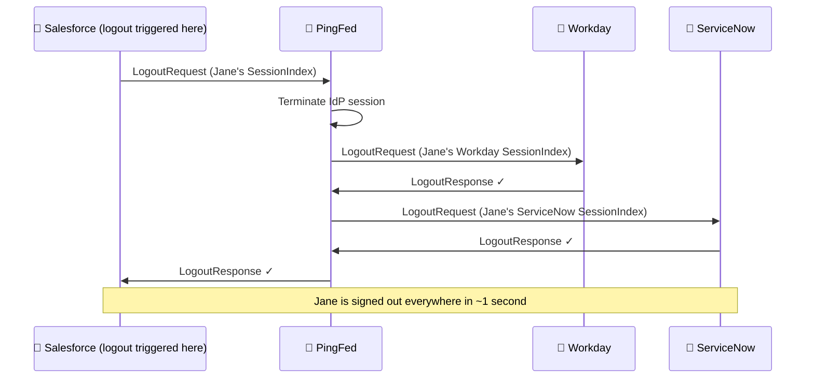

# SAML 2.0 + IAM Concepts — The Complete Mastery Guide

> **Your goal:** By the end of this guide you will understand SAML 2.0 and enterprise IAM deeply enough to architect, implement, debug, and configure SSO integrations — and explain them to anyone on your team. Written for smart developers who have never worked with enterprise identity protocols.

---

## 🧭 Developer Orientation — Read This First

### What problem does this guide solve for you?

```
Situation                                        What you need to know
────────────────────────────────────────────────────────────────────────────────
Your company uses Salesforce, Workday, etc.  →   SP-initiated SSO (Module 3)
You're building a SaaS app for enterprise    →   Onboarding + multi-tenant (Module 5)
New employee can't log into an app           →   Attribute mapping debug (Module 5)
User "logged out" but session still active   →   SLO limitations (Module 4)
Your company acquires another company        →   Identity brokering (Module 10)
Security team asks about assertion replay    →   Module 6 entirely
"Why do we have PingFederate?"               →   Hub-and-spoke architecture (Module 10)
```

### The master analogy — the corporate security system

This analogy runs through the entire guide. Every SAML concept maps back here.

```
CORPORATE SECURITY SYSTEM                   SAML
────────────────────────────────────────────────────────────────
Head Office security (knows all staff) =   Identity Provider (IdP)
Branch office security desk            =   Service Provider (SP)
Employee                               =   Principal (the user)
Signed letter from Head Office         =   SAML Assertion
Pre-agreed letter template             =   Metadata
Employee's building pass               =   NameID
Job title and department on letter     =   Attributes in assertion
Stamp of authenticity on letter        =   Assertion signature
Branch calls Head Office first         =   SP-initiated SSO
Head Office calls ahead for VIP        =   IdP-initiated SSO
One Head Office sign-off = all branches=   Single Sign-On
```

### The mental shift: SAML is about trust, not passwords

The central idea in SAML is this: **the app (SP) trusts the IdP completely, so it never needs to check your password itself.** The SP says "I don't know who you are — but PingFederate just signed a letter saying you're a manager at London Branch, and I trust PingFederate, so you're in."

This pre-established trust — set up before the first login ever happens — is what makes SSO work.

### 🔖 Symbol guide

| Symbol | Meaning |
|:---:|---|
| 💡 | Core concept — read carefully |
| 🔐 | Security critical — never skip |
| 🏭 | Production pattern |
| ⚠️ | Common mistake |
| 📖 | Real-world story |
| 🛠️ | Debugging guide |
| 🧪 | Test yourself |

---

## Module 1 — What SAML is and why it exists {#module-1}

### 💡 Plain English first

> **SAML in one sentence:** It is the system that lets you click a button at Salesforce, get redirected to your company login page, type your work password ONCE, and be signed in — without Salesforce ever knowing your password or creating a separate account for you.

### 📖 The story that makes it concrete

It is 2005. Jane works at a large bank. Her first morning:

- IT gave her an Active Directory password for her Windows login
- Salesforce gave her a separate Salesforce password
- Bloomberg gave her a Bloomberg terminal password
- The expense system has its own login
- SharePoint has another
- The risk management system has one more
- She has **nine different passwords** for nine different systems

When she goes on maternity leave, IT has to manually disable nine accounts. They forget two. Six months later, the bank is audited. The auditor finds active accounts for a person who hasn't worked there for six months. This is a compliance failure.

SAML was built in 2002 to solve exactly this: one verified identity, trusted everywhere, without sharing passwords across systems.

```
After SAML (same bank, 2010):
  Jane has one password — her Windows/AD password
  She opens Salesforce → clicks "Sign in with company account"
  She's redirected to PingFederate (the bank's IdP)
  She types her AD password — Salesforce NEVER sees it
  PingFed verifies against AD, issues a signed assertion
  Salesforce reads: "This is Jane, she's a Relationship Manager, London Branch"
  Jane is in — in 3 seconds, no second password

When Jane leaves:
  IT disables her ONE AD account
  All SAML SSO fails immediately — she can't log into anything
  No audit findings. Zero forgotten accounts.
```

### 💡 The three actors

```
┌──────────────────────────────────────────────────────────────────────────┐
│                                                                          │
│  👤 PRINCIPAL (the employee / user)                                      │
│     Wants to access an app. Has an account at the IdP (usually AD).     │
│     Never directly interacts with SAML XML — it all happens via          │
│     browser redirects in the background.                                 │
│                                                                          │
│  🔐 IDENTITY PROVIDER (IdP)                                              │
│     The authority that knows who users are. Verifies their identity.     │
│     Issues signed SAML Assertions. Examples: PingFederate, Okta,         │
│     Azure AD, ADFS. Usually backed by Active Directory.                  │
│                                                                          │
│  📱 SERVICE PROVIDER (SP)                                                │
│     The application (Salesforce, Workday, ServiceNow).                   │
│     It has NO user database — it relies entirely on the IdP's assertion. │
│     It validates the signature on the assertion and grants access.       │
│     It never sees the user's password.                                   │
│                                                                          │
│         ◄──── Pre-established trust via metadata exchange ────►         │
│                  (this setup happens BEFORE any logins)                  │
└──────────────────────────────────────────────────────────────────────────┘
```

### 💡 SAML vs OAuth/OIDC — use this decision table

| Question | Use SAML | Use OIDC/OAuth |
|---|---|---|
| Building a new app today? | No | **Yes** |
| Legacy SaaS (Salesforce, Workday, SAP)? | **Yes** | No |
| Mobile app login? | No | **Yes** |
| Enterprise B2B SSO with corporate IdPs? | **Yes** | Maybe |
| API access tokens needed? | No | **Yes** |
| App older than 2015? | Probably SAML | — |
| App supports both? | — | **Choose OIDC** |

> **🏭 Rule:** If an app supports both SAML and OIDC, always choose OIDC for new integrations. SAML is for apps that give you no choice.

### ⚠️ Common misconceptions — Module 1

```
❌ "SAML is a login system where the app checks your password"
✅ The SP never checks your password. The IdP does. The SP only checks
   the IdP's signed assertion. This is the entire point of SAML.

❌ "SAML sends your password to the app"
✅ Your password never leaves the IdP. The browser carries a signed XML
   document — not your credentials.

❌ "SAML and OAuth do the same thing"
✅ SAML handles authentication (who you are) + attribute federation.
   OAuth handles API authorisation (what an app can do).
   They solve different problems. Modern IdPs do both.
```

---

## Module 2 — SAML building blocks {#module-2}

### 💡 Plain English first

> **The four layers in one analogy:** Think of SAML like sending a legal document by registered post.
> - **Assertion** = the CONTENT of the document (what is being claimed)
> - **Protocol** = the FORM used (AuthnRequest = "please send me a document", Response = "here it is")
> - **Binding** = the ENVELOPE and delivery method (registered post vs courier vs email)
> - **Profile** = the USE CASE rules (sending a legal notice has specific rules vs sending a birthday card)
> - **Metadata** = the pre-agreed template both the lawyer and the court already have

### 💡 Layer 1: The SAML Assertion — the signed letter

An assertion is a signed XML document with four key sections. Here is a real one, annotated for beginners:

```xml
<samlp:Response
  InResponseTo="_req_1a2b3c"     ← Links back to the request (proves it was requested)
  Destination="https://salesforce.com/saml/SSO">

  <saml:Issuer>https://pingfed.bank.com</saml:Issuer>
  <!-- ↑ Who wrote this letter (IdP entity ID) — SP must verify this is trusted -->

  <samlp:StatusCode Value="...Success"/>
  <!-- ↑ Check this FIRST — if not Success, don't process the assertion -->

  <saml:Assertion ID="_assert_9g4b3c">

    <!-- ① WHO: the user's identifier at this SP -->
    <saml:NameID Format="...emailAddress">jane.smith@bank.com</saml:NameID>
    <saml:SubjectConfirmationData
      NotOnOrAfter="2024-04-18T09:35:00Z"    ← Expires in 5 minutes (replay protection)
      Recipient="https://salesforce.com/saml/SSO"  ← Only valid for THIS SP
      InResponseTo="_req_1a2b3c"/>            ← Must match stored request ID

    <!-- ② WHEN: validity window -->
    <saml:Conditions
      NotBefore="2024-04-18T09:29:55Z"        ← Not valid before this (clock skew buffer)
      NotOnOrAfter="2024-04-18T09:35:00Z">    ← Not valid after this
      <saml:Audience>https://salesforce.com</saml:Audience>
      <!-- ↑ This assertion is ONLY for Salesforce — cannot be used at Workday -->
    </saml:Conditions>

    <!-- ③ HOW: authentication method — tells SP how strongly user was verified -->
    <saml:AuthnContextClassRef>
      urn:oasis:names:tc:SAML:2.0:ac:classes:PasswordProtectedTransport
      <!-- Password over TLS. MFA would be: ac:classes:MobileTwoFactorUnregistered -->
    </saml:AuthnContextClassRef>

    <!-- ④ WHAT: user attributes — this is how authorisation works -->
    <saml:AttributeStatement>
      <saml:Attribute Name="email">
        <saml:AttributeValue>jane.smith@bank.com</saml:AttributeValue>
      </saml:Attribute>
      <saml:Attribute Name="Role">
        <saml:AttributeValue>Relationship_Manager</saml:AttributeValue>
      </saml:Attribute>
      <saml:Attribute Name="BranchCode">
        <saml:AttributeValue>LON-EC2-042</saml:AttributeValue>
      </saml:Attribute>
    </saml:AttributeStatement>

    <!-- ⑤ PROOF: the digital signature over everything above -->
    <ds:Signature>
      <!-- RSA-SHA256. SP verifies using IdP's public cert from metadata.
           If even ONE byte of the assertion was changed, this check fails. -->
    </ds:Signature>

  </saml:Assertion>
</samlp:Response>
```

> **🔐 Critical rule:** Always validate the **Assertion** signature, not just the Response signature. The most dangerous SAML attack (XSW — covered in Module 6) exploits SPs that only check the outer Response.

### 💡 NameID formats — choosing the right user identifier

```
emailAddress  → "jane.smith@bank.com"
  ⚠️ If Jane changes her email, the SP creates a NEW account (duplicate!)
  Use only if the SP needs to match users by email address

persistent    → "_7f3a2b1c4d5e"  (opaque, random, never changes)
  ✅ Recommended. Jane can change email 10 times — same account in the SP
  The "stable ID" that survives everything

transient     → Changes every session
  For privacy — SP cannot track users across sessions
  Use when: user doesn't want cross-session tracking
```

### 💡 AuthnRequest parameters every developer must know

```xml
<samlp:AuthnRequest
  ForceAuthn="false"
  <!-- ForceAuthn="true" = "I don't care if you have an active SSO session —
       make the user authenticate AGAIN right now."
       Use for: wire transfers, password change screens, sensitive data access -->

  IsPassive="false">
  <!-- IsPassive="true" = "Try SSO silently. If user isn't already logged in,
       do NOT show a login page — just return a NoPassive error."
       Use for: background session checks, optional personalisation -->
```

### 💡 SAML error status codes — your debugging cheat sheet

```
When SSO fails, this is the FIRST thing to look at in the SAMLResponse:

...status:Success             → All good. Error is elsewhere.
...status:Requester           → YOUR config is wrong (SP entity ID, ACS URL)
...status:Responder           → IdP-side problem (LDAP down, user not found, AD locked)
...status:AuthnFailed         → User typed wrong password / account locked
...status:NoPassive           → IsPassive=true but no active session (expected)
...status:RequestDenied       → User not in the allowed group for this app
...status:InvalidNameIDPolicy → SP requested NameID format IdP doesn't support
...status:VersionMismatch     → SAML version mismatch (rare — usually config error)
```

> **🛠️ Debugging tool:** Install the SAML-tracer browser extension (Firefox/Chrome). It intercepts every SAML flow and shows you the decoded XML. When a user says "SSO isn't working," open SAML-tracer, reproduce the error, and read the StatusCode.

### 💡 Layer 2: Bindings — how messages travel

```
HTTP-REDIRECT binding (for AuthnRequest):
  Message is compressed + Base64 encoded + placed in the URL query string
  URL: https://pingfed.bank.com/idp/SSO.saml2?SAMLRequest=PHNhbWx...
  Size limit: ~2KB. Fine for AuthnRequest (small). NOT for assertions (too big).

HTTP-POST binding (for SAMLResponse — the important one):
  IdP returns an HTML page with a hidden form that auto-submits:
    <form method="POST" action="https://salesforce.com/saml/SSO">
      <input type="hidden" name="SAMLResponse" value="PHNhbWxw..."/>
    </form>
    <script>document.forms[0].submit();</script>
  Browser POSTs this to Salesforce. Browser is just a messenger — it can't
  read or modify the signed XML (any change breaks the signature).
```

### 💡 Metadata — the pre-agreed templates

**Before any SSO login can ever work, IdP and SP exchange metadata XML.**

This is a one-time setup. The metadata tells each party: where to send messages, what certificate to use for signature verification, and what the other party's identifier is.

```xml
<!-- What IdP metadata tells SPs: -->
<md:EntityDescriptor entityID="https://pingfed.bank.com">
  <!-- ↑ The IdP's unique name — every assertion will have this as Issuer -->

  <md:KeyDescriptor use="signing">
    <ds:X509Certificate>MIIDnjCCAoagAw...</ds:X509Certificate>
    <!-- ↑ THE MOST IMPORTANT THING IN METADATA
         This certificate is how SPs verify assertion signatures.
         Wrong certificate = every assertion fails validation.
         Expired certificate = every assertion fails validation. -->
  </md:KeyDescriptor>

  <md:SingleSignOnService
    Location="https://pingfed.bank.com/idp/SSO.saml2"/>
  <!-- ↑ Where to redirect users for login -->
</md:EntityDescriptor>
```

```xml
<!-- What SP metadata tells IdPs: -->
<md:EntityDescriptor entityID="https://salesforce.com">
  <!-- ↑ MUST MATCH AudienceRestriction in every assertion exactly -->

  <md:AssertionConsumerService
    Location="https://salesforce.com/saml/SSO"/>
  <!-- ↑ The ACS URL — where IdP POSTs the SAMLResponse back to -->
</md:EntityDescriptor>
```

> **⚠️ Entity ID mismatch is the #1 onboarding failure.** The entity ID string in IdP's SP Connection config MUST exactly match what the SP reports as its own entity ID. One extra slash, different case, http vs https = AudienceRestriction failure.

---

## Module 3 — SP-initiated SSO: the complete flow {#module-3}

### 💡 Start from what you see — then learn what happens

You open Salesforce. It shows a button: *"Sign in with your company account."* You click it. You get redirected to your company's login page. You type your Windows password. You're back in Salesforce, logged in.

You never created a Salesforce password. Salesforce never knew your Windows password existed.

Here is every technical step that just happened:



### 💡 What Salesforce validates — every single check

```
On receiving the SAMLResponse at the ACS URL:

✅ Step 1: Decode Base64 → parse XML
✅ Step 2: Verify assertion SIGNATURE using IdP cert from metadata
           (if this fails: stop immediately — do not process further)
✅ Step 3: StatusCode == Success (if not: show error, log it)
✅ Step 4: Issuer == "https://pingfed.bank.com" (must match registered IdP)
✅ Step 5: AudienceRestriction contains "https://salesforce.com" (MY entity ID)
✅ Step 6: NotBefore ≤ now ≤ NotOnOrAfter (allow max 60 seconds clock skew)
✅ Step 7: InResponseTo == stored AuthnRequest ID (prevents injection)
✅ Step 8: Assertion ID not seen before (prevents replay)
✅ Step 9: SubjectConfirmation Recipient == this ACS URL
✅ Step 10: Extract NameID → find or create user account
✅ Step 11: Extract attributes → assign roles and permissions
✅ Step 12: Create local session → redirect to RelayState URL

Every check is mandatory. Skip any one = security vulnerability.
```

### 📖 Real-world: bank employee attribute mapping

```xml
<!-- PingFed sends this to Salesforce -->
<saml:AttributeStatement>
  <saml:Attribute Name="email">
    <saml:AttributeValue>jane.smith@bank.com</saml:AttributeValue>
  </saml:Attribute>
  <saml:Attribute Name="SalesforceProfile">
    <saml:AttributeValue>Relationship Manager</saml:AttributeValue>
  </saml:Attribute>
  <saml:Attribute Name="BranchCode">
    <saml:AttributeValue>LON-EC2-042</saml:AttributeValue>
  </saml:Attribute>
</saml:AttributeStatement>

<!-- Salesforce maps these to:
  SalesforceProfile="Relationship Manager" → Standard User profile
  BranchCode="LON-EC2-042"               → Territory: London EC2    -->
```

---

## Module 4 — IdP-initiated SSO + Single Logout {#module-4}

### 💡 IdP-initiated — starting from the portal

The user is already logged in to the company portal (the IdP). They see tiles for all their apps. They click "Workday." The IdP sends a SAMLResponse **without any prior request** — directly to Workday.

```
DIFFERENCE FROM SP-INITIATED:
  SP-initiated:   SP asks for assertion → IdP provides it → InResponseTo present
  IdP-initiated:  IdP sends assertion unprompted → no InResponseTo to validate

WHY THIS MATTERS SECURITY-WISE:
  In SP-initiated, the SP knows it asked for this assertion.
  In IdP-initiated, the SP has no way to know if it was legitimately requested.
  This opens the door to Login CSRF attacks (see Module 6).
```

### 💡 RelayState — how deep linking works through SSO

```
Scenario: Jane's colleague emails her: "Review this contract"
          The link is: https://salesforce.com/contracts/00123456

Jane clicks the link. Salesforce has no session. SP-initiated SSO begins.

Without RelayState:
  Jane logs in → lands on Salesforce homepage → has to navigate to the contract
  
With RelayState:
  1. Salesforce: "no session — starting SSO, but I remember where you wanted to go"
  2. RelayState = "https://salesforce.com/contracts/00123456" (encoded)
  3. PingFed receives AuthnRequest with RelayState
  4. PingFed authenticates Jane
  5. PingFed sends SAMLResponse + RelayState back to Salesforce
  6. Salesforce: "authentication success — redirect to RelayState"
  7. Jane lands directly on the contract page ✅

Security rule: ONLY redirect to RelayState URLs matching your own domain.
               An attacker sets RelayState=https://attacker.com/phishing
               → user successfully logs in → gets redirected to phishing site
```

### 💡 SessionIndex — the link that makes Single Logout work

```
In the assertion AuthnStatement:
  <saml:AuthnStatement SessionIndex="_sess_7h5c4d3e">

This SessionIndex is the key to SLO. Here's why it matters:

The IdP keeps a table:
  User     | SP          | SessionIndex     | Logged in since
  jane     | Salesforce  | _sess_7h5c4d3e   | 09:00
  jane     | Workday     | _sess_2b3c4d1e   | 09:02
  jane     | ServiceNow  | _sess_5f6g7h8i   | 09:15

When SLO is triggered (Jane logs out of Salesforce):
  IdP sends LogoutRequest to Workday with SessionIndex=_sess_2b3c4d1e
  Workday terminates THAT session for jane
  IdP sends LogoutRequest to ServiceNow with SessionIndex=_sess_5f6g7h8i
  ServiceNow terminates THAT session for jane
  All of Jane's sessions are now terminated everywhere

Without SessionIndex: IdP can't tell WHICH session to terminate at each SP.
```

### 💡 Single Logout — how it propagates



> **🏭 SLO reality in production:** Many SaaS apps implement SLO poorly. The IdP must handle graceful timeouts — if an SP doesn't respond within 5 seconds, log it and continue with the rest. Never let one unresponsive SP block the entire logout chain.

---

## Module 5 — Application onboarding end-to-end {#module-5}

### 💡 Who does what — the responsibility matrix

```
Task                                    | IT / IdP admin | App vendor / SP admin | Your developer
─────────────────────────────────────────────────────────────────────────────────────────────────
Export IdP metadata XML                 | ✅ You         |                       |
Create SP Connection in PingFed         | ✅ You         |                       |
Configure Attribute Contract            | ✅ You         |                       |
Upload IdP metadata into the app        |                | ✅ Vendor / SP admin  |
Map SAML attributes to app roles        |                | ✅ Vendor / SP admin  |
Enable SSO in the app                   |                | ✅ Vendor / SP admin  |
Write SAML library integration          |                |                       | ✅ Developer
Handle assertion at ACS endpoint        |                |                       | ✅ Developer
Debug attribute mapping issues          | ✅ You         | ✅ Vendor             | ✅ Developer
```

### 💡 The onboarding lifecycle

```
Day 0 — Procurement
  └─ Vendor confirms SAML 2.0 support + provides SP metadata XML or:
     • SP Entity ID (e.g. "https://company.service-now.com")
     • ACS URL (e.g. "https://company.service-now.com/saml_redirect.do")
     • NameID format preference (email or persistent)
     • Required attribute names (they call it "department", "role", etc.)

Day 1 — IdP Configuration (PingFederate)
  └─ Create SP Connection → import SP metadata
     Configure Attribute Contract:
       AD attribute    →   Assertion attribute name SP expects
       mail            →   email
       givenName       →   firstName
       sn              →   lastName
       memberOf        →   groups  (filter: only groups starting with "APP_")
       department      →   department
     Set auth policy (password only vs MFA required)
     Export your IdP metadata → send to SP admin

Day 1 — SP Configuration (done by vendor / SP admin)
  └─ Upload your IdP metadata XML into the app's SSO settings
     Map incoming SAML attributes to app roles
     Enable SAML SSO

Day 2 — Testing
  └─ Test with pilot users. Use SAML-tracer to inspect assertions.
     Fix the 2–3 errors that ALWAYS appear (see table below).

Day 3 — Go-live
  └─ Enable app tile for correct AD groups. Done.
```

### 🛠️ The three errors that ALWAYS happen during onboarding

```
Error 1: "Signature validation failed"
  Cause:   SP admin uploaded a test/self-signed cert instead of your production cert
  Symptom: SSO fails immediately, user sees generic error in the app
  Fix:     Re-export the SIGNING certificate from your IdP metadata XML
           (not the encryption cert — the SIGNING cert)
           Have SP admin delete old cert and upload this one
  Verify:  SAML-tracer will show "signature valid" after fix

Error 2: "User logs in but gets wrong role / no permissions"
  Cause:   Attribute name mismatch
           PingFed sends: "groups" with value "Salesforce_Manager"
           Salesforce expects: "Role" with value "Manager"
  Symptom: User can log in but sees empty screen or read-only view
  Fix:     Align attribute names in PingFed Attribute Contract
           OR in SP's attribute mapping config
  Verify:  SAML-tracer → look at AttributeStatement → confirm names match

Error 3: "AudienceRestriction mismatch" / "Invalid audience"
  Cause:   Entity ID mismatch — most common onboarding error
           PingFed SP Connection has: "https://salesforce.com"
           Salesforce expects:        "https://salesforce.com/" (trailing slash)
  Symptom: User redirected back to error page after login
  Fix:     Verify EXACT string match in both places (case, slashes, http vs https)
  Verify:  Copy the entity ID from SP metadata and paste it into PingFed — don't type it
```

### 💡 Certificate rotation — zero-downtime procedure

```
⚠️ Doing this wrong = ALL SSO breaks for ALL users simultaneously

CORRECT PROCEDURE (use overlap period):

Step 1: Add NEW certificate to IdP metadata ALONGSIDE the old one
        (IdP now has two certs listed — SPs that fetch metadata will see both)

Step 2: Wait 24–72 hours for all SPs to refresh their cached metadata
        SPs that manually upload metadata: contact them to re-import NOW

Step 3: Switch IdP to SIGN new assertions with the NEW certificate
        Old assertions signed with old cert: still valid (SP trusts both)
        New assertions signed with new cert: verified with new cert ✓

Step 4: Monitor for 24 hours — there should be zero failures

Step 5: Remove OLD certificate from IdP metadata
        Contact manual-upload SPs to remove old cert too

Total safe duration: 3–5 days
NEVER remove old cert before confirming all SPs have the new one
```

### 📖 Real-world timeline

| App type | Typical time | Main bottleneck |
|---|---|---|
| Simple SaaS (Slack, Zoom) | 1–2 days | Vendor documentation quality |
| Salesforce / ServiceNow | 1–2 weeks | Profile mapping + permission sets |
| SAP / Oracle EBS | 2–4 weeks | SAP support involvement |
| Custom internal app | 2–4 weeks | Developer implementing SAML library |
| New enterprise B2B customer | 30–60 minutes | Agreeing attribute contract naming |

---

## Module 6 — SAML security attacks and hardening {#module-6}

### 🔐 Attack 1: XML Signature Wrapping (XSW) — the most critical SAML vulnerability

> **Plain English:** The attacker takes a valid signed assertion and hides a malicious one inside it. The signature check passes (it's checking the real assertion). But the app processes the fake one instead.

**Before (legitimate assertion):**
```xml
<samlp:Response>
  <saml:Assertion ID="_real_assert">     ← Signature covers THIS element
    <saml:NameID>jane@bank.com</saml:NameID>
    <ds:Signature><Reference URI="#_real_assert"/></ds:Signature>
  </saml:Assertion>
</samlp:Response>
```

**After (attacker's manipulated XML):**
```xml
<samlp:Response>
  <saml:Assertion ID="_evil_assert">     ← App reads THIS one (position-based)
    <saml:NameID>admin@bank.com</saml:NameID>
    <!-- NO signature on this element -->
    <saml:Assertion ID="_real_assert">   ← Signature covers THIS nested one
      <saml:NameID>jane@bank.com</saml:NameID>
      <ds:Signature><Reference URI="#_real_assert"/></ds:Signature>
    </saml:Assertion>
  </saml:Assertion>
</samlp:Response>
```

**What happens:** Signature check passes (it validates `_real_assert`). But the app finds the assertion by position (first child) not by ID — so it processes `_evil_assert` where NameID = admin.

**Result:** Attacker is logged in as admin without knowing any password.

**Prevention:**
```
1. Use a security-reviewed SAML library (python3-saml, java-saml, passport-saml)
   NEVER parse SAML XML manually with generic XML libraries
2. Process the assertion using the ID referenced in the Signature's Reference element
   NOT by position (first child, last child, XPath)
3. Validate XML schema before processing
```

### 🔐 Attack 2: Assertion Replay

```
Attack: Attacker intercepts a valid assertion (before its 5-min expiry)
        Submits it to SP's ACS URL → signature valid, time valid → access granted

Prevention:
  SP maintains a cache (Redis) of used assertion IDs.
  On each assertion received: check if ID was seen before.
  If yes: reject immediately.
  If no: add to cache with TTL = NotOnOrAfter timestamp.
```

### 🔐 Attack 3: Open Redirect via RelayState

```
Attack: Attacker crafts URL with RelayState=https://attacker.com/phishing
        User authenticates successfully (legitimate login)
        App redirects to RelayState → user lands on phishing site

Prevention:
  ONLY redirect to RelayState values on your own domain.
  if (new URL(relayState).hostname !== 'yourapp.com') {
    redirect('/dashboard'); // safe fallback
  }
```

### 🔐 Attack 4: Login CSRF via IdP-initiated SSO

```
Attack: Attacker initiates IdP-initiated SSO using the victim's browser
        Victim's browser submits attacker's account assertion to the SP
        Victim is now logged in AS the attacker
        Whatever victim does (enter payment details, change email) benefits attacker

Prevention:
  SP-initiated: validate InResponseTo against a stored request ID
  IdP-initiated: embed a CSRF token in RelayState and verify it on receipt
  Result: assertions without a valid bound request are rejected
```

### ✅ Complete hardening checklist

```
SP validates on every assertion:
✅ Assertion signature (NOT just Response signature) using IdP cert from metadata
✅ Issuer == registered IdP entity ID (exact string match)
✅ AudienceRestriction contains this SP's entity ID
✅ NotBefore ≤ now ≤ NotOnOrAfter (max 60s clock skew tolerance)
✅ InResponseTo == stored, unused AuthnRequest ID (SP-initiated flows)
✅ Assertion ID not in replay cache (Redis with TTL = NotOnOrAfter)
✅ SubjectConfirmation Recipient == this ACS URL exactly
✅ StatusCode == Success before processing any assertion content

Implementation rules:
✅ TLS 1.2+ on ALL SAML endpoints (ACS, SLO, metadata URL)
✅ Use a vetted SAML library — never hand-roll XML parsing
✅ Schema-validate XML before processing
✅ Whitelist RelayState to own domain only
✅ Process assertion by signature Reference URI — not by XML position
✅ Certificate rotation plan documented and tested
✅ Log every assertion ID, validation failure, and status code to SIEM
```

---

## Module 7 — IAM fundamentals {#module-7}

### 💡 The four pillars — how they connect

```
┌────────────┐    ┌──────────────────┐    ┌──────────────────┐    ┌──────────────┐
│  IDENTITY  │───▶│ AUTHENTICATION   │───▶│ AUTHORISATION    │───▶│    AUDIT     │
│            │    │                  │    │                  │    │              │
│ Who exists │    │ Prove it's them  │    │ What can they do │    │ What they did│
│            │    │                  │    │                  │    │              │
│ AD / LDAP  │    │ PingFed / Okta   │    │ RBAC / ABAC      │    │ SIEM / IGA   │
│ SCIM / HR  │    │ Azure AD         │    │ PAM / Policies   │    │ Audit logs   │
└────────────┘    └──────────────────┘    └──────────────────┘    └──────────────┘
      ↑
SAML operates between Authentication and Authorisation:
  proves identity (authn) + carries attribute claims (authz signals)
```

### 💡 Active Directory — the identity source

```
AD is where enterprise users ACTUALLY live. PingFederate reads AD to
authenticate users and fetch attributes for SAML assertions.

Key AD concepts for SAML:
  Domain         = bank.com (the security boundary)
  OU             = Organisational Unit (like folders: OU=London, OU=Finance)
  Group          = What PingFed reads for role/permission attributes
                   memberOf: ["SF_RelationshipManager", "London_Branch", "AllStaff"]
  userPrincipalName = jane.smith@bank.com (login name — used in NameID)
  mail           = jane.smith@bank.com (email attribute)
  sAMAccountName = jsmith (Windows login name — legacy)

PingFed + AD interaction:
  1. User submits credentials at PingFed
  2. PingFed → AD (LDAP): "authenticate jane.smith@bank.com with this password"
  3. AD: success/failure
  4. PingFed → AD (LDAP): "fetch all attributes for jane.smith@bank.com"
  5. AD returns: mail, givenName, sn, memberOf, department, manager...
  6. PingFed maps AD attributes → SAML assertion attribute names per Attribute Contract
```

### 💡 IGA — Identity Governance and Administration

> **Plain English:** IGA is the system above everything else that decides WHO should have access to WHAT, automates granting and revoking it, and generates the reports that satisfy auditors.

```
The IAM stack (top to bottom):

  ┌──────────────────────────────────────────────────────────────────┐
  │  IGA (SailPoint / Saviynt)                                       │
  │  "Who should have access" — governance, compliance, automation   │
  │  Quarterly access reviews: "Does Jane still need Salesforce?"    │
  └─────────────────────────┬────────────────────────────────────────┘
                             │ provisions access decisions to:
              ┌──────────────┼───────────────┐
              ▼              ▼               ▼
         AD (groups)    SCIM (apps)      PingFed (policies)
              │              │
              ▼              ▼
         PingFed reads  App accounts created
         groups for      before first login
         SAML assertions

IGA key functions:
  • Joiner: new hire → trigger full provisioning automatically
  • Mover: role change → old access revoked, new granted same day
  • Leaver: termination → AD disabled in minutes, all apps deprovisioned
  • Access reviews: quarterly "certify this person still needs this"
  • SoD: prevent Finance approver from also being Finance submitter
  • Orphaned accounts: find and remove accounts with no corresponding HR record
```

### 💡 Joiner / Mover / Leaver — the lifecycle that matters

```
JOINER (new employee, Day 1):
  08:00  HR creates record in HR system
  08:15  IGA triggers: create AD account, add to role groups
  08:30  SCIM provisions accounts in all 35 SCIM-connected apps
  09:00  Employee arrives → ALL app tiles in portal → SAML SSO works immediately
  Target SLA: all access ready before employee arrives

MOVER (promotion to manager):
  Request submitted → IGA approval workflow
  Old groups removed → new groups added (same day)
  SCIM updates app roles automatically
  Next SAML login → new roles in assertion → SP applies new permissions
  ⚠️ Existing SP sessions keep old roles until they expire (4–8h)

LEAVER (termination):
  T+0:   AD account disabled (IMMEDIATE — automated, no human needed)
  T+0:   ALL SAML SSO fails instantly (IdP auth against AD fails for disabled accounts)
  T+5m:  SCIM deprovisions all app accounts
  T+1h:  Audit confirms zero active access
  SLA:   AD disabled within 1 hour of termination. Most orgs target 15 minutes.
```

### 💡 SCIM — automated account lifecycle

```
SAML handles login. SCIM handles account existence. You need BOTH.

Without SCIM:     JIT provisioning (account created on first SSO login)
With SCIM:        Account exists BEFORE first login (proactive)

SCIM 2.0 is a REST API standard every compliant app exposes:

  POST   /scim/v2/Users        → Create account (new joiner)
  PATCH  /scim/v2/Users/{id}   → Update account (mover, role change)
  DELETE /scim/v2/Users/{id}   → Delete account (leaver)
  GET    /scim/v2/Users        → List all accounts (reconciliation)
```

---

## Module 8 — Authorisation models {#module-8}

### 💡 RBAC — Role-Based Access Control

```
Simple model: User → Role → Permissions
SAML carries roles in AttributeStatement → SP maps to its own permission model

Example:
  SAML assertion has: Role=Manager
  Salesforce maps:    Manager → read + write + approve access

Works well for: small-medium orgs, simple permission structures
Breaks down at: enterprise scale (500 staff × 20 apps = thousands of roles to manage)
```

### 💡 ABAC — Attribute-Based Access Control

```
Advanced model: Access decision = f(user attributes, resource attributes, environment)
All user attributes come from the SAML assertion.

Example policy:
  ALLOW IF
    user.department = "Trading"
    AND user.clearanceLevel >= "Level3"
    AND resource.classification = "Confidential"
    AND time BETWEEN "07:00" AND "21:00"

Real use case:
  Healthcare: ALLOW patient record access IF
    user.role = "Physician"
    AND user.employeeId IN patient.treatingTeamIds
    
  The treating physician attribute in the SAML assertion unlocks specific patient records.
  No one else on staff — regardless of role — can access those records.
```

### 💡 JIT provisioning vs SCIM

```
JIT (Just-In-Time):
  User arrives at SP via SSO for the first time.
  SP checks: "Do I have an account for this NameID?"
  No → SP creates account from assertion attributes → user logs in.
  
  ✅ Simple — no pre-provisioning needed
  ⚠️ Deprovisioning problem: SP account lives until SP decides to clean up
     (user could still access SP if they have a cached session or token)

SCIM:
  Auth Server pushes account creation/updates/deletion to apps automatically.
  Account exists before first SSO login.
  Account is disabled/deleted immediately when HR system triggers termination.
  
  ✅ Strict lifecycle control — leaver deprovisioned in minutes
  ✅ Account exists on Day 1 with pre-loaded settings
  ⚠️ Requires SP to support SCIM 2.0 API

Use JIT when:  simple apps, SP doesn't support SCIM, account creation on demand is fine
Use SCIM when: strict deprovisioning SLA, Day-1 access required, large-scale management
```

### 💡 Step-up authentication via AuthnContext

```
Scenario: Bank employee accessing a wire transfer screen

1. Jane is logged into Salesforce (password-only authentication)
   AuthnContext in her assertion: PasswordProtectedTransport

2. Jane navigates to "Initiate Wire Transfer" — a high-risk action

3. App checks AuthnContext: password-only is NOT sufficient for this action

4. App redirects back to IdP with:
   <samlp:RequestedAuthnContext Comparison="minimum">
     <saml:AuthnContextClassRef>MobileTwoFactorUnregistered</saml:AuthnContextClassRef>
   </samlp:RequestedAuthnContext>
   AND ForceAuthn="true"  ← Force re-authentication even if session is active

5. PingFed prompts for MFA → Jane completes MFA

6. New assertion issued with MFA AuthnContext

7. Wire transfer screen now accessible ✅

This is step-up authentication — the SP demands stronger proof for sensitive actions.
```

---

## Module 9 — Production use cases {#module-9}

### 📖 Use case A — Global bank: 12,000 employees, 80 SAML apps

```
Architecture:
  Identity:   Active Directory (2 forests — retail + investment banking)
  IdP:        PingFederate 11.x (2-node active-active cluster)
  SPs:        80 SAML SP connections
  SCIM:       35 apps (proactive — account exists on Day 1)
  JIT:        45 apps (reactive — account created on first login)
  MFA:        Enforced via RequestedAuthnContext for trading/finance apps

Day 1 for a new Relationship Manager:
  08:00  HR system triggers IGA joiner workflow
  08:15  AD account created, added to: AllStaff, LondonBranch, SF_RelManager
  08:30  SCIM provisions: Salesforce, ServiceNow, Workday, expense system
  09:00  Jane arrives → portal shows all 80 app tiles → SSO works for all ✅

Termination (leaver):
  T+0    Manager submits termination → automated workflow
  T+0    AD account disabled → ALL SAML SSO fails immediately
  T+5m   SCIM deprovisions all 35 apps
  T+1h   Audit record complete
```

### 📖 Use case B — SaaS platform: multi-tenant SAML

```
A B2B HR SaaS platform. 50 enterprise customers. Each has their own corporate IdP.
Customers include: Goldman Sachs (Okta), Barclays (PingFed), NHS Trust (Azure AD).

How the platform routes each login to the right IdP:

  User enters: jane@goldman.com
  Platform: domain "goldman.com" → IdP config: Goldman's Okta instance
  Redirect to: https://goldman.okta.com/app/saml/...
  Assertion returns to: https://hrplatform.com/saml/acs/goldman
                                                        ↑ tenant-specific ACS URL

Tenant isolation: AudienceRestriction = "https://hrplatform.com/saml/goldman"
  A Goldman assertion submitted to Barclays' ACS = REJECTED (audience mismatch)

Onboarding a new customer: 30–60 min
  Most of that time: agreeing attribute naming with their IT team
```

### 📖 Use case C — SAML → OIDC migration

```
Company started with SAML in 2012. Now has 60 SAML apps. Modernising to OIDC.

Strategy: don't break anything — migrate app by app

Phase 1 (now):  New apps built → OIDC only. No new SAML integrations.
Phase 2 (6m):   Mobile apps → OIDC + PKCE (SAML doesn't work in native apps)
Phase 3 (12m):  SaaS apps supporting both → migrate to OIDC
Phase 4 (forever): SAP, Oracle, ADFS-era apps → stay on SAML

PingFed bridge: same user session issues BOTH SAML assertions AND OIDC tokens.
User logs in once → can access SAML apps AND OIDC apps without re-authentication.
The migration is transparent to users — same login page, same password.
```

---

## Module 10 — SAML federation architecture patterns {#module-10}

### 💡 Hub-and-Spoke vs Mesh federation

```
THE PROBLEM WITH MESH (direct bilateral trust):
  5 IdPs + 80 SaaS apps = 5 × 80 = 400 bilateral trust relationships
  Each needs: metadata exchange, cert management, attribute mapping
  Adding 1 new app = configure it in ALL 5 IdPs
  Certificate expires on one IdP = update it in 80 SPs

  This is unmanageable. Nobody runs this at scale.

HUB-AND-SPOKE (central IdP as trust hub):
  5 IdPs + 80 SaaS apps = 5 + 80 = 85 relationships
  Adding 1 new app = configure it in the hub ONLY
  Certificate rotation = update in hub ONLY — SPs see it automatically

  [Azure AD]  ─┐
  [Okta]      ─┼──▶  [PingFederate HUB]  ──▶  [Salesforce]
  [ADFS]      ─┘                          ──▶  [Workday]
                                          ──▶  [ServiceNow]
                                          ──▶  [...77 more SPs]
```

### 💡 Identity Brokering — PingFed as protocol + attribute proxy

```
What PingFed actually does in most enterprises:
  It doesn't just authenticate users.
  It BROKERS between upstream identity sources and downstream SPs.

UPSTREAM (who tells PingFed who the user is):
  Active Directory (LDAP)
  Azure AD (OIDC or SAML)
  Another company's SAML IdP (B2B federation)

DOWNSTREAM (what PingFed tells apps):
  SAML assertions (for legacy apps)
  OIDC tokens (for modern apps)
  OAuth access tokens (for APIs)

PingFed transforms as it brokers:
  Azure AD sends: "groups: [Azure-Finance-UK, Azure-London]"
  PingFed maps:   "groups: [Finance, London]" → Salesforce understands this
  Salesforce receives: clean, normalised attributes — never knows about Azure AD

Protocol brokering (the modernisation superpower):
  Legacy IdP (ADFS — SAML only) → PingFed → Modern App (OIDC only)
  PingFed receives SAML from ADFS, issues OIDC token to the modern app.
  The modern app never knows the upstream was SAML.
```

### 💡 Circle of Trust — the formal trust boundary

```
Circle of Trust (CoT) = the set of all entities that have mutually exchanged
metadata and established trust relationships.

Visualised:
  ╔═══════════════════════════════════════════════════════════╗
  ║              IN THE CIRCLE (trusted):                     ║
  ║   PingFed IdP ──▶ Salesforce, Workday, ServiceNow (80)   ║
  ╚═══════════════════════════════════════════════════════════╝
  Outside the circle: ALL OTHER entities → assertions REJECTED

Adding someone to the CoT:
  They provide metadata → your IT reviews it → you import it → they're in
  
In PingFed admin console:
  Your SP Connections list = your Circle of Trust
  PingFed only issues assertions to entity IDs in this list

Real use: a bank adding a new clearing house partner to their CoT
  1. Clearing house exports their IdP metadata
  2. Bank IT security reviews: cert, entity ID, endpoints
  3. Legal approves the federation agreement
  4. PingFed admin imports metadata → clearing house is now in the CoT
  5. Clearing house employees can now SSO to the bank's trade reporting portal
```

### 💡 Cross-domain federation — two companies sharing access

```
Scenario: Investment bank gives fund managers at Goldman access to their research portal

Goldman Sachs employees use their Goldman corporate credentials to access
JPMorgan's research portal. Neither company manages accounts for the other.

  [Goldman Sachs IdP] ──(SAML assertion)──▶ [JPMorgan Research Portal]
  
  Goldman's assertion says: "This is Alex Chen, Fund Manager, Fixed Income"
  JPMorgan's portal says: "Goldman Sachs IdP is in our CoT → let Alex in"
                           "Fund Manager role → read access to rates research"

What JPMorgan configured:
  Import Goldman's IdP metadata (adds Goldman to JPMorgan's CoT)
  Map Goldman's "jobTitle=Fund Manager" → JPMorgan portal role "research-reader"

What Goldman configured:
  Import JPMorgan's SP metadata
  Add JPMorgan portal as an SP connection
  Configure which Goldman users can access it (just Fund Managers)

NameID consideration:
  WRONG: emailAddress — if Alex's email changes, JPMorgan creates a duplicate account
  RIGHT: persistent — Alex's opaque ID stays the same even if email changes
```

### 💡 The complete IAM stack — how everything connects

```
This is the map of the entire territory. Every protocol covered in this guide
fits into one of these layers.

┌────────────────────────────────────────────────────────────────────────────────┐
│  GOVERNANCE (IGA): Who SHOULD have access · access reviews · SoD · compliance │
└────────────────────────────┬───────────────────────────────────────────────────┘
                             │ provisions entitlements
                             ▼
┌────────────────────────────────────────────────────────────────────────────────┐
│  IDENTITY (AD / LDAP / Azure AD): who users ARE · source of truth             │
└────────────────────────────┬───────────────────────────────────────────────────┘
                             │ LDAP (read) + SCIM (write to apps)
                             ▼
┌────────────────────────────────────────────────────────────────────────────────┐
│  AUTH BROKER (PingFederate): authenticates + issues assertions + tokens        │
│  SAML → legacy SaaS │ OIDC → modern apps │ OAuth → APIs                      │
└────────────────────────────┬───────────────────────────────────────────────────┘
                             │
           ┌─────────────────┼──────────────────────────────┐
           ▼                 ▼                               ▼
   [Salesforce]        [Modern Web App]               [REST API]
   SAML SSO            OIDC + OAuth                   OAuth tokens
   SCIM provisioned    BFF pattern                    JWT validation
```

---

## Quick Reference {#quick-reference}

### Which flow for which situation?

```
User starts at the app?     → SP-initiated SSO
User starts at the portal?  → IdP-initiated SSO (less secure — validate carefully)
Logging out everywhere?     → Single Logout (SLO) — if all SPs support it
Building new SSO today?     → Use OIDC, not SAML (if the app allows)
```

### SP validation checklist

```
✅ Assertion signature using IdP cert from metadata
✅ Issuer == registered IdP entity ID (exact string)
✅ AudienceRestriction == this SP's entity ID
✅ NotBefore ≤ now ≤ NotOnOrAfter (max 60s clock skew)
✅ InResponseTo == stored, unused AuthnRequest ID
✅ Assertion ID not in replay cache (Redis + TTL)
✅ SubjectConfirmation Recipient == this ACS URL
✅ StatusCode == Success
```

### SAML security rules

```
1.  Validate assertion signature — not just Response signature
2.  Use a vetted SAML library — never hand-roll XML parsing
3.  Validate Issuer and AudienceRestriction on every assertion
4.  Cache and reject replayed assertion IDs
5.  Validate InResponseTo in SP-initiated flows
6.  Whitelist RelayState to own domain only
7.  Process assertion by signature Reference URI — not by position
8.  TLS on all SAML endpoints always
9.  Zero-downtime cert rotation with overlap period
10. SAML-tracer for debugging — never guess
```

---

## Glossary {#glossary}

| Term | Full form | Plain English |
|---|---|---|
| **IdP** | Identity Provider | The system that knows who you are (PingFed, Okta, Azure AD) |
| **SP** | Service Provider | The app you want to access (Salesforce, Workday) |
| **ACS** | Assertion Consumer Service | The SP's endpoint where IdP POSTs the SAMLResponse |
| **SSO** | Single Sign-On | Log in once, access many apps |
| **SLO** | Single Logout | Log out once, get signed out of all apps |
| **CoT** | Circle of Trust | The set of entities with pre-established metadata trust |
| **ATM** | Access Token Manager | PingFederate component that configures token issuance |
| **IGA** | Identity Governance and Administration | System governing who has access and automating lifecycle |
| **SCIM** | System for Cross-domain Identity Management | REST API standard for automated account provisioning |
| **RBAC** | Role-Based Access Control | Access based on job roles |
| **ABAC** | Attribute-Based Access Control | Access based on user/resource/environment attributes |
| **PAM** | Privileged Access Management | Protecting high-privilege admin accounts |
| **JIT** | Just-In-Time provisioning | Account created on first SSO login |
| **OU** | Organisational Unit | A container in Active Directory (like a folder) |
| **UPN** | User Principal Name | AD login format: jane.smith@bank.com |
| **SoD** | Segregation of Duties | Preventing one person from having conflicting permissions |
| **MFA** | Multi-Factor Authentication | Login requiring two or more verification methods |
| **B2B** | Business-to-Business | Federation between two organisations |
| **ECP** | Enhanced Client or Proxy | SAML profile for non-browser clients (largely replaced by OIDC) |
| **LDAP** | Lightweight Directory Access Protocol | The protocol used to talk to Active Directory |
| **NameID** | — | The user identifier in a SAML assertion |
| **EntityID** | — | The unique identifier for an IdP or SP (usually a URL) |
| **Binding** | — | The transport mechanism for SAML messages (Redirect, POST) |
| **Profile** | — | A combined specification for a specific SAML use case |
| **Metadata** | — | XML document establishing trust between IdP and SP |
| **RelayState** | — | The "where to go after login" parameter in SAML flows |
| **ForceAuthn** | — | Forces fresh authentication even if SSO session exists |
| **IsPassive** | — | Requests SSO without showing login UI — error if no session |
| **XSW** | XML Signature Wrapping | Attack that exploits position-based XML processing |

---

*SAML 2.0 Core: OASIS saml-core-2.0-os · Web Browser SSO: saml-profiles-2.0-os · SCIM 2.0: RFC 7642–7644 · RBAC: NIST SP 800-162 · ABAC: NIST SP 800-162 · Liberty Alliance ID-FF (Circle of Trust origin)*
