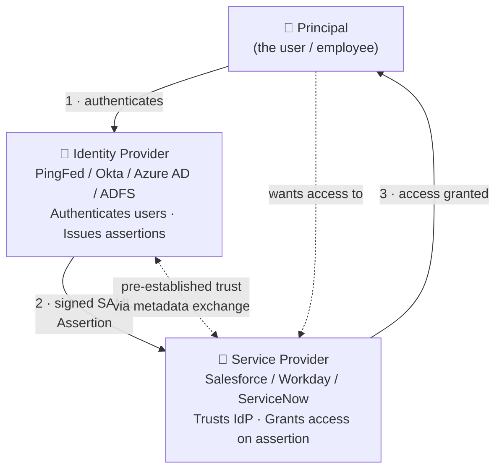
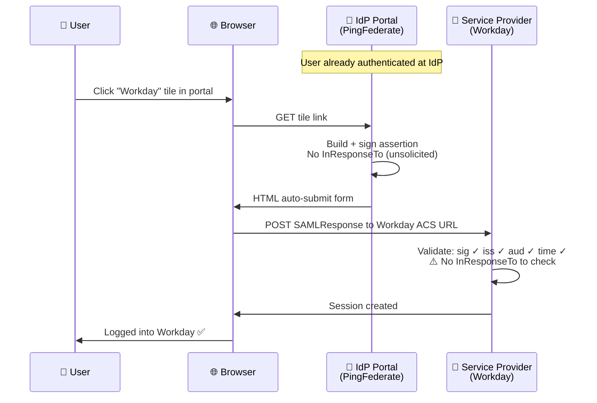
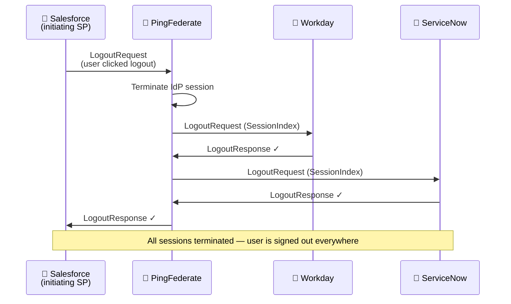

# SAML 2.0 + IAM Concepts — Complete Reference Guide

> **Scope:** SAML 2.0 protocol, SP-initiated and IdP-initiated SSO, Single Logout, building blocks, application onboarding, security hardening, IAM fundamentals (identity lifecycle, AD/LDAP, SCIM, IGA, RBAC, ABAC, JIT, PAM), and SAML vs OIDC comparison. Apigee and PingFederate configuration are a separate track.

---

## 🗺️ Learning Roadmap

```
Phase 1 — Foundations        Phase 2 — The SSO Flows      Phase 3 — Onboarding
┌──────────────────────┐     ┌──────────────────────┐     ┌──────────────────────┐
│ M1: What SAML is     │  →  │ M3: SP-initiated SSO │  →  │ M5: App onboarding   │
│ M2: Building blocks  │     │ M4: IdP-init + SLO   │     │     end-to-end       │
└──────────────────────┘     └──────────────────────┘     └──────────────────────┘
                                        ↓
Phase 4 — Security           Phase 5 — IAM Concepts        Phase 6 — Production
┌──────────────────────┐     ┌──────────────────────┐     ┌──────────────────────┐
│ M6: Attacks +        │  →  │ M7: Identity          │  →  │ M9: Use cases +      │
│     hardening        │     │     lifecycle + IGA   │     │     SAML vs OIDC     │
└──────────────────────┘     │ M8: RBAC, ABAC, JIT  │     └──────────────────────┘
                              └──────────────────────┘
```

| Symbol | Meaning |
|:---:|---|
| 💡 | Core concept |
| 🔐 | Security critical |
| 🏭 | Production pattern |
| ⚠️ | Common mistake / pitfall |
| 📖 | Real-world example |
| 🔧 | Configuration |
| 🛠️ | Debugging |

---

## Table of Contents

1. [Module 1 — What SAML is and why it exists](#module-1)
2. [Module 2 — SAML building blocks](#module-2)
3. [Module 3 — SP-initiated SSO flow](#module-3)
4. [Module 4 — IdP-initiated SSO + Single Logout](#module-4)
5. [Module 5 — Application onboarding end-to-end](#module-5)
6. [Module 6 — SAML security attacks and hardening](#module-6)
7. [Module 7 — IAM fundamentals](#module-7)
8. [Module 8 — Authorisation models: RBAC, ABAC, JIT, PAM](#module-8)
9. [Module 9 — Production use cases + SAML vs OIDC](#module-9)
10. [Module 10 — SAML Federation Architecture Patterns](#module-10)
11. [Quick Reference Cheat Sheet](#quick-reference)

---

## Module 1 — What SAML is and why it exists {#module-1}

### 💡 The enterprise problem SAML was built to solve

Before SAML, enterprises had a painful reality: 15 apps meant 15 different passwords, 15 separate account databases, and when someone left the company, IT had to manually disable 15 accounts — and often missed some.

> **📖 Year 2001, large bank:** A relationship manager has separate logins for Salesforce (CRM), Bloomberg (data), risk management system, treasury platform, email, SharePoint, JIRA, the expense system, and seven more. When she leaves the company, her manager emails IT. IT remembers to disable AD, Salesforce, and email — but misses the Bloomberg terminal. Six months later, her Bloomberg credentials are still active.

```
Before SAML                           After SAML
──────────────────────────────────    ──────────────────────────────────
Employee has 15 separate passwords    Employee has 1 corporate password
IT provisions 15 accounts manually   IT manages 1 identity in AD
Leaver: 15 manual disables           Leaver: 1 AD disable = all access gone
Helpdesk flooded with password resets One MFA reset fixes everything
One breach = multiple systems at risk One credential scope limited by time
```

### 💡 The three actors



| Actor | Role | Real-world examples |
|---|---|---|
| **Principal** | The user. Has an account at the IdP (usually AD). Never sees SAML XML — it all happens via browser redirects. | Employees, contractors, partners |
| **Identity Provider (IdP)** | Authenticates users. Issues signed SAML Assertions. The trust authority. | PingFederate, Okta, Azure AD, ADFS, Google Workspace |
| **Service Provider (SP)** | The app. Trusts the IdP. Validates the assertion. Creates a local session. Never sees the user's password. | Salesforce, Workday, ServiceNow, AWS, any SaaS app |

### 💡 What SAML is and is not

```
SAML IS:    An authentication + attribute federation protocol
            Answers: "Who is this user?" + "What are their attributes?"
            Designed for: SSO between organisations and across apps

SAML IS NOT: An authorisation protocol for APIs
             It doesn't issue access tokens for API calls (that's OAuth)

SAML IS NOT: A user provisioning protocol
             It handles login, not account lifecycle (that's SCIM)
```

### 💡 SAML vs OAuth/OIDC vs both

| Factor | SAML 2.0 | OIDC | OAuth 2.0 |
|---|---|---|---|
| **Primary purpose** | Enterprise SSO + attribute federation | Identity + modern SSO | API authorisation |
| **Data format** | XML (~5KB assertions) | JSON / JWT (compact) | JSON / JWT |
| **Transport** | Browser redirects only | Browser + native + APIs | Any HTTP client |
| **Mobile support** | Poor | Excellent | Excellent |
| **Setup complexity** | High | Medium | Medium |
| **Use when** | Legacy enterprise SaaS, B2B federation | Modern apps, new builds | API access, microservices |

> **🏭 Key insight:** Modern enterprise IdPs (PingFederate, Okta, Azure AD) support all three simultaneously from the same user store. Legacy apps use SAML. Modern apps use OIDC. APIs use OAuth. The IdP bridges all three.

---

## Module 2 — SAML building blocks {#module-2}

SAML has four technical layers. Understanding all four is the difference between successful onboarding in 2 days vs weeks of confusing back-and-forth with vendors.

```
Layer 4 — Profiles    (Web Browser SSO, Single Logout, ECP)
               ↑
Layer 3 — Bindings    (HTTP-Redirect, HTTP-POST, Artifact)
               ↑
Layer 2 — Protocols   (AuthnRequest, SAMLResponse, LogoutRequest)
               ↑
Layer 1 — Assertions  (Authentication, Attribute, AuthzDecision)
               ↑
Foundation — Metadata (establishes trust before any flow can work)
```

### 💡 Layer 1: Assertions — the signed XML identity claim

A SAML Assertion is a signed XML document that says: *"I have verified this user, here is who they are, here is how they authenticated, here are their attributes."*

```xml
<!-- The outer Response wrapper -->
<samlp:Response
  ID="_resp_8f3a2b1c4d5e6f7a"
  InResponseTo="_req_1a2b3c4d5e"     ← ties back to SP's AuthnRequest
  Destination="https://salesforce.com/saml/SSO">

  <saml:Issuer>https://pingfed.bank.com</saml:Issuer>
  <!--          ↑ IdP entity ID — SP validates this is a trusted IdP -->

  <samlp:Status>
    <samlp:StatusCode Value="urn:oasis:names:tc:SAML:2.0:status:Success"/>
  </samlp:Status>

  <saml:Assertion ID="_assert_9g4b3c2d5e6f">

    <!-- ① WHO: the user identifier -->
    <saml:Subject>
      <saml:NameID Format="...emailAddress">jane.smith@bank.com</saml:NameID>
      <saml:SubjectConfirmation Method="...bearer">
        <saml:SubjectConfirmationData
          NotOnOrAfter="2024-04-18T09:35:00Z"      ← 5-min validity window
          Recipient="https://salesforce.com/saml/SSO"
          InResponseTo="_req_1a2b3c4d5e"/>          ← links back to request
      </saml:SubjectConfirmation>
    </saml:Subject>

    <!-- ② WHEN: validity window + intended audience -->
    <saml:Conditions NotBefore="2024-04-18T09:29:55Z"
                     NotOnOrAfter="2024-04-18T09:35:00Z">
      <saml:AudienceRestriction>
        <saml:Audience>https://salesforce.com</saml:Audience>
        <!--            ↑ SP entity ID — assertion ONLY valid for this SP -->
      </saml:AudienceRestriction>
    </saml:Conditions>

    <!-- ③ HOW: authentication method used -->
    <saml:AuthnStatement AuthnInstant="2024-04-18T09:29:58Z"
                         SessionIndex="_sess_7h5c4d3e">
      <!--                             ↑ used by SLO to identify this session -->
      <saml:AuthnContext>
        <saml:AuthnContextClassRef>
          urn:oasis:names:tc:SAML:2.0:ac:classes:PasswordProtectedTransport
          <!-- MFA: ...ac:classes:MobileTwoFactorUnregistered -->
        </saml:AuthnContextClassRef>
      </saml:AuthnContext>
    </saml:AuthnStatement>

    <!-- ④ ATTRIBUTES: user data that drives authorisation -->
    <saml:AttributeStatement>
      <saml:Attribute Name="email">
        <saml:AttributeValue>jane.smith@bank.com</saml:AttributeValue>
      </saml:Attribute>
      <saml:Attribute Name="Role">
        <saml:AttributeValue>Relationship_Manager</saml:AttributeValue>
        <saml:AttributeValue>Branch_London_EC2</saml:AttributeValue>
      </saml:Attribute>
    </saml:AttributeStatement>

    <!-- ⑤ SIGNATURE: cryptographic proof of integrity -->
    <ds:Signature>
      <!-- RSA-SHA256 over assertion content -->
      <!-- SP verifies with IdP's public cert from metadata -->
    </ds:Signature>

  </saml:Assertion>
</samlp:Response>
```

> **🔐 Critical rule:** Always validate the **assertion** signature specifically — not just the Response-level signature. The XML Signature Wrapping (XSW) attack exploits SPs that only check the outer Response signature. See Module 6 for the full attack explanation.

### 💡 NameID formats — choosing the right user identifier

| Format | Value example | Stability | Recommendation |
|---|---|---|---|
| `persistent` | `_7f3a2b1c4d5e` (opaque) | Stable forever | ✅ **Recommended** for most cases |
| `emailAddress` | `jane@bank.com` | Changes if email changes | ⚠️ Breaks SP accounts on email change |
| `transient` | Random, changes each session | Ephemeral | For privacy — SP cannot track users |
| `unspecified` | Anything agreed with SP | Varies | Legacy integrations only |

### 💡 AuthnRequest parameters

```xml
<samlp:AuthnRequest
  ID="_req_1a2b3c4d5e"
  Destination="https://pingfed.bank.com/idp/SSO.saml2"
  AssertionConsumerServiceURL="https://salesforce.com/saml/SSO"
  ForceAuthn="false"
  <!--
    ForceAuthn="true"  → Force re-authentication even if IdP session is active
    Use for: password change flows, wire transfers, sensitive data access
    The SP demands fresh proof of identity, overriding existing SSO sessions
  -->
  IsPassive="false">
  <!--
    IsPassive="true"  → Do NOT show a login UI
    If no active session: return NoPassive error immediately (don't prompt)
    Use for: silent authentication checks ("is this user still logged in?")
             background session validation
    Returns: urn:oasis:names:tc:SAML:2.0:status:NoPassive if no session
  -->
  <saml:Issuer>https://salesforce.com</saml:Issuer>
  <samlp:NameIDPolicy Format="...emailAddress" AllowCreate="true"/>
</samlp:AuthnRequest>
```

### 💡 SAML error status codes

When SSO fails, the StatusCode tells you exactly where and why. These are the codes you'll see in production debugging.

```
Success codes:
  urn:...status:Success              → All good

Top-level error codes:
  urn:...status:Requester            → Problem with the SP's request
                                       (bad AuthnRequest, unknown SP entity ID)
  urn:...status:Responder            → IdP-side error
                                       (LDAP down, user not found, internal error)
  urn:...status:VersionMismatch      → SAML version mismatch

Second-level codes (appear as nested StatusCode):
  urn:...status:AuthnFailed          → User failed authentication (wrong password, locked)
  urn:...status:NoPassive            → IsPassive=true but no active session exists
  urn:...status:RequestDenied        → Policy denied the request (user not in allowed group)
  urn:...status:InvalidNameIDPolicy  → SP requested NameID format IdP doesn't support
  urn:...status:UnsupportedBinding   → SP requested binding IdP doesn't support
```

> **🛠️ Debugging tip:** When a user reports "SSO not working", the status code is the first thing to check. Responder = call the IdP team. Requester = check your SP configuration. AuthnFailed = user credential issue. Start with the SAML-tracer browser extension to see the raw response.

### 💡 Layer 2: Protocols

**AuthnRequest** — SP sends this to initiate SP-initiated SSO.
**SAMLResponse** — IdP returns this with the signed assertion.
**LogoutRequest / LogoutResponse** — used for Single Logout propagation.

> **🔐 InResponseTo linkage:** The ID on the AuthnRequest must appear as `InResponseTo` on the SAMLResponse. The SP stores the AuthnRequest ID and validates the response references it. This is how the SP knows the response was requested by it — not injected by an attacker.

### 💡 Layer 3: Bindings — how messages travel

| Binding | Used for | Mechanism | Size limit |
|---|---|---|---|
| **HTTP-Redirect** | AuthnRequest (SP→IdP) | Deflated, Base64, URL query string | ~2KB — small only |
| **HTTP-POST** | SAMLResponse (IdP→SP) | Base64 in auto-submitting HTML form | No limit — standard for assertions |
| **Artifact** | High-security environments | Reference token via browser; SP fetches assertion server-to-server | No limit; assertion never in browser |

```
Standard Web Browser SSO Profile uses:
  SP → IdP:  HTTP-Redirect binding  (AuthnRequest in URL)
  IdP → SP:  HTTP-POST binding      (SAMLResponse in hidden form)
```

### 💡 Layer 4: Profiles

| Profile | What it covers |
|---|---|
| **Web Browser SSO** | The core profile — SP-initiated and IdP-initiated SSO via browser |
| **Single Logout (SLO)** | Propagating logout across all SPs with active sessions |
| **Enhanced Client/Proxy (ECP)** | Non-browser clients (rare — OIDC replaced this use case) |
| **Artifact Resolution** | Back-channel assertion retrieval (high-security environments) |

### 💡 Metadata — the foundation of SAML trust

> **🔐 Metadata is the foundation of SAML security.** The signing certificate in metadata is what each party uses to verify messages. Configure the wrong certificate, and every assertion fails. An attacker who can replace the certificate in metadata can forge assertions. Protect metadata endpoints with TLS and access controls.

**IdP metadata** (what IdP publishes for SPs):
```xml
<md:EntityDescriptor entityID="https://pingfed.bank.com">
  <md:IDPSSODescriptor WantAuthnRequestsSigned="true">

    <!-- Certificate SPs use to verify assertion signatures -->
    <md:KeyDescriptor use="signing">
      <ds:X509Certificate>MIIDnjCCAoagAwIBAgIGAX...</ds:X509Certificate>
    </md:KeyDescriptor>

    <!-- Where to send browser for SSO login -->
    <md:SingleSignOnService
      Binding="...HTTP-Redirect"
      Location="https://pingfed.bank.com/idp/SSO.saml2"/>

    <!-- Where to send logout requests -->
    <md:SingleLogoutService
      Binding="...HTTP-Redirect"
      Location="https://pingfed.bank.com/idp/SLO.saml2"/>

    <md:NameIDFormat>...emailAddress</md:NameIDFormat>
    <md:NameIDFormat>...persistent</md:NameIDFormat>
  </md:IDPSSODescriptor>
</md:EntityDescriptor>
```

**SP metadata** (what SP gives to the IdP):
```xml
<md:EntityDescriptor entityID="https://salesforce.com">
  <!--                           ↑ Must match AudienceRestriction in every assertion -->
  <md:SPSSODescriptor
    AuthnRequestsSigned="true"
    WantAssertionsSigned="true">

    <!-- The ACS URL — where IdP POSTs the SAMLResponse -->
    <md:AssertionConsumerService
      Binding="...HTTP-POST"
      Location="https://salesforce.com/saml/SSO"
      index="0" isDefault="true"/>

    <md:SingleLogoutService
      Binding="...HTTP-Redirect"
      Location="https://salesforce.com/saml/logout"/>
  </md:SPSSODescriptor>
</md:EntityDescriptor>
```

---

## Module 3 — SP-initiated SSO flow {#module-3}

### 💡 Complete flow

```mermaid
sequenceDiagram
    participant U as 👤 User
    participant B as 🌐 Browser
    participant SP as 📱 Service Provider<br/>(Salesforce)
    participant IdP as 🔐 Identity Provider<br/>(PingFederate)

    U->>B: Visit https://salesforce.com/app
    B->>SP: GET /app (no session)
    SP->>SP: Generate AuthnRequest<br/>Store request ID in session
    SP->>B: 302 Redirect to IdP SSO URL<br/>?SAMLRequest=...&RelayState=...
    B->>IdP: GET /idp/SSO.saml2?SAMLRequest=...
    IdP->>IdP: Validate AuthnRequest
    IdP->>B: Show login page
    U->>B: Enter credentials + MFA
    B->>IdP: POST credentials
    IdP->>IdP: Authenticate against AD<br/>Fetch attributes<br/>Build + sign assertion
    IdP->>B: HTML auto-submit form<br/><form POST SAMLResponse to ACS URL>
    B->>SP: POST SAMLResponse to ACS URL<br/>(HTTP-POST binding)
    SP->>SP: Decode + validate assertion<br/>sig ✓ iss ✓ aud ✓ time ✓<br/>InResponseTo ✓ replayCheck ✓
    SP->>SP: Map attributes → roles
    SP->>B: Create session → redirect to RelayState
    B->>U: User is logged in ✅
```



### 💡 What the SP validates (step by step)

```
On receiving SAMLResponse at ACS URL:

Step 1: Decode Base64 → parse XML
Step 2: Verify assertion signature using IdP's certificate from metadata
Step 3: Check Issuer = "https://pingfed.bank.com" (expected IdP)
Step 4: Check AudienceRestriction = "https://salesforce.com" (my entity ID)
Step 5: Check NotBefore ≤ now ≤ NotOnOrAfter (max 60s clock skew)
Step 6: Check InResponseTo = stored AuthnRequest ID (prevents injection)
Step 7: Check Assertion ID not seen before (replay prevention cache)
Step 8: Check SubjectConfirmation Recipient = this ACS URL
Step 9: Extract NameID → find or create user account
Step 10: Extract attributes → assign roles and permissions
Step 11: Create local session → redirect to RelayState URL
```

### 📖 Real-world: bank relationship manager accessing Salesforce

```xml
<!-- SAML AttributeStatement: PingFed → Salesforce -->
<saml:AttributeStatement>
  <saml:Attribute Name="email">
    <saml:AttributeValue>jane.smith@bank.com</saml:AttributeValue>
  </saml:Attribute>
  <saml:Attribute Name="SalesforceProfile">
    <saml:AttributeValue>Relationship Manager</saml:AttributeValue>
  </saml:Attribute>
  <saml:Attribute Name="BranchCode">
    <saml:AttributeValue>LON-EC2-042</saml:AttributeValue>
  </saml:Attribute>
  <saml:Attribute Name="Manager">
    <saml:AttributeValue>false</saml:AttributeValue>
  </saml:Attribute>
</saml:AttributeStatement>

<!-- Salesforce maps these attributes to:
  SalesforceProfile="Relationship Manager" → Standard User profile
  BranchCode="LON-EC2-042"               → Territory: London EC2
  Manager="true"                         → Manager permission set granted  -->
```

---

## Module 4 — IdP-initiated SSO + Single Logout {#module-4}

### 💡 IdP-initiated SSO

User is already logged into the company portal. They click an app tile. The IdP sends an **unsolicited** SAMLResponse — no AuthnRequest was sent first.



> **⚠️ IdP-initiated is less secure than SP-initiated.** Without an AuthnRequest, there is no `InResponseTo` to validate — the SP cannot verify the assertion was requested by it, making injection and CSRF attacks harder to detect. Only accept IdP-initiated flows from trusted IdP IP ranges, and enforce all other assertion validations strictly.

### 💡 RelayState — context across the SSO flow

```
SP-initiated:  SP sets RelayState = "https://salesforce.com/account/00123456"
               → After SSO, user lands directly on that specific CRM record
               → This is how deep-linking works through SSO

IdP-initiated: IdP sets RelayState = target SP resource URL
               → Carries "where to go" to the SP's ACS handler

Security rule: NEVER blindly redirect to RelayState
               ONLY redirect if RelayState matches your own domain
               Prevents: open redirect attacks post-SSO (user redirected to phishing site)
```

### 💡 SessionIndex — the key to Single Logout

The `SessionIndex` in the AuthnStatement is how the IdP tracks **which specific session at each SP** belongs to the current user. Without it, SLO cannot function correctly.

```
When the assertion is issued:
  SessionIndex="_sess_7h5c4d3e"
  ↑ IdP creates a session record linking this value to:
     • The user (NameID)
     • The SP (entity ID)
     • The session start time

When SLO is triggered:
  IdP looks up all SessionIndex values for this user
  Sends LogoutRequest to each SP including their specific SessionIndex
  SP terminates the session that matches that SessionIndex
  SP sends LogoutResponse back

Why it matters for developers:
  When handling LogoutRequest: match by SessionIndex to terminate
  the RIGHT session (a user may have multiple concurrent sessions)
```

### 💡 Single Logout (SLO) — propagating logout everywhere



> **🏭 Reality of SLO in production:** Many SaaS apps implement SLO poorly or not at all. The IdP should gracefully handle non-responding SPs (timeout, log, continue). Active SP sessions may persist for 4–8 hours after AD account disable — set shorter session timeouts for security-critical applications.

---

## Module 5 — Application onboarding end-to-end {#module-5}

### 💡 The onboarding lifecycle

```
Day 0 — Procurement
├── Business approves new SaaS app
├── Security confirms SAML 2.0 support
├── Vendor provides: SP metadata XML or manual values
│   (Entity ID, ACS URL, NameID format, certificate)
└── Agreement on attribute names: "what do you call the role field?"

Day 1 — IdP Configuration (PingFederate)
├── Create SP Connection → import SP metadata
├── Configure NameID format
├── Define Attribute Contract (what attributes to send)
│   AD attribute    →   Assertion attribute name
│   mail            →   email
│   givenName       →   firstName
│   memberOf        →   groups  (filtered by App_* prefix)
│   department      →   department
├── Set authentication policy (password vs MFA required)
└── Export IdP metadata → send to SP admin

Day 1 — SP Configuration
├── Upload IdP metadata (or enter manually)
├── Map SAML attributes to app fields
├── Enable JIT provisioning (optional)
└── Enable SAML SSO mode

Day 2 — Testing (expect 2–3 config errors — this is normal)
├── 3–5 pilot users from different AD groups
├── Use SAML-tracer browser extension to inspect assertions
└── Fix the errors (see table below)

Day 3 — Go-live
├── Enable app tile for appropriate AD groups
├── Communicate to users
├── Enable SCIM provisioning if supported
└── Document in IAM register
```

### ⚠️ The three most common onboarding failures

| Error message | Root cause | Fix |
|---|---|---|
| "Signature validation failed" | Wrong IdP certificate uploaded to SP | Re-export from IdP metadata, re-upload |
| "User logged in but wrong role" | Attribute name mismatch (SP expects `Role`, IdP sends `groups`) | Align names in Attribute Contract or SP mapping |
| "AudienceRestriction mismatch" | SP Entity ID in IdP ≠ SP's own configured Entity ID | Verify exact string match in both places |

### 🔐 Zero-downtime certificate rotation

SAML certificate rotation done wrong will break every SSO flow simultaneously. The correct procedure uses an overlap period.

```
Step 1 — Add new certificate ALONGSIDE the old one in IdP metadata
         (IdP now has two signing certs listed — both are trusted by SPs)

Step 2 — Give SPs time to refresh their cached metadata
         If SPs fetch metadata dynamically: wait for cache TTL (typically 24h)
         If SPs use manually uploaded metadata: contact each SP admin to re-import

Step 3 — Switch IdP to sign new assertions with the NEW certificate
         Old assertions signed with old cert: still valid (SP trusts both)
         New assertions signed with new cert: SP validates with new cert ✓

Step 4 — Monitor for any validation failures (there should be none)

Step 5 — Remove the OLD certificate from IdP metadata
         Notify SP admins to remove old cert if they manage it manually

Total duration: 24-72 hours for a safe rotation with no SSO disruption
⚠️ NEVER remove the old cert before confirming all SPs have the new cert
```

### 📖 Real-world: onboarding ServiceNow to PingFederate

```
Healthcare company onboarding ServiceNow ITSM to existing PingFed:

What ServiceNow admin exports:
  → SP metadata XML with:
     Entity ID: https://company.service-now.com
     ACS URL:   https://company.service-now.com/navpage.do
     Certificate: (ServiceNow's signing cert)
     NameID format: email

What PingFed admin configures:
  → SP Connection with:
     SP Entity ID: https://company.service-now.com
     ACS URL: https://company.service-now.com/navpage.do
     Attribute contract:
       mail         → email
       givenName    → first_name
       sn           → last_name
       memberOf     → roles  (mapping: SNOW_ITIL→itil, SNOW_ADMIN→admin)

Errors hit during testing:
  Error 1: "Email attribute not found"
    Cause: PingFed was sending "mail" but ServiceNow expected "email"
    Fix: rename attribute in Attribute Contract to "email"

  Error 2: "User has no roles assigned"
    Cause: Group filter regex wrong — was matching SNOW_* but groups were named SN_*
    Fix: update memberOf filter to SN_ITIL, SN_ADMIN

  Error 3: "Signature invalid"
    Cause: ServiceNow admin uploaded a test cert, not the production IdP cert
    Fix: re-export production cert from PingFed metadata, re-upload to ServiceNow

Time from start to first successful SSO login: 6 hours (including 2h debugging)
```

### 💡 Typical onboarding timelines

| App type | Timeline | Key complexity driver |
|---|---|---|
| Simple SaaS (Slack, Zoom) | 1–2 days | Standard attributes, clear vendor docs |
| Salesforce / ServiceNow | 1–2 weeks | Role hierarchy, profile mapping, custom attributes |
| SAP / Oracle | 2–4 weeks | Vendor support required, complex config |
| Custom internal app | 2–4 weeks | Development required for SAML library integration |
| Multi-tenant B2B SaaS | 30–60 min per customer | Attribute contract agreed with each customer's IT |

---

## Module 6 — SAML security attacks and hardening {#module-6}

### 🔐 Attack 1: XML Signature Wrapping (XSW) — the most critical vulnerability

> **How it works:**
> 1. Attacker logs in legitimately → captures a valid signed SAMLResponse
> 2. Creates a malicious assertion (NameID = "admin@bank.com")
> 3. Inserts malicious assertion into the XML alongside the legitimate one
> 4. The XML digital signature still validates — it references the legitimate assertion by ID
> 5. A naive SP processes the **malicious** assertion (by XML position, not by ID reference)
> 6. Attacker is now authenticated as the admin account

```
Legitimate assertion:   <saml:Assertion ID="_real_assert_123">...jane@bank.com...</saml:Assertion>
Malicious wrapper:      <saml:Assertion ID="_evil">...admin@bank.com...
                          <saml:Assertion ID="_real_assert_123">...jane@bank.com...</saml:Assertion>
                        </saml:Assertion>
Signature references:   <Reference URI="#_real_assert_123"/> ← signature is valid!
SP processes:           The OUTER assertion (admin@bank.com) ← WRONG
```

> **🏭 Real-world impact:** XSW vulnerabilities have been found in OneLogin, Duo Security, and multiple enterprise SSO products. This is not theoretical — it has been exploited in production.

> **Prevention:**
> ```
> 1. Use a security-reviewed SAML library (python3-saml, java-saml, passport-saml)
>    Never implement XML parsing yourself
> 2. Always process the assertion referenced by the signature's <Reference URI>
>    NOT by XML position (first child, last child, etc.)
> 3. Schema-validate the XML before processing
> 4. Sign both the Response AND the inner Assertion (belt and braces)
> ```

### 🔐 Attack 2: Assertion Replay

```
Attack:
  1. Attacker intercepts a valid SAML assertion (XSS, network, log exposure)
  2. Submits it to SP's ACS URL before NotOnOrAfter expires (5-min window)
  3. SP validates: signature ✓, time window ✓ — both pass
  4. Attacker is logged in as the victim

Prevention (SP-side):
```

```python
async def validate_assertion(assertion):
    assertion_id    = assertion.get_id()
    not_on_or_after = assertion.get_not_on_or_after()

    # Check if this assertion ID was already used
    if await redis.exists(f"saml:used:{assertion_id}"):
        raise SecurityError("Assertion replay detected — ID already seen")

    # Mark as used (auto-expires when assertion becomes invalid)
    ttl = (not_on_or_after - datetime.utcnow()).seconds
    await redis.setex(f"saml:used:{assertion_id}", ttl, "1")

    # Continue normal validation...
```

### 🔐 Attack 3: Open Redirect via RelayState

```
Attack:  Attacker crafts link with RelayState=https://attacker.com/phishing
         User sees legitimate company login page
         Logs in successfully
         Gets redirected to attacker's site

Prevention:
  Only redirect to RelayState values matching your own domain
```

```python
from urllib.parse import urlparse

def safe_redirect(relay_state, allowed_host="yourapp.com"):
    if relay_state:
        parsed = urlparse(relay_state)
        if parsed.netloc and parsed.netloc != allowed_host:
            return redirect("/dashboard")  # fallback to safe default
    return redirect(relay_state or "/dashboard")
```

### 🔐 Attack 4: Login CSRF via IdP-initiated SSO

> **How it works:**
> 1. Attacker initiates an IdP-initiated SSO flow using the **victim's** browser
> 2. Victim's browser submits an assertion for the **attacker's** account to the SP
> 3. Victim is now logged in as the attacker — anything they do (enter payment info,
>    change settings) is done in the attacker's account

> **Prevention:**
> - For SP-initiated flows: always validate `InResponseTo` against a stored request ID
> - For IdP-initiated flows: embed a CSRF token in RelayState and validate it on receipt
> - Reject any IdP-initiated assertions where you cannot validate the flow origin

### ✅ Production hardening checklist

**SP must validate on every assertion:**
```
✅ Assertion signature (not just Response) using IdP cert from metadata
✅ Issuer = expected IdP entity ID (exact string match)
✅ AudienceRestriction = this SP's entity ID
✅ NotBefore ≤ now ≤ NotOnOrAfter (max 60s clock skew)
✅ InResponseTo = stored AuthnRequest ID (SP-initiated flows)
✅ Assertion ID not in replay prevention cache
✅ SubjectConfirmation Recipient = this ACS URL
✅ StatusCode = Success (before processing any assertion content)
```

**Implementation rules:**
```
✅ TLS 1.2+ on all SAML endpoints (ACS, SLO, metadata URL)
✅ Use a security-reviewed SAML library — never DIY XML parsing
✅ Schema-validate XML before processing
✅ Whitelist RelayState redirects to own domain only
✅ Process assertion by signature Reference ID, not XML position
✅ Zero-downtime cert rotation plan (see Module 5)
✅ Log all assertion IDs and validation failures → SIEM
✅ Sign AuthnRequests (WantAuthnRequestsSigned="true" in IdP metadata)
```

---

## Module 7 — IAM fundamentals {#module-7}

### 💡 The four pillars of IAM

```
┌────────────┐    ┌──────────────────┐    ┌──────────────────┐    ┌──────────┐
│  IDENTITY  │ →  │ AUTHENTICATION   │ →  │ AUTHORISATION    │ →  │  AUDIT   │
│            │    │                  │    │                  │    │          │
│ Who are    │    │ Prove it         │    │ What can you do? │    │ What did │
│ you?       │    │                  │    │                  │    │ you do?  │
│            │    │                  │    │                  │    │          │
│ AD / LDAP  │    │ PingFed / Okta   │    │ RBAC / ABAC      │    │ SIEM     │
│ SCIM / HR  │    │ ADFS / Azure AD  │    │ PAM / IGA        │    │ IGA logs │
└────────────┘    └──────────────────┘    └──────────────────┘    └──────────┘

SAML sits at the Authentication ↔ Authorisation boundary:
  proves identity AND carries attribute claims that drive authorisation decisions
```

### 💡 Active Directory and LDAP

Active Directory (AD) is the dominant on-premises enterprise identity store. PingFederate connects to AD via LDAP to authenticate users and read attributes for SAML assertions.

```
Key AD concepts:
  Domain        → security boundary (e.g. bank.com)
  Forest        → collection of domains with shared trust
  OU            → Organisational Unit — container for organising objects
  Group         → collection of users (what PingFed reads for SAML attributes)
  sAMAccountName → Windows login name (jsmith)
  userPrincipalName → UPN — typically email format (jane.smith@bank.com)

How PingFederate uses AD:
  1. User submits credentials at PingFed login page
  2. PingFed binds to AD with service account
  3. Validates user credentials via LDAP
  4. Reads attributes: mail, givenName, sn, memberOf, department, employeeID
  5. Maps AD attributes → SAML assertion attribute names per Attribute Contract
  6. Issues signed assertion
```

### 💡 IGA — Identity Governance and Administration

**IGA** (Identity Governance and Administration) is the layer above SCIM and AD that manages the *lifecycle* and *governance* of identity — who should have access, for how long, and how that gets reviewed.

```
IGA sits above all other IAM systems:

  HR System (Workday/SAP HR)
      ↓ hire/move/terminate events
  IGA Platform (SailPoint, Saviynt, Omada)
      ↓ translates business roles to technical entitlements
  AD / LDAP             SCIM Provisioning
      ↓                       ↓
  PingFederate          SaaS App accounts
      ↓
  SAML SSO to all connected apps

IGA key functions:
  • Joiner/Mover/Leaver workflow automation
  • Role-based access request and approval
  • Access certification (periodic reviews: "does Jane still need this?")
  • Segregation of Duties (SoD) — prevent conflicting role combinations
  • Orphaned account detection and cleanup
  • Compliance reporting (SOX, GDPR, ISO 27001)
```

> **📖 Real-world:** A bank runs quarterly access reviews via IGA. Every manager certifies their team's access. Access that isn't certified within 30 days is automatically revoked. This is how the bank demonstrates SOX compliance and avoids audit findings.

### 💡 Identity lifecycle: Joiner / Mover / Leaver

```
JOINER (new employee):
  08:00  HR system creates record (start date triggers workflow)
  08:15  IGA provisions AD account + adds to role-based security groups
  08:30  SCIM pushes account to 35 core apps (email, calendar, Salesforce, ITSM)
  09:00  Employee arrives → portal shows all app tiles
         → SAML SSO works for all 80 connected apps immediately
  Target SLA: all access ready within 4 hours of start date

MOVER (role change — e.g. promoted to manager):
  Manager submits change request → IGA approval workflow
  Old AD groups removed → new groups added (same day)
  SCIM updates app roles automatically
  Next SAML login: assertion carries new roles → SP applies new permissions
  ⚠️ Challenge: active SP sessions keep old roles until session expires
     Solution: short session timeouts (4-8h) or SLO-triggered re-authentication

LEAVER (employee exits):
  T+0:   HR triggers termination → IGA automated workflow
  T+0:   AD account DISABLED immediately
  T+0:   All SAML SSO attempts fail instantly (IdP auth against AD fails)
  T+5m:  SCIM deprovisions all app accounts
  T+1h:  Manual audit confirms all access removed
  Target SLA: AD disabled within 1 hour of termination
  ⚠️ Active SP sessions may persist 4-8h until local timeout
     Critical apps (trading, wire transfers): 15-30 min sessions + SLO
```

### 💡 SCIM — automated account lifecycle

SAML handles login. SCIM handles account existence. Together they give you both SSO and automated provisioning.

```bash
# Create user (new joiner arriving at ServiceNow)
POST https://app.example.com/scim/v2/Users
{ "userName": "jane.smith@bank.com",
  "active": true,
  "roles": [{"value": "itil", "primary": true}] }

# Disable user (leaver)
PATCH https://app.example.com/scim/v2/Users/{id}
{ "Operations": [{"op": "replace", "path": "active", "value": false}] }

# Update roles (mover)
PATCH https://app.example.com/scim/v2/Users/{id}
{ "Operations": [{"op": "replace", "path": "roles",
  "value": [{"value": "itil_manager", "primary": true}]}] }
```

| | SCIM | JIT provisioning |
|---|---|---|
| Account creation | Before first login (proactive) | On first login (reactive) |
| Deprovisioning | Immediately on event | Only when AD auth fails |
| Best for | Zero-day access, strict deprovisioning SLA | Simple apps, small scale |

---

## Module 8 — Authorisation models: RBAC, ABAC, JIT, PAM {#module-8}

### 💡 RBAC — Role-Based Access Control

Users → assigned to roles → roles have permissions. SAML carries roles in the AttributeStatement.

```xml
<saml:Attribute Name="Role">
  <saml:AttributeValue>Manager</saml:AttributeValue>
</saml:Attribute>
<!-- SP maps:
  Manager  → read + write + approve
  Employee → read + write own records only
  Auditor  → read only                    -->
```

> **⚠️ RBAC limitation at enterprise scale:** 500 employees × 20 apps = thousands of roles to manage. Roles become too coarse-grained. A "Manager" role gives all-or-nothing access — it can't restrict by data sensitivity, time, or location. This is where ABAC steps in.

### 💡 ABAC — Attribute-Based Access Control

Access decisions based on attributes of the **user**, **resource**, **action**, and **environment**. All user attributes come from the SAML assertion.

```
Policy rule (pseudo-code):
ALLOW IF
  user.department = "Finance"
  AND user.clearanceLevel >= "Level3"
  AND resource.classification = "Confidential"
  AND action = "read"
  AND time BETWEEN "08:00" AND "18:00"
  AND user.location = "corporate-network"

Healthcare example:
ALLOW patient record access IF
  user.role = "Physician"
  AND user.employeeId IN patient.treatingTeamIds
  AND action IN ["read", "write"]
```

### 💡 JIT provisioning

When a user first SSOs into an app, the SP automatically creates their account from the SAML assertion.

```
First login to ServiceNow via SAML SSO:
  1. Assertion arrives with valid signature
  2. SP checks: account exists for "jane.smith@bank.com"? → No
  3. Create account from assertion attributes:
       username  = NameID value
       firstName = firstName attribute
       lastName  = lastName attribute
       roles     = map "groups" attribute → ServiceNow roles
  4. Log user in to newly created account

Subsequent logins:
  SP updates attributes from assertion → keeps in sync with AD automatically
```

### 💡 AuthnContextClassRef — authentication strength reference

```
Password only:
  urn:oasis:names:tc:SAML:2.0:ac:classes:PasswordProtectedTransport

MFA (TOTP, push notification, hardware token):
  urn:oasis:names:tc:SAML:2.0:ac:classes:MobileTwoFactorUnregistered

Smartcard / PKI certificate:
  urn:oasis:names:tc:SAML:2.0:ac:classes:Smartcard

Kerberos (integrated Windows authentication):
  urn:oasis:names:tc:SAML:2.0:ac:classes:Kerberos

Windows integrated + MFA:
  urn:oasis:names:tc:SAML:2.0:ac:classes:InternetProtocolPassword
```

> **📖 Step-up authentication at a bank:**
> 1. Employee logs in with password → AuthnContext = PasswordProtectedTransport
> 2. Navigates to wire transfer page (high-risk action)
> 3. SP checks AuthnContext — MFA not performed → insufficient for this action
> 4. SP sends new AuthnRequest with `RequestedAuthnContext = MobileTwoFactorUnregistered`
>    AND `ForceAuthn="true"` (force re-authentication)
> 5. PingFed prompts for MFA → employee completes
> 6. New assertion issued with MFA AuthnContext
> 7. Wire transfer screen now accessible

---

## Module 9 — Production use cases + SAML vs OIDC {#module-9}

### 📖 Use case A — Global bank: 12,000 employees, 80 SAML apps

```
Architecture:
  Identity: Active Directory (2 forests — retail + investment banking)
  IdP:      PingFederate 11.x cluster (2 nodes, active-active, load balanced)
  SPs:      80 SAML SP connections
  SCIM:     35 apps (proactive provisioning)
  JIT:      45 apps (on-demand provisioning)
  MFA:      Enforced for privileged apps via RequestedAuthnContext

Onboarding SLA (Day 1):
  08:00  HR triggers joiner workflow → IGA automated provisioning
  08:15  AD account created + added to role groups
  08:30  SCIM pushes to 35 core apps
  09:00  Employee arrives → SSO works for all 80 apps ✅

Termination SLA:
  T+0    AD disabled → ALL SAML SSO fails immediately
  T+5m   SCIM deprovisions all 35 SCIM-connected apps
  T+1h   Audit confirms clean
```

### 📖 Use case B — SaaS platform: multi-tenant SAML

```
50 enterprise customers, each with their own corporate IdP

Routing by email domain:
  User enters jane@bigbank.com
  Platform: domain "bigbank.com" → SP connection "sp-bigbank"
  Redirect to: https://pingfed.bigbank.com/idp/SSO.saml2
  Assertion returns to: https://hrplatform.com/saml/acs/bigbank
                                                          ↑
                              Tenant-specific ACS URL → strict isolation

Tenant isolation via AudienceRestriction:
  BigBank assertion:  Audience = "https://hrplatform.com/saml/bigbank"
  CapCorp assertion:  Audience = "https://hrplatform.com/saml/capcorp"
  → BigBank assertion submitted to CapCorp's ACS URL: REJECTED ✓

Customer onboarding time: 30–60 min
Bottleneck: every customer names their role attribute differently
```

### 📖 Use case C — Migrating SAML → OIDC progressively

```
Phase 1 (now):   New apps → OIDC only (no new SAML integrations)
Phase 2 (6m):    Mobile apps → OIDC + PKCE
Phase 3 (12m):   SaaS apps that support both → migrate to OIDC
Phase 4 (ongoing): SAP, Oracle, mainframes → SAML indefinitely

PingFed bridge: same user session → can issue both SAML assertions
                AND OIDC tokens simultaneously
                User logs in once → accesses SAML and OIDC apps without re-auth

Why some apps will never migrate:
  - SAP, Oracle EBS: only support SAML, no OIDC roadmap
  - Cross-org B2B corporate federation: deeply embedded trust frameworks
  - Regulated environments: audited SAML configurations cannot change without re-audit
```

### 💡 SAML vs OIDC — complete decision guide

| Factor | Choose SAML | Choose OIDC |
|---|---|---|
| **App type** | Legacy enterprise SaaS (Salesforce, SAP, Workday) | Modern web/mobile apps, new builds |
| **Client** | Web browser only | Browser, native mobile, desktop, IoT |
| **Federation** | Cross-org corporate IdP federation (B2B) | Consumer SSO, modern B2B |
| **Token format** | App requires XML assertion | App prefers JSON/JWT |
| **API access** | Not needed | Required (OAuth access tokens) |
| **Setup effort** | High (metadata, XML, certs) | Lower (discovery, JWKS) |
| **Mobile support** | Poor | Excellent |
| **Your actual choice** | No choice — app only supports SAML | Always prefer OIDC for new builds |

> **🏭 Architect's rule:** If an app supports both protocols, always choose OIDC for new integrations. SAML is for apps that give you no choice — legacy enterprise tools, cross-org corporate federation, or systems built before 2015.

---

## Quick Reference Cheat Sheet {#quick-reference}

### SAML flow selection

```
User starts at...
├── The SP (app)      → SP-initiated SSO (more secure, has InResponseTo)
└── The IdP (portal)  → IdP-initiated SSO (convenient, more attack surface)

Logging out...
├── One app           → Local logout only (most common in practice)
└── Everywhere        → Single Logout (SLO) — requires all SPs to support it
```

### SP validation checklist

```
✅ Assertion signature (not just Response) using IdP cert from metadata
✅ Issuer = expected IdP entity ID (exact string)
✅ AudienceRestriction = this SP's entity ID
✅ NotBefore ≤ now ≤ NotOnOrAfter (max 60s clock skew)
✅ InResponseTo = stored AuthnRequest ID (SP-initiated only)
✅ Assertion ID not in replay cache
✅ SubjectConfirmation Recipient = this ACS URL
✅ StatusCode = Success
```

### IAM joiner/mover/leaver SLAs

| Event | AD action | SAML impact | Target SLA |
|---|---|---|---|
| Joiner | Create + add to groups | SSO works immediately | 4 hours from start date |
| Mover | Update group membership | New roles on next login | Same day |
| Leaver | **Disable account** | All SSO fails **instantly** | **1 hour from termination** |

### SAML security non-negotiables

```
1.  Validate assertion signature specifically (not just Response)
2.  Validate Issuer against known IdP entity ID
3.  Validate AudienceRestriction against your own entity ID
4.  Enforce NotBefore/NotOnOrAfter strictly (60s max skew)
5.  Cache and reject replayed assertion IDs (Redis with TTL)
6.  Validate InResponseTo in SP-initiated flows
7.  Whitelist RelayState redirect targets to own domain
8.  Process assertion by signature Reference URI, not XML position
9.  Never roll your own XML parsing — use a vetted SAML library
10. TLS on all SAML endpoints, always
```

### SAML error status codes quick reference

| Status code | Meaning | Who to call |
|---|---|---|
| `...status:Success` | All good | — |
| `...status:Responder` | IdP-side error (LDAP down, user not found) | IdP team |
| `...status:Requester` | Bad request from SP | SP team (check Entity ID, ACS URL) |
| `...status:AuthnFailed` | User failed authentication | User or password reset |
| `...status:NoPassive` | IsPassive=true, no active session | Expected — handle gracefully |
| `...status:RequestDenied` | Policy denied (user not in allowed group) | Access provisioning team |

### Protocol landscape — which to use when

```
Enterprise B2B SSO with corporate IdPs?    → SAML 2.0
Building modern web or mobile app?         → OIDC
API access tokens for microservices?       → OAuth 2.0
App that enterprise customers will use?    → SAML (they have PingFed/Okta/ADFS)
New internal app for employees?            → OIDC
SAP / Oracle / mainframe integration?      → SAML (no choice)
```

---

*SAML 2.0 Core: OASIS saml-core-2.0-os · Web Browser SSO: saml-profiles-2.0-os · SCIM 2.0: RFC 7642–7644 · RBAC: NIST SP 800-162 · ABAC: NIST SP 800-162*

---

## Module 10 — SAML Federation Architecture Patterns {#module-10}

> These patterns describe **how SAML trust relationships are structured at scale** — from a single enterprise to cross-organisation federations. Every enterprise running SAML at scale uses one of these patterns, whether they name it or not.

---

### 💡 Hub-and-Spoke vs Mesh Federation

This is the most consequential SAML architecture decision a large enterprise makes. The wrong choice leads to hundreds or thousands of trust relationships that are impossible to manage.

**The problem: bilateral trust doesn't scale**

```
MESH FEDERATION (bilateral trust between every pair):
─────────────────────────────────────────────────────

Each IdP must establish a direct trust relationship with each SP.
If you have 5 IdPs and 80 SaaS apps, that's 5 × 80 = 400 bilateral trusts.

  [Azure AD] ─────── [Salesforce]
  [Azure AD] ─────── [Workday]
  [Azure AD] ─────── [ServiceNow]  ← 80 connections from Azure AD alone
  [Azure AD] ─────── [Jira] ...
  [Okta]     ─────── [Salesforce]
  [Okta]     ─────── [Workday]     ← another 80 from Okta
  ...
  
  Total connections = 5 × 80 = 400
  Each connection needs: metadata exchange, cert management, attribute mapping
  When an SP's certificate expires: update in ALL 5 IdPs
  When a new app is added: configure in ALL 5 IdPs
  → Operational nightmare at scale
```

```
HUB-AND-SPOKE FEDERATION (central IdP as the trust hub):
─────────────────────────────────────────────────────────

All SPs trust ONE hub (PingFederate). All upstream IdPs connect to the hub.
Adding a new SP = 1 configuration (in PingFed). Always.
Adding a new upstream IdP = 1 configuration (in PingFed). Always.

  [Azure AD]  ─┐
  [Okta]      ─┼──▶  [PingFederate HUB]  ◀──▶  [Salesforce]
  [Ping IdP]  ─┘            │                   [Workday]
  [ADFS]      ─┘            │                   [ServiceNow]
                             │                   [Jira]
                             │                   ...80 SPs
  
  Total connections = 5 (upstream IdPs) + 80 (SPs) = 85
  When an SP's certificate expires: update in PingFed ONLY
  When a new app is added: configure in PingFed ONLY
  → Linear scaling, single point of management
```

| | Mesh | Hub-and-Spoke |
|---|---|---|
| **Connections formula** | N × M | N + M |
| **5 IdPs + 80 SPs** | 400 connections | 85 connections |
| **Adding a new SP** | Configure in every IdP | Configure in hub only |
| **Certificate rotation** | Update in every IdP | Update in hub only |
| **Attribute policy** | Must be replicated per-pair | Centralised in hub |
| **Suitable for** | Small scale (1 IdP, ≤5 SPs) | Enterprise (any scale) |

> **📖 Real-world scenario — UK financial services firm post-merger:**
> Barclays acquires a smaller bank. Smaller bank has ADFS as IdP. Barclays has PingFederate. Smaller bank has 12 SAML-connected SaaS apps. Barclays has 80.
>
> **Mesh approach (rejected):** Smaller bank's ADFS would need to establish trust with all 80 Barclays SPs. Barclays' PingFed would need to trust all 12 acquired apps. = 92 new bilateral trusts. Certificate updates would need to happen in two systems. Attribute contracts differ between the two IdPs.
>
> **Hub-and-spoke approach (chosen):** Configure ADFS as an upstream IdP in PingFed (1 connection). PingFed now brokers authentication for all acquired employees. Their ADFS credentials work for all 80 Barclays apps immediately. IT team manages one config, not 92.

---

### 💡 Identity Brokering — IdP acting as a protocol and attribute proxy

Identity brokering is when a central IdP (like PingFederate) acts as a **middleman** — authenticating against an upstream identity source and issuing its own assertions downstream to SPs. The SPs only ever see and trust the broker, not the upstream IdP.

```
WITHOUT BROKERING (direct trust):
  [Azure AD] ──── SAML Assertion ────▶ [Salesforce]
  [Azure AD] ──── SAML Assertion ────▶ [Workday]
  [Azure AD] ──── OIDC ID Token ─────▶ [Modern App]
  
  Problem: Azure AD must be configured for every SP.
           Protocol differences (some SPs want SAML, some want OIDC).
           Attribute mapping differs per SP.

WITH BROKERING (central IdP as proxy):
  [Azure AD] ──── validates credentials ────▶ [PingFederate BROKER]
                                                      │
                                    ┌─────────────────┼──────────────────┐
                                    ▼                 ▼                  ▼
                             SAML Assertion    SAML Assertion      OIDC Token
                                    │                 │                  │
                             [Salesforce]       [Workday]         [Modern App]
  
  PingFed adds:
    • Attribute transformation (AD attribute names → SP-expected names)
    • Protocol translation (SAML in → OIDC out, or vice versa)
    • Policy enforcement (MFA required for finance apps)
    • Issuer normalisation (all assertions say "iss=pingfed", not "iss=azure")
```

**What the broker changes in the assertion:**

```
Azure AD token (what PingFed receives from upstream):
  iss: https://login.microsoftonline.com/tenant-id
  sub: AzureAD-user-GUID-abc123
  email: jane.smith@bank.com
  groups: ["Azure-Group-Finance", "Azure-Group-London"]
           ↓ PingFed transforms this ↓
PingFed assertion (what Salesforce receives):
  iss: https://pingfed.bank.com          ← broker's entity ID, not Azure AD's
  sub: jane.smith@bank.com               ← normalised to email format
  email: jane.smith@bank.com
  SalesforceProfile: Relationship Manager  ← mapped from Azure group name
  BranchCode: LON-EC2                      ← looked up from LDAP, not in Azure AD
  Department: Retail Banking               ← merged from LDAP + Azure AD
```

> **📖 Real-world scenario — M&A integration:**
> A pharma company (running Okta) acquires a biotech startup (running Azure AD). Both companies need employees to access the same research collaboration platform (a SAML SP).
>
> **Without brokering:** The collaboration platform needs two separate SAML connections — one for Okta, one for Azure AD. Each has different attribute names, different certificate management, different session policies.
>
> **With PingFed as broker:**
> - Pharma employees: Okta → PingFed → Collaboration Platform
> - Biotech employees: Azure AD → PingFed → Collaboration Platform
> - Collaboration platform: one SAML connection, always to PingFed
> - PingFed normalises attributes from both: `department` from Okta = `businessUnit` from Azure AD → both mapped to `ResearchDivision` that the platform expects
> - Compliance team: one place (PingFed) to set the policy "biotech employees need MFA when accessing lab data"

**Protocol brokering — SAML in, OIDC out (and vice versa):**

```
Scenario: Legacy enterprise IdP (SAML only) + Modern SaaS app (OIDC only)

  [ADFS]  ──── SAML Assertion ────▶  [PingFederate]  ──── OIDC Token ────▶  [Modern App]
  (only speaks SAML)                  (translates)         (only speaks OIDC)
  
  PingFed:
    1. Receives SAML assertion from ADFS
    2. Extracts user identity and attributes
    3. Issues an OIDC ID token + access token for the modern app
    4. The modern app never knows the upstream used SAML
    
  This is how enterprises modernise: swap SPs from SAML to OIDC one by one
  without changing the upstream identity source.
```

---

### 💡 Circle of Trust (CoT) — the formal trust boundary

The **Circle of Trust** is the formal term (originating in the Liberty Alliance's ID-Federation Framework, adopted into SAML 2.0) for the set of all entities — IdPs and SPs — that have mutually exchanged metadata and established trust relationships.

```
THE CIRCLE OF TRUST VISUALISED:

  ╔═══════════════════════════════════════════════════════════╗
  ║              CIRCLE OF TRUST — Bank.com                   ║
  ║                                                           ║
  ║   ┌──────────────┐     ┌──────────┐   ┌──────────────┐  ║
  ║   │  PingFed IdP │────▶│Salesforce│   │  ServiceNow  │  ║
  ║   │  (hub)       │     └──────────┘   └──────────────┘  ║
  ║   └──────┬───────┘     ┌──────────┐   ┌──────────────┐  ║
  ║          │             │  Workday │   │     Jira     │  ║
  ║          │             └──────────┘   └──────────────┘  ║
  ║          │             ┌──────────────────────────────┐  ║
  ║          └────────────▶│   ...72 more SP connections  │  ║
  ║                        └──────────────────────────────┘  ║
  ╚═══════════════════════════════════════════════════════════╝
  
  OUTSIDE THE CIRCLE:         ← No trust. Assertions from outside are REJECTED.
  [Competitor's IdP]
  [Unknown SaaS app]
  [Rogue SAML sender]
  
  To join the circle: exchange metadata + security review + IT approval
```

**What defines membership in the CoT:**
- Metadata has been exchanged (IdP has SP's metadata, SP has IdP's metadata)
- Certificates are current and valid
- Entity IDs are registered and known
- The relationship is actively maintained (certificate rotation, updates)

**The CoT in PingFederate terminology:**
In PingFed's admin console, every SP Connection you create represents one SP being admitted to your Circle of Trust. The list of SP Connections IS your Circle of Trust. PingFed will only issue assertions to entity IDs that appear in this list.

> **📖 Real-world scenario — bank admitting a new vendor:**
> A bank wants to give their new clearing house partner access to their trade reporting system. The clearing house uses their own SAML IdP (not the bank's PingFed).
>
> Process to admit them into the CoT:
> 1. Clearing house exports their IdP metadata XML
> 2. Bank's IT security team reviews: entity ID, signing certificate, endpoint URLs
> 3. Legal team approves the federation agreement
> 4. PingFed admin imports clearing house's metadata (admits them to CoT)
> 5. Clearing house imports bank's SP metadata for the trade reporting system
> 6. Test with clearing house's test users
> 7. Go live — clearing house employees can now SSO to the trade reporting system
>
> The entire trust is encoded in the metadata exchange. There are no shared passwords, no VPN, no separate account database for clearing house users.

---

### 💡 Cross-domain / Cross-realm federation — B2B partner access

Cross-domain federation is when two **separate organisations** federate their identity systems so employees of Company A can access Company B's systems using their own corporate credentials — without Company B creating separate accounts for those employees.

```
CROSS-DOMAIN FEDERATION ARCHITECTURE:

    COMPANY A DOMAIN                     COMPANY B DOMAIN
  ┌──────────────────┐                 ┌──────────────────────────────┐
  │                  │                 │                              │
  │  [Company A IdP] │                 │  [Company B IdP]             │
  │  PingFed A       │                 │  PingFed B                   │
  │  Authenticates   │                 │                              │
  │  Company A users │                 │  [Company B SPs]             │
  │                  │                 │  Trade portal                │
  └────────┬─────────┘                 │  Research platform           │
           │                           │  Data exchange system        │
           │    Metadata exchange      └──────────────────────────────┘
           │    (one-time setup)
           │◀──────────────────────────▶│
           │
  Cross-domain flow:
  Company A employee → authenticates at Company A IdP
                     → Company A IdP issues assertion
                     → Assertion accepted by Company B SP (because CoTs are linked)
                     → Employee accesses Company B's portal
                     → Company B's system never manages Company A employee's password
```

**The attribute mapping challenge across domain boundaries:**

```
Company A sends (their internal naming):        Company B expects:
  "costCentre": "CC-2045"              →        "department": "Trading"
  "employeeLevel": "VP"                →        "accessTier": "senior"
  "companyEmail": "j.smith@company-a.com" →     "externalUserId": "j.smith@company-a.com"
  "activeDirectoryGroups": [...]       →        "partnerRole": "analyst"

This mapping is configured in whichever IdP is acting as the bridge.
It's the most time-consuming part of every B2B federation project.
```

> **📖 Real-world scenario — investment bank giving fund managers access:**
> A global investment bank provides an online research portal for their institutional clients — fund managers at asset management firms worldwide. Each asset management firm has their own corporate IdP (some have Okta, some have Azure AD, some have PingFed).
>
> **Architecture:** Each asset management firm's IdP federates with the bank's portal.
> - Fund managers log into their own company's SSO portal (their normal daily login)
> - Click "Bank Research Portal" tile
> - IdP-initiated SAML assertion sent to bank's portal (cross-domain)
> - Bank's portal validates: "this assertion is from Goldman Sachs' registered IdP — trusted"
> - Fund manager is in — without the bank ever creating or managing Goldman Sachs employee accounts
>
> **What the bank needs per customer firm:**
> - The firm's IdP metadata (entity ID, SSO URL, signing certificate)
> - Agreed NameID format (persistent recommended — so even if Goldman changes someone's email, their portal access persists)
> - Agreed attribute contract (which attributes identify which access tier)
>
> **Time to onboard a new institutional client:** 2–4 hours (mostly legal/contractual, technical config takes 30 minutes)

**NameID considerations in cross-domain federation:**

```
AVOID emailAddress format in cross-domain:
  If Goldman Sachs changes john.smith@goldman.com → j.smith@goldman.com
  The bank's portal sees a different NameID → creates a duplicate account
  All of John's saved reports, preferences, history: lost

USE persistent format instead:
  NameID = <opaque ID that never changes>
  Even if email changes, the NameID stays the same
  Bank's portal maps NameID → internal user record → history preserved
  
  <saml:NameID Format="...persistent">
    _goldman_user_789a3b2c1d4e
  </saml:NameID>
```

---

### 💡 How everything connects — the complete IAM stack

After studying SAML, OAuth, OIDC, SCIM, and IGA separately, here is the single reference architecture showing where every protocol lives and how a single user event flows through all of them.

```
┌──────────────────────────────────────────────────────────────────────────────────┐
│                           GOVERNANCE LAYER                                       │
│  ┌─────────────────────────────────────────────────────────────────────────┐    │
│  │  IGA Platform (SailPoint / Saviynt / Omada)                             │    │
│  │  • Access request & approval workflows                                   │    │
│  │  • Quarterly access certification campaigns (SOX / GDPR compliance)      │    │
│  │  • Segregation of Duties (SoD) enforcement                               │    │
│  │  • Orphaned account detection and cleanup                                │    │
│  └──────────────────────────────┬──────────────────────────────────────────┘    │
└─────────────────────────────────┼────────────────────────────────────────────────┘
                                  │ triggers provisioning on hire/move/terminate
                                  ▼
┌──────────────────────────────────────────────────────────────────────────────────┐
│                           IDENTITY LAYER                                         │
│  ┌──────────────────────┐         ┌──────────────────────────────────────┐      │
│  │  HR System           │         │  Active Directory / Azure AD         │      │
│  │  (Workday / SAP HR)  │────────▶│  Source of truth for who users are   │      │
│  │  Hire/terminate/move │         │  Groups → roles → app access         │      │
│  └──────────────────────┘         └──────────────┬───────────────────────┘      │
└─────────────────────────────────────────────────┼─────────────────────────────────┘
                                                   │ LDAP (authentication + attribute read)
                                                   ▼
┌──────────────────────────────────────────────────────────────────────────────────┐
│                        FEDERATION / AUTH PROTOCOL LAYER                          │
│  ┌────────────────────────────────────────────────────────────────────────┐     │
│  │  PingFederate (Hub IdP + Auth Server + Protocol Broker)                │     │
│  │  • Authenticates users against AD                                       │     │
│  │  • Issues SAML assertions to legacy SaaS apps                          │     │
│  │  • Issues OIDC tokens to modern apps                                    │     │
│  │  • Issues OAuth 2.0 access tokens to APIs                              │     │
│  │  • Brokers between upstream IdPs (Azure AD, Okta, partner IdPs)        │     │
│  │  • Hub in hub-and-spoke federation topology                            │     │
│  └────────────────────────┬───────────────────────────────────────────────┘     │
│                            │                                                     │
│  ┌─────────────┬───────────┼────────────────────────────┐                      │
│  │             │           │                            │                      │
│  ▼             ▼           ▼                            ▼                      │
│  SAML 2.0    OIDC       OAuth 2.0                   SCIM 2.0                  │
│  Assertions  ID Tokens  Access Tokens               Provisioning               │
│  (SSO)       (identity) (API auth)                  (account lifecycle)        │
└──────────────────────────────────────────────────────────────────────────────────┘
         │           │            │                         │
         ▼           ▼            ▼                         ▼
┌──────────────────────────────────────────────────────────────────────────────────┐
│                           APPLICATION LAYER                                      │
│                                                                                  │
│  Salesforce    Workday    ServiceNow    Custom REST API    Mobile App            │
│  (SAML SSO)   (SAML SSO)  (SAML SSO)   (OAuth 2.0)       (OIDC + OAuth)        │
│                                                                                  │
│  SCIM creates accounts    SCIM creates accounts    JIT provisioning on           │
│  before first login       before first login       first SSO login               │
└──────────────────────────────────────────────────────────────────────────────────┘
```

**Tracing a single employee login across the full stack:**

```
Jane joins the bank on Monday. Here is what happens to her identity:

SUNDAY (day before):
  IGA platform triggers joiner workflow
  AD account created: jane.smith / UPN: jane.smith@bank.com
  Added to groups: BankEmployees, LondonOffice, RetailBanking, SF_RelationshipManager
  SCIM provisions Salesforce account (Standard User profile, LON territory)
  SCIM provisions ServiceNow account (itil role)
  SCIM provisions Workday account (employee self-service role)

MONDAY 09:00 (Jane's first login):
  Jane opens laptop → Windows login → Kerberos ticket issued by AD
  Jane's browser → https://salesforce.com → SP-initiated SAML
  Salesforce → PingFed: AuthnRequest
  PingFed → AD: LDAP lookup for jane.smith
  AD returns: mail, givenName, memberOf=[SF_RelationshipManager, LondonOffice...]
  PingFed → builds SAML assertion → signs with RSA key
  Browser → Salesforce ACS URL: SAMLResponse POST
  Salesforce: sig ✓ aud ✓ time ✓ → maps SF_RelationshipManager → Standard User
  Jane is in Salesforce in 2 seconds ✅
  
  Jane clicks Workday tile in portal → IdP-initiated SSO
  PingFed → Workday: SAML assertion (different attribute mapping)
  Jane is in Workday ✅
  
Protocols used in Jane's first hour:
  Kerberos  — Windows desktop authentication
  LDAP      — PingFed reads Jane's AD attributes
  SCIM      — Created Jane's app accounts the night before
  SAML      — SP-initiated and IdP-initiated SSO
  IGA       — Orchestrated the entire provisioning workflow
```

**Bilateral vs Multilateral federation — the governance model:**

```
BILATERAL FEDERATION (pairwise trust):
  Bank A ↔ Clearing House X   (1 trust relationship, negotiated directly)
  Bank A ↔ Clearing House Y   (another, separately negotiated)
  Bank A ↔ Data Vendor Z      (another)
  
  N × M relationships. Fine for a handful of partners.
  Used in: most enterprise B2B, private sector partnerships.

MULTILATERAL FEDERATION (trust network):
  Central federation authority vets all members.
  All vetted members trust each other automatically.
  
  [NHS Trust 1] ─┐
  [NHS Trust 2] ─┤
  [GP Surgery A]─┼──▶  [NHS Identity Federation Hub]  ◀──▶  [Patient Portal]
  [GP Surgery B]─┤                                           [Lab System]
  [Hospital X]  ─┘                                           [Pharmacy System]
  
  Adding one new NHS Trust = instant access to all 300 connected systems.
  Used in: UK NHS, US InCommon, European eduGAIN, government sectors.
  
  Governance requirement: all members must pass security audit to join.
  Exit mechanism: federation authority can revoke membership (removes trust instantly).
```

---

*SAML 2.0 profiles: OASIS saml-profiles-2.0-os · Liberty Alliance ID-FF (Circle of Trust) · InCommon Federation (multilateral example) · UK NHS Login (multilateral government) · SCIM 2.0: RFC 7642–7644*
